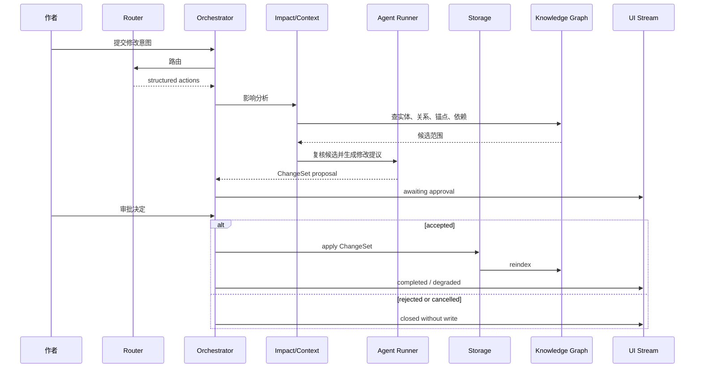
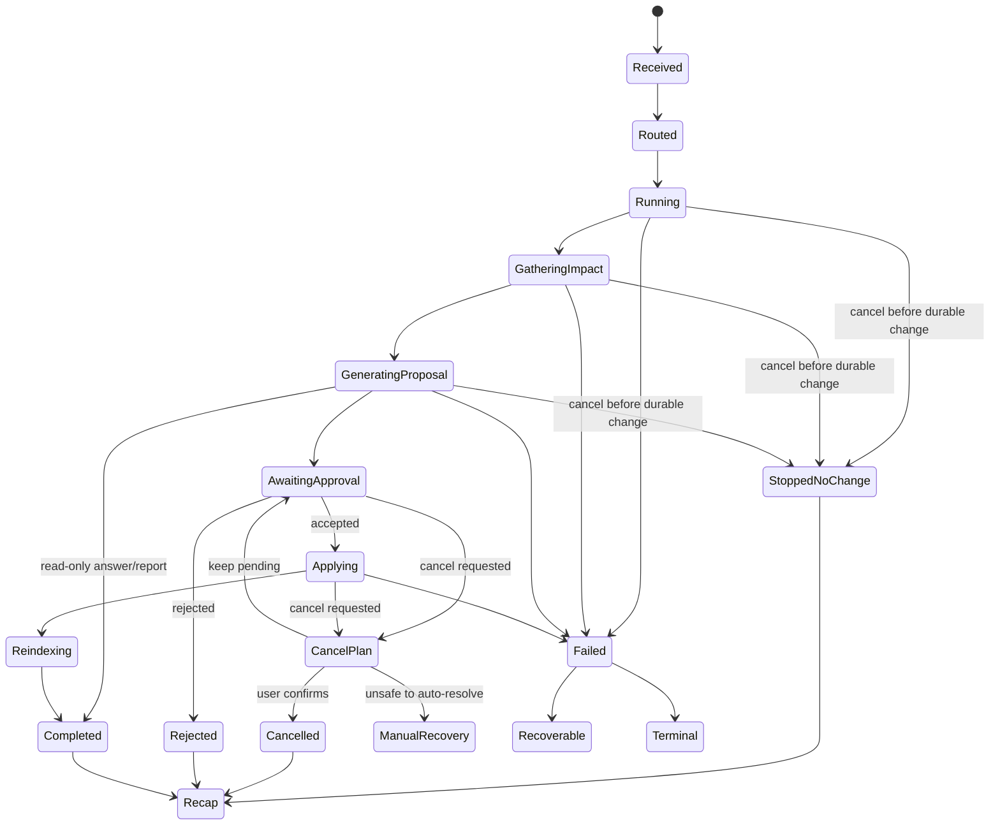
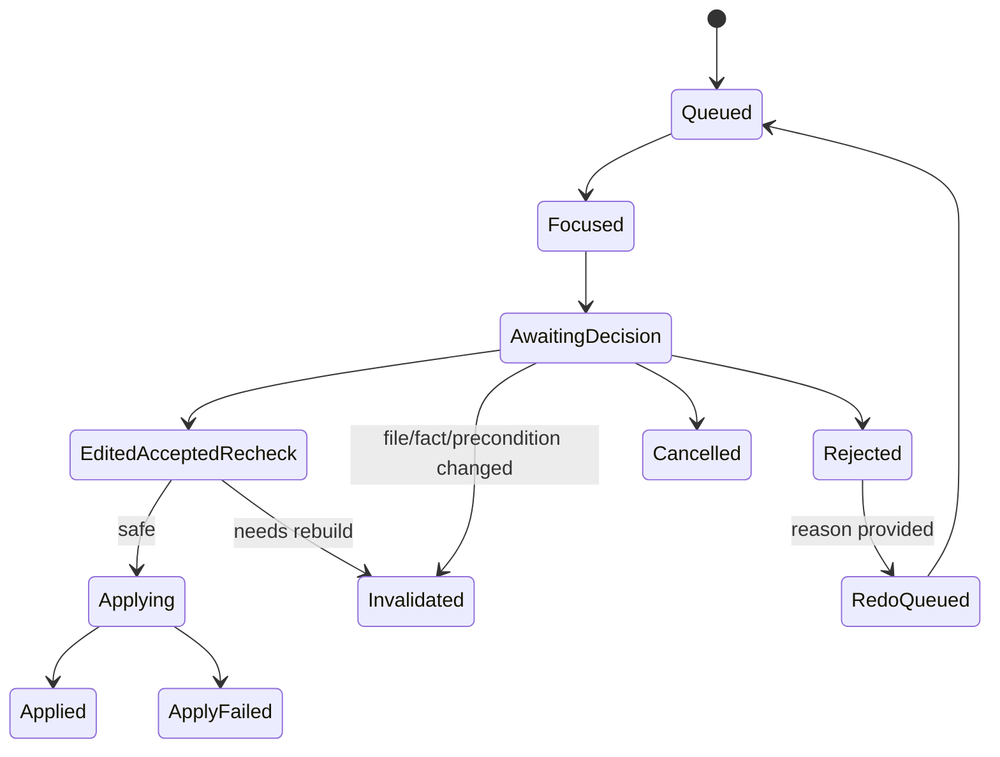
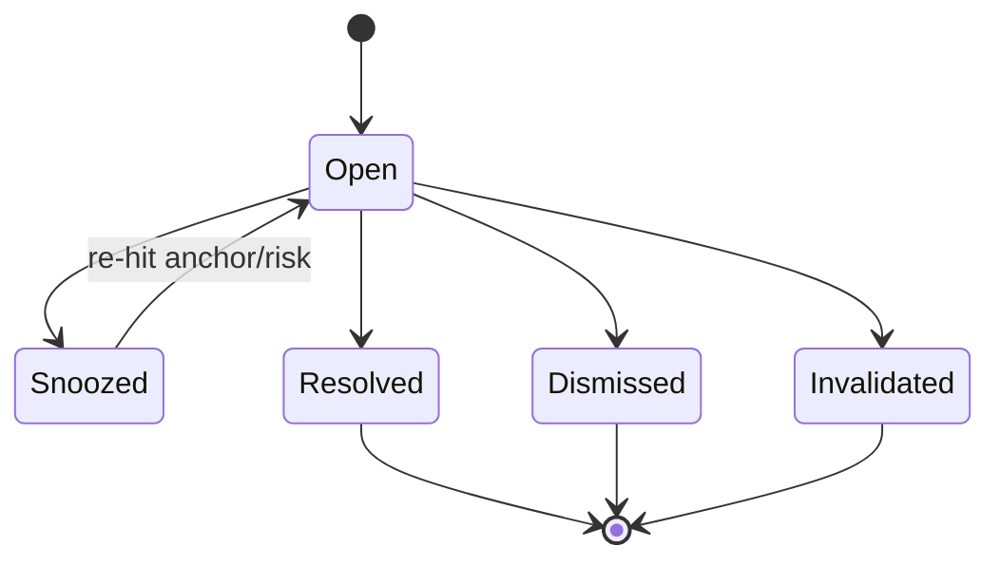
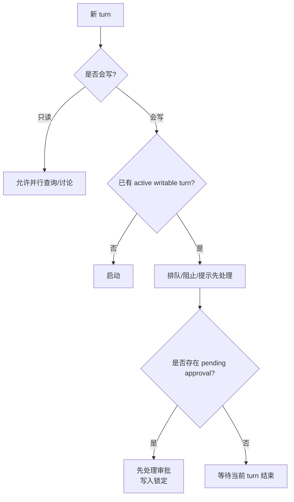

# S03 · Turn Orchestration

这篇用一个具体 turn 来解释编排层:作者说“把女主第一次出手的代价改重一点,全书相关地方都同步”。系统不能只把这句话交给模型,也不能边找边改。它必须把意图、影响分析、Agent 输出、审批、落盘、取消和恢复放进同一个生命周期。

## Turn 是一个事务信封

Turn Orchestration 不拥有小说内容,也不拥有模型能力。它拥有的是“这一轮发生了什么”的事务信封。

| 信封里有什么 | 为什么必须在这里 |
|---|---|
| user turn 身份和当前状态 | 刷新、断线、取消后能恢复 |
| Router action | 用户意图被结构化,不能靠下游猜 |
| action queue | 多个动作按顺序执行,避免互相覆盖 |
| cascade 记录 | 连带影响在审批前汇总 |
| ChangeSet | 一次可审定的最小批次 |
| approval lifecycle | pending、accepted、rejected、invalidated 有明确状态 |
| cancel / correction 信息 | 失败或取消后能解释已经发生什么、下一步如何收场 |
| recap trigger | turn 终态后生成用户级变更回执 |
| mode gate | 当前讨论/规划/写作权限、切换阻断原因和重启恢复 |

## 一轮复杂修改的泳道

cascade 在审批前完成。审批后才进入存储写入。用户必须一次看到“这批改动为什么放在一起”。

## 生命周期状态机

状态机不是 UI 动画。它是恢复和并发控制的业务事实。前端状态点只是它的投影。

## Router 只产出动作

Router 的职责是把自然语言意图变成结构化 action,例如讨论、写章、改设定、查询、取消或打开审批。Router 不做这些事。

| Router 输出 | 编排层判断 |
|---|---|
| 只读回答 | 可以并行或直接调用 Agent |
| 查询 | 走 fact query,不改变作品 |
| 写作/改写 | 需要上下文、Agent、proposal |
| 设定变更 | 需要 impact analysis 和审批 |
| 取消 | 进入统一 cancel 语义 |
| 非法 action | turn 失败,不让下游猜 |

Discuss Mode 是 Router action 中最严格的只读分支,详见 [M04 · Discuss Mode](./M04-discuss-mode.md)。它可以讨论、解释和建议,但不能生成可落盘 ChangeSet。

## 模式闸门

模式是项目状态,不是前端 tab。S04 拥有模式状态机:S02 持久化当前模式、最近一次切换、切换来源和阻断原因;UI 只投影它。实现可以使用状态机库,但库名不是主权,不能让实现细节决定模式语义。

| 当前模式 | 可生成什么 | 必须阻断什么 |
|---|---|---|
| Discuss | answer/report、只读查询、切换建议 | 任何写入、ChangeSet、inline accept 和经验沉淀。 |
| Planning | 设定、结构、角色、关系、伏笔、世界规则 proposal | 正文落笔和正文替换。 |
| Writing | 正文草稿、正文改写、轻量表达修改、读者/守则报告 | 直接改设定、治理实体、改变世界规则。 |

"Planning 阻断正文落笔"指 Planning 不产出正文创作;设定变更的 cascade ChangeSet 可以包含维持一致性所必需的正文替换 item,它们随整批在审批卡内由作者审定([M08](./M08-approval-cascade.md)),不构成模式越界。

模式切换只能由用户显式发起。切换前 S04 必须检查 active writable turn、pending approval、applying/recovery、未关闭 atomic group 和 writing-blocked obligation。若任何条件不满足,切换进入 blocked projection,说明先处理什么;系统不能静默切换后继续执行旧队列。

重启后恢复按持久模式和持久 turn 状态校正:没有 active writable turn 时恢复最近模式;存在 pending approval 时恢复到审批锁定投影;存在 interrupted/recovery 时先展示恢复入口,不接受新的可写 action。

## 跨模式前置

写作模式发现“正文成立必须先改设定/关系/伏笔/世界规则”时,不能把设定修改塞进写作 ChangeSet。它生成 planning prerequisite:

| 情况 | S04 处理 |
|---|---|
| 正文提案可独立成立 | 正文 proposal 正常进入审批。 |
| 正文依赖设定先改 | 正文 proposal 标记 blocked-by-planning,不进入 Applying;生成只读说明和规划前置入口。 |
| 设定改动与正文改动必须同批原子 | 拆成“规划前置审批 → 写作审批”两步;前一步未生效前,后一步只能保留草稿/预览,不能落盘。 |
| 用户拒绝规划前置 | 对应正文 proposal invalidated 或降级为只读建议。 |

这条规则保护 plan/07 的模式边界和 plan/08 的原子性:必要连带修改不能拆散落盘,但也不能让写作模式越权修改设定。

## ChangeSet 的最小 anatomy

| 部件 | 用途 |
|---|---|
| intent | 用户原始意图的结构化摘要 |
| affected items | 受影响文件、段落、实体、概念或依赖 |
| proposed edits | 候选修改内容 |
| rationale | 为什么这些地方一起改 |
| risks | 守则、事实冲突、低置信项 |
| preconditions | 文件版本、锚点、索引健康度 |
| correction hints | 已生效后如何生成反向修正 |
| dependency groups | 哪些 item 必须同批生效,哪些可以独立裁决 |
| residual obligations | 用户搁置或拒绝后仍需后续处理的影响项 |

完整 schema 在 appendix;根层只强调 ChangeSet 必须能被用户看懂、能被存储层应用、能被失败流程恢复。

## Cascade preflight

跨章节或全书级 cascade 在进入 Agent 生成前必须先过 preflight。Preflight 不是技术日志,而是一次面向作者的执行承诺:预计会处理多大范围、是否分批、哪些地方需要 checkpoint、等待是否可解释、取消后会停在哪里。

| 输入 | 来源 | S04 决策 |
|---|---|---|
| 影响范围和 dependency group | S07/S06 | 能否组成同一审批批次,哪些必须一起生效 |
| context 体量和 overflow 风险 | S07/S08 | 是否缩小范围、摘要替代、分阶段执行或显式失败 |
| provider 上限和限流 | I01 | 是否需要降级模型、排队或分批 |
| 能力 gate 状态 | V03/V02 经 S07 投影 | 是否标记 `needs data`、低置信或阻断全书承诺 |

S04 拥有用户可见 preflight 结果。它可以让用户确认一次性执行,也可以把 cascade 切成多个可审定批次;但不能在等待、批次或覆盖范围不可解释时直接启动全书级长任务。

Turn 用量指标(token 消耗、prompt cache 命中、context 体量)是用户可见的技术指标,不是 Trace 里事后解释的统计项;preflight 只解释范围、批次、等待与取消点,不做任何预算或成本审批。Preflight 展示必须至少说明预计范围、批次数、等待区间、主要不确定来源、是否会触发降级模型/排队、取消后的静止点。S04 只拥有 preflight 结果的编排和展示;provider 上限、限流和模型能力仍由 I01 提供,context 体量和 overflow 风险仍由 S07/S08 提供。

| preflight 结果 | 后续 |
|---|---|
| ready | 启动 cascade,保留取消点和最终审批 |
| needs confirmation | 用户确认范围或等待后再启动 |
| split required | 生成分批队列,每批有独立 checkpoint 和审批解释 |
| needs data | 能力 gate 或体量估算缺证据,不能承诺全书级处理 |
| blocked | 范围或 provider 上限不满足,要求缩小任务或改路线 |

单条 stale freshness marker 应在涉及陈旧证据的卡片、Trace 行或审批说明旁以轻量状态提示出现:说明哪类证据已过期、最后新鲜水位、可继续只读查看还是必须刷新后才能写入。它不能替代 S07/S06/R04 的健康判定,也不能把 stale 包装成成功;它只是把已存在的新鲜度状态放到用户看得见的位置。

## 部分通过的事务边界

部分通过只允许发生在相互独立的 dependency group 之间。一个 primary change 与维持世界一致所必需的事实、称谓、锚点、伏笔或守则修正属于同一个 atomic group;用户不能只接受主修改而搁置必需一致性项。Design 和 prototype 可以展示行级差异,但交互选择必须服从 atomic group:必需项成组接受或成组拒绝,只有独立低置信 item 能单独搁置。

| 裁决 | 编排语义 | 用户可见结果 |
|---|---|---|
| 接受完整 group | group 内 item 同批进入 Applying | 显示为一组已接受修改 |
| 拒绝完整 group | group 内 item 都不落盘 | 记录拒绝理由,可重做或关闭 |
| 搁置独立 item | 生成 residual obligation | Recap、Trace 和后续 Validator 都能看到 |
| 搁置触碰 R4 的 item | turn 进入 writing-blocked | 阻止继续写正文,直到解决或明确拒绝理由 |
| 编辑后接受 | 以用户编辑版替代 proposal | 新内容仍需满足 group preconditions |

Residual obligation 不是隐藏 TODO。它是项目状态的一部分:必须带来源、原因、阻断级别、下次检查入口、去重键和用户最后裁决。后续 Agent 写作、Validator、ReaderPanel 或 Search 命中相关材料时,都必须把它作为上下文或风险解释的一部分。

## 质量汇合与 EditedAccepted

AwaitingApproval 前必须有质量汇合点。S04 只允许在以下材料都有明确状态后打开审批:Runner 完整 proposal、S12 风险/诊断状态、S07 context gap/overflow 状态、S06 影响范围置信度和 S01/S06 的前置健康状态。任何一项缺失都必须以 `unavailable`、`inconclusive`、`needs data` 或 `blocked` 进入卡片,不能后台补阻断级结论。

用户在审批卡里手动编辑后接受时,状态不是直接 Applying,而是 `EditedAcceptedRecheck`:系统轻量重检用户编辑版是否改变事实、破坏 atomic group、引入新风险或解决原阻断级风险。重检结果只有三种:

| 重检结果 | 下一步 |
|---|---|
| safe | 进入 Applying,用用户编辑版落盘。 |
| needs rebuild | 原卡 invalidated,带用户编辑内容重新生成 proposal。 |
| blocked | 保持待审或要求修改,不能落盘。 |

阻断级风险被用户编辑“解决”时,必须有 no-change-evidence 或 resolved-evidence:检查范围、风险 id、证据锚点、结论和置信状态。没有证据时只能继续阻断或标记 inconclusive。

## Approval queue 与 obligation 状态

同一项目可以排多个 pending approval,但 S04 拥有队列顺序和单卡生命周期。一次只允许一个 focused approval 接受用户裁决;点名查看其他卡不改变队列顺序,取消单卡只关闭该卡及其派生 redo,不能影响其他 pending 卡。

拒绝理由进入 redo context,但自动重做必须有相似度和收敛判定。若新 proposal 与被拒版本高度相似,或连续重做仍未解决拒绝理由,S04 停止自动重做并要求用户决定:保留拒绝、改写理由、拆分任务或人工编辑。

Obligation 状态机由 S04 拥有:

同一来源、风险类型、锚点、dependency group 和用户裁决形成 obligation 去重键。重复命中只追加证据和最近触发时间,不制造多条噪音待办。`Resolved` 表示后续事实或审批已消除风险;`Dismissed` 表示用户明确不处理;`Invalidated` 表示来源文件、锚点或审批已失效。三者都要进入 recap/activity 投影,但不能互相替代。

## 并发原则

同一项目同一时间只允许一个可写 turn 进入危险路径。只读查询可以并行,但不能改变 pending 审批或落盘结果。

pending approval 存在时,Orchestrator 必须把项目切成“写入锁定、只读放行”:会写入作品、生成新 ChangeSet、接受跨文档改写、改变模式权限或影响审批前置条件的 action 一律阻止或要求先处理审批;只读查询、搜索、打开文档、Trace 查看和 Discuss 可以继续运行。只读 action 必须读取一致快照或标注当前 pending 状态,不能修改审批卡、自动失效审批或把讨论摘要沉淀为项目事实。

Open Novel 是单实例单窗口应用。用户从主界面返回项目选择或切换项目时,Orchestrator 必须先处理当前项目的 active turn、pending approval、applying/recovery 和未保存编辑;未收场前不能在后台保留另一个可写或只读项目窗口,也不能把运行中的 turn 静默挂到新项目上。

## 取消不是 abort

| 取消发生时 | 处理 |
|---|---|
| 还在路由/检索 | 停止运行,记录取消 |
| Agent 正在生成 | 停止流,丢弃未完成输出 |
| 已生成 pending ChangeSet | 标记取消或关闭审批 |
| 已开始写入 | 进入内部恢复或人工处理 |
| 内部恢复不安全 | 停止后续动作,展示不可自动恢复原因 |

所有入口都走同一取消语义:输入条按钮、命令面板、状态点、Router action 和快捷键不允许各自发明一套取消。

所有非终态都必须能响应 stop request,但响应不等于立刻安全结束。模型调用、工具调用、reindex、Applying 和恢复流程都必须给出 `stopping` 投影,直到 S03/S09/S14 返回明确 stopped、completed、failed 或 manual recovery。

运行中且没有 durable change 时,取消不需要二次确认:系统停止剩余工作,保留已完成的只读结果,并生成 stopped recap。只要存在 pending ChangeSet、已开始落盘或内部恢复不安全,Orchestrator 必须生成 cancel plan 让用户确认影响范围。CancelPlan 必须说明哪些结果已产生、哪些 artifact 可保留、哪些审批/obligation 会关闭、是否需要反向修正;用户确认前,系统不能自行丢弃已审定或已进入写入记录的事实。

Cancel、timeout 和 provider/tool failure 不是同一种 failure。用户主动取消返回 stopped/cancelled;超时返回 timeout,并说明可重试点;工具无法取消时进入 needs-manual-recovery 或等待工具安全点。S04 不把用户取消计入模型失败率,也不把超时包装成用户拒绝。

用户侧不暴露 Git 式回退。所有撤销和恢复都向前追加:撤销一次已落盘修改时,系统生成反向 ChangeSet;恢复到历史内容时,系统基于历史 recap / 快照生成恢复提案。两者都必须经作者审定,不能直接改写项目历史。

Approval Cascade 是 ChangeSet 的用户可见审定模块,详见 [M08 · Approval Cascade](./M08-approval-cascade.md)。本篇定义生命周期,M08 定义审批 UI 必须解释什么。

Turn Recap 是 turn 结束后的用户级 changelog,详见 [M17 · Turn Recap And Continuation](./M17-turn-recap-and-continuation.md)。S04 只负责在正确状态触发 recap,不把 recap 当作品事实源。

## Recap 触发

Recap 只在 terminal turn result 后生成:Completed、StoppedNoChange、Cancelled、Rejected、Applied、ApplyFailed、FailedTerminal、ManualRecoveryOpened。`AwaitingApproval` 不是终态,只能生成 pending activity item;宿主崩溃恢复不是 recap,而是 recovery note。若用户稍后处理审批,最终 recap 必须引用同一个 turn 和写入记录,把 pending 等待和最终裁决连起来。

| 状态 | 生成什么 |
|---|---|
| AwaitingApproval | pending activity item,显示待审和恢复入口。 |
| StoppedNoChange | stopped recap,说明无 durable change。 |
| Applied / Completed | terminal recap,引用写入记录和 reindex 状态。 |
| ApplyFailed / ManualRecoveryOpened | failure recap + recovery note,说明哪些事实已生效、哪些需要处理。 |
| 宿主崩溃恢复 | recovery note,不生成成功或停止 recap。 |

Recap、Trace 和 Activity 的来源是 S14 写入记录与 S04 turn state 投影;前端事件流不能临时拼出另一份历史。

## 失败分叉

| 分叉 | 用户看到 | 下游状态 |
|---|---|---|
| Router action 非法 | 无法理解或当前模式不可执行 | 无写入 |
| 影响分析低置信 | 需要确认或扩大审查范围 | ChangeSet 带低置信标记 |
| cascade 不收敛 | 建议拆分或人工确认 | 不继续递归 |
| ChangeSet 生成失败 | 本轮无法生成可审定修改 | 不进入审批 |
| 审批落盘失败 | 接受未生效,可重试/取消 | storage 决定恢复 |
| post-apply reindex 失败 | 作品已保存,索引降级 | 进入 repair/degraded,不能倒退已提交事务 |
| recovery 缺少状态 | 不重跑危险动作 | 进入人工处理 |

## FAQ

**Q: pending 审批能不能自动过期?**

A: 不能按时间自动过期。只有相关文件、锚点、版本或项目事实变化导致 precondition 不成立时才失效。

**Q: cascade 为什么不能边发现边写?**

A: 因为作者需要一次看全影响范围。边发现边写会让审批失去意义,也让失败收场变复杂。

**Q: 只读查询能不能在写入 turn 运行时并行?**

A: 可以。pending approval 期间也是同一规则:查询、搜索、打开文档、Trace 和只读讨论可以继续,但必须读取一致快照或标记当前待审状态,不能改变正在进行的审批/落盘,也不能生成新的可写 action。

**Q: 失败后能不能让 Router 再跑一次恢复?**

A: 不作为默认恢复。恢复以持久 turn 状态为准,避免重复执行危险动作。

**Q: 阻断级风险来自 Creative Engine 时,谁阻断?**

A: [S11 · Creative Engine](./S11-creative-engine.md) 提供风险;Turn Orchestration 在审批和落盘路径上执行阻断语义。

## Appendix

- [appendix/event-catalog](./appendix/A03-event-catalog.md) 保存 turn、cascade、approval、cancel 事件明细。
- [appendix/json-schemas](./appendix/A02-json-schemas.md) 保存 Router action、ChangeSet 和审批输出 schema。
- [appendix/tool-catalog](./appendix/A04-tool-catalog.md) 保存影响分析和 cascade 工具参数;工具权限和失败语义由 [S08](./S08-agent-tooling-boundary.md) 定义。
