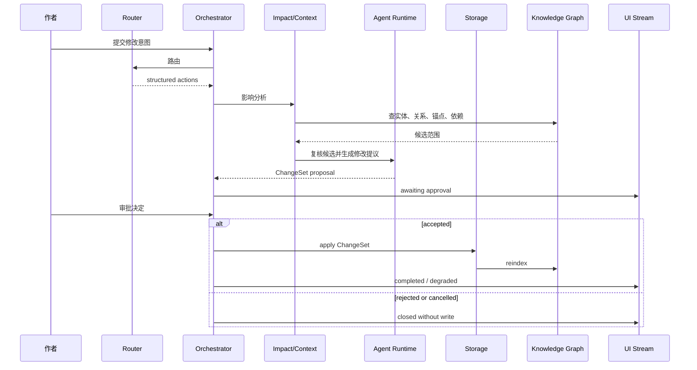
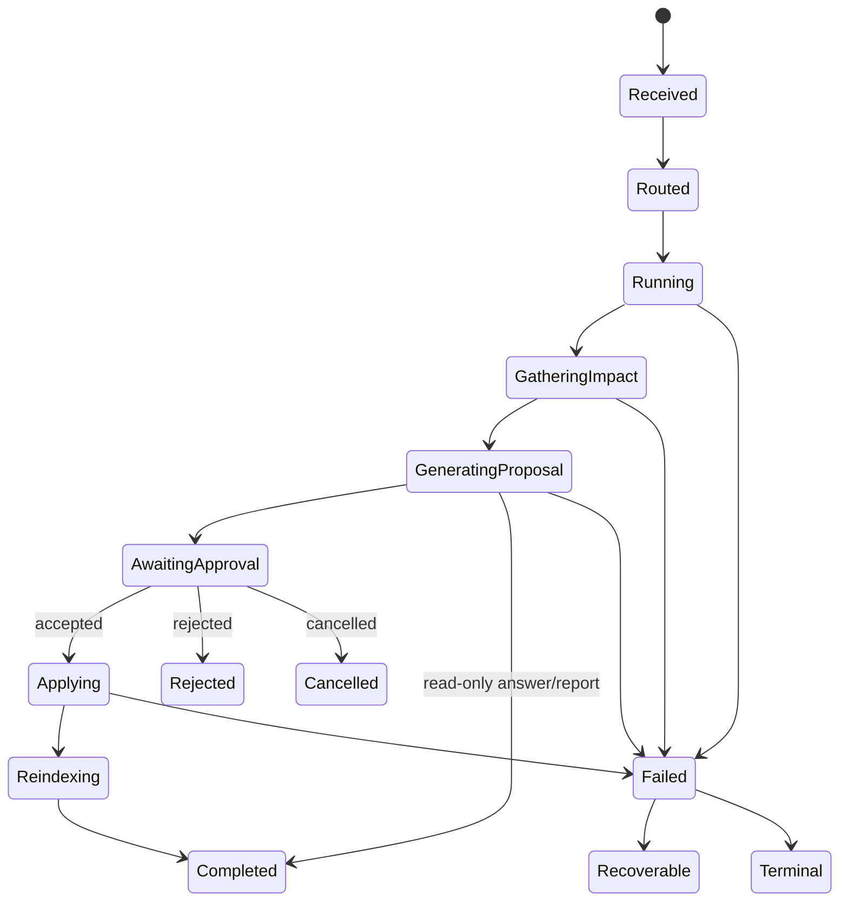
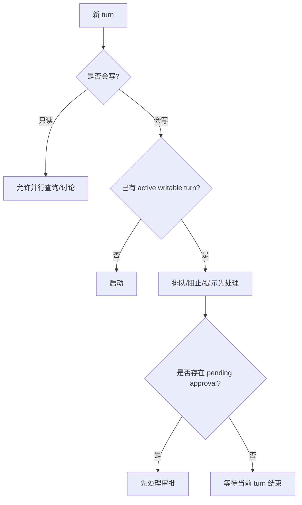

# S04 · Turn Orchestration

这篇用一个具体 turn 来解释编排层:作者说“把女主第一次出手的代价改重一点,全书相关地方都同步”。系统不能只把这句话交给模型,也不能边找边改。它必须把意图、影响分析、Agent 输出、审批、落盘、取消和恢复放进同一个生命周期。

## Turn 是一个事务信封

Turn Orchestration 不拥有小说内容,也不拥有模型能力。它拥有的是“这一轮发生了什么”的事务信封。

| 信封里有什么 | 为什么必须在这里 |
|---|---|
| user turn 身份和当前状态 | 刷新、断线、取消后能恢复 |
| Router action | 用户意图被结构化,不能靠下游猜 |
| action queue | 多个动作按顺序执行,避免互相覆盖 |
| cascade 记录 | 连带影响在审批前汇总 |
| ChangeSet | 一次可审定的最小批次 |
| approval lifecycle | pending、accepted、rejected、invalidated 有明确状态 |
| cancel / rollback 信息 | 失败或取消后能解释已经发生什么 |

## 一轮复杂修改的泳道

cascade 在审批前完成。审批后才进入存储写入。用户必须一次看到“这批改动为什么放在一起”。

## 生命周期状态机

状态机不是 UI 动画。它是恢复和并发控制的业务事实。前端状态点只是它的投影。

## Router 只产出动作

Router 的职责是把自然语言意图变成结构化 action,例如讨论、写章、改设定、查询、取消或打开审批。Router 不做这些事。

| Router 输出 | 编排层判断 |
|---|---|
| 只读回答 | 可以并行或直接调用 Agent |
| 查询 | 走 fact query,不改变作品 |
| 写作/改写 | 需要上下文、Agent、proposal |
| 设定变更 | 需要 impact analysis 和审批 |
| 取消 | 进入统一 cancel 语义 |
| 非法 action | turn 失败,不让下游猜 |

Discuss Mode 是 Router action 中最严格的只读分支,详见 [M04 · Discuss Mode](./M04-discuss-mode.md)。它可以讨论、解释和建议,但不能生成可落盘 ChangeSet。

## ChangeSet 的最小 anatomy

| 部件 | 用途 |
|---|---|
| intent | 用户原始意图的结构化摘要 |
| affected items | 受影响文件、段落、实体、概念或依赖 |
| proposed edits | 候选修改内容 |
| rationale | 为什么这些地方一起改 |
| risks | 守则、事实冲突、低置信项 |
| preconditions | 文件版本、锚点、索引健康度 |
| rollback hints | 已生效后如何撤销 |

完整 schema 在 appendix;根层只强调 ChangeSet 必须能被用户看懂、能被存储层应用、能被失败流程恢复。

## 并发原则

同一项目同一时间只允许一个可写 turn 进入危险路径。只读查询可以并行,但不能改变 pending 审批或落盘结果。

## 取消不是 abort

| 取消发生时 | 处理 |
|---|---|
| 还在路由/检索 | 停止运行,记录取消 |
| Agent 正在生成 | 停止流,丢弃未完成输出 |
| 已生成 pending ChangeSet | 标记取消或关闭审批 |
| 已开始写入 | 进入 rollback 或人工处理 |
| rollback 不安全 | 停止后续动作,展示不可自动恢复原因 |

所有入口都走同一取消语义:输入条按钮、命令面板、状态点、Router action 和快捷键不允许各自发明一套取消。

Approval Cascade 是 ChangeSet 的用户可见审定模块,详见 [M08 · Approval Cascade](./M08-approval-cascade.md)。本篇定义生命周期,M08 定义审批 UI 必须解释什么。

## 失败分叉

| 分叉 | 用户看到 | 下游状态 |
|---|---|---|
| Router action 非法 | 无法理解或当前模式不可执行 | 无写入 |
| 影响分析低置信 | 需要确认或扩大审查范围 | ChangeSet 带低置信标记 |
| cascade 不收敛 | 建议拆分或人工确认 | 不继续递归 |
| ChangeSet 生成失败 | 本轮无法生成可审定修改 | 不进入审批 |
| 审批落盘失败 | 接受未生效,可重试/取消 | storage 决定恢复 |
| recovery 缺少状态 | 不重跑危险动作 | 进入人工处理 |

## FAQ

**Q: pending 审批能不能自动过期?**

A: 不能按时间自动过期。只有相关文件、锚点、版本或项目事实变化导致 precondition 不成立时才失效。

**Q: cascade 为什么不能边发现边写?**

A: 因为作者需要一次看全影响范围。边发现边写会让审批失去意义,也让 rollback 变复杂。

**Q: 只读查询能不能在写入 turn 运行时并行?**

A: 可以,但它必须读取一致快照或标记当前状态,不能改变正在进行的审批/落盘。

**Q: 失败后能不能让 Router 再跑一次恢复?**

A: 不作为默认恢复。恢复以持久 turn 状态为准,避免重复执行危险动作。

**Q: blocking 风险来自 Creative Engine 时,谁阻断?**

A: Creative Engine 提供风险;Turn Orchestration 在审批和落盘路径上执行阻断语义。

## Appendix

- [appendix/event-catalog](./appendix/A03-event-catalog.md) 保存 turn、cascade、approval、cancel 事件明细。
- [appendix/json-schemas](./appendix/A02-json-schemas.md) 保存 Router action、ChangeSet 和审批输出 schema。
- [appendix/tool-catalog](./appendix/A04-tool-catalog.md) 保存影响分析和 cascade 工具参数。
