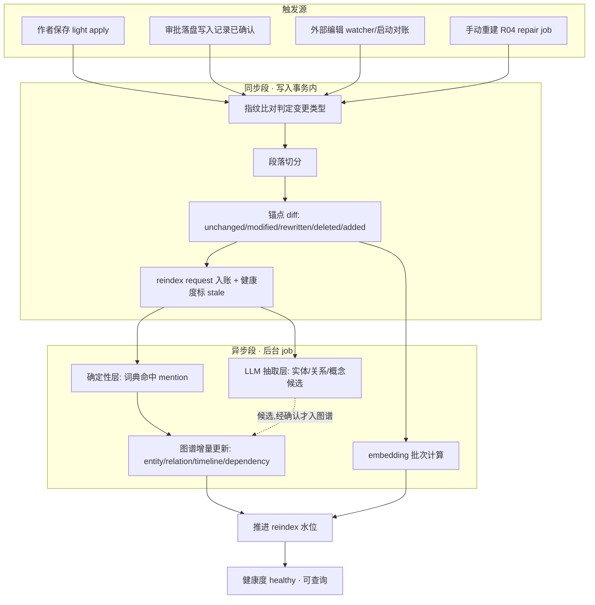
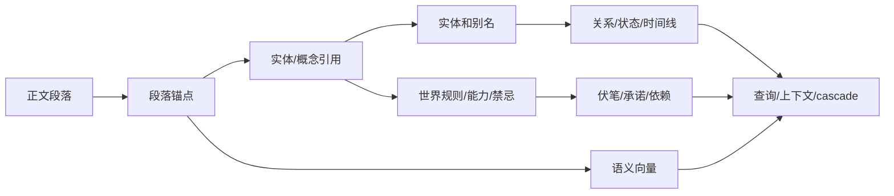
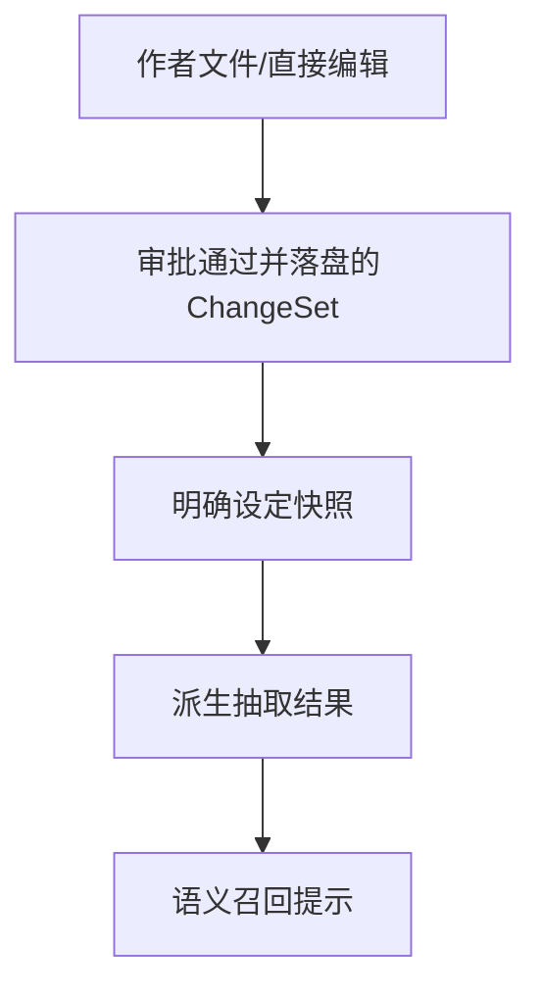
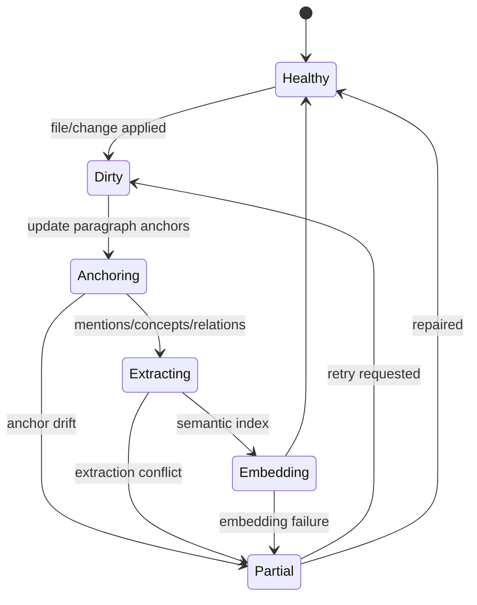

# S05 · Knowledge Graph

这篇解释系统如何把小说正文和设定变成可查询、可引用、可用于一致性判断的知识图谱。它不是第二份小说,也不是模型总结出的“真相库”。它是从作者事实派生出来的一组索引,全部物化在每项目派生索引库 `index.db` 中——整库可删,可由 [R04](./platform/R04-index-health-and-repair.md) 从作者文件和 `project.db` 全量重建。`index.db` 损坏不等同项目事实库损坏,后者恢复语义待 [TODO-P1-60](../TODO.md) 裁决。

本篇的主线骨架是一条管线叙事:**从一次保存到可查询**。读完主线,实现者应该能回答“作者按下保存之后,系统在什么时机、以什么顺序、在哪个事务边界内,把这次变更变成可查询的图谱事实”。对象职责、时点语义、实体治理和事故收场在主线之后展开。

## 从一次保存到可查询

### 端到端管线

### 第一步:触发源

四种事件能启动索引管线,每种必须携带足够信息让管线只处理变化部分:

| 触发源 | 携带什么 | 范围 |
|---|---|---|
| 作者直接保存(light apply) | editor action id、文件 id、保存后内容指纹、editor 已知的变更区间 | 单文件局部 |
| 审批落盘(写入记录已确认) | apply id、影响文件列表、每文件输入/输出指纹、reindex 水位 | ChangeSet 覆盖的全部文件 |
| 外部编辑(watcher 事件 / 启动对账) | 文件路径、事件类型、watcher cursor 位置;启动对账时是全 ledger 指纹重扫 | 单文件或全项目对账 |
| 手动重建(R04 repair job) | scope、触发原因、输入水位、index version | 局部或整库 |

前两种来自系统自己的写入路径,变更范围是已知的;外部编辑只知道“文件可能变了”,必须先走指纹比对;手动重建跳过比对,按 scope 强制重算。watcher 事件如何与自写回声区分、cursor 如何推进,定义在 [S14](./S14-project-storage.md) 与 [I03](./platform/I03-filesystem-and-watcher.md),本篇只消费判定结果。

### 第二步:变更检测

文件级先比内容指纹(来自 `project.db` 的 fingerprint ledger):指纹相同直接结束,不进入切分。指纹不同则进入段级 diff,把变更分为五类:

| 判定 | 依据 | 处理 |
|---|---|---|
| unchanged | 标题路径 + 内容签名都匹配 | 锚点不动,下游不重算 |
| modified | 内容签名相同但完整 hash 不同(小改:标点、错别字、空白) | 保留锚点 id,更新 hash 和 offset,该段重扫 + 重算 embedding |
| rewritten | 旧锚点失配,但邻接段对照命中且文本相似度达阈值 | 旧锚点软删,新锚点建立,依赖引用迁移到新锚点 |
| deleted | 旧锚点失配且无相似新段 | 锚点软删,引用它的 dependency/evidence 标失效 |
| added | 新段无对应旧锚点 | 新建锚点,全套下游抽取 |

### 第三步:段落切分与锚点身份

段落切分按 Markdown 结构:剥 frontmatter,按空行切块,标题单独成段并为后续段提供标题路径,代码块和表格整体为一段。

锚点身份是三段组合:**文件 id + 所属标题路径 hash + 段落内容签名**。内容签名不是原文 hash,而是归一化指纹——剔除空白、标点和数字后再 hash,因此:

- 改错别字、加删标点:签名不变,锚点稳定(判 modified)。
- 删一句话、同义改写:签名变,锚点失配——由**邻接段对照**兜底:若旧锚点的前后邻接段仍在,且对应位置的新段文本相似度达阈值,判为 rewritten,锚点迁移、依赖引用跟随迁移。
- 大段重写或整章重排:邻接对照也失配,退化为 deleted + added,相关 dependency/evidence 引用失效,UI 必须提示“锚点大变,请检查相关伏笔”,不能静默假装迁移成功。

只用段序号(插入一段全体偏移)、只用内容 hash(改一字即断)、只用标题+序号(改标题即断)都被否决过;三段组合 + 归一化签名 + 邻接兜底是经过权衡的折中。差量 reindex 只处理 modified/rewritten/deleted/added 四类段,unchanged 段的 mention、refs、embedding 全部保留。

### 第四步:抽取分层

抽取分两层,触发时机和产出可信度不同:

| 层 | 机制 | 触发 | 产出 |
|---|---|---|---|
| 确定性层 | Aho-Corasick 词典对变化段做 surface form 命中,产出 entity/alias/concept mention | 同 reindex job,每个变化段必跑 | 高置信 mention(指向已确认实体/概念) |
| LLM 抽取层 | 模型从变化段提取新实体、新关系、新概念候选 | 异步、可批量、可被预算外条件延后 | 只产生待确认或低置信对象 |

词典本身是派生索引之一:它由 `index.db` 中已确认的 entity canonical name、已确认 alias 和 concept surface form 物化而成。实体治理动作(确认别名、合并、拆分、改名)和概念审定通过后,词典必须重建并对受影响范围重扫 mention;整库重建时词典先于 mention 扫描重建。

LLM 抽取的候选不直接成为图谱事实。新实体、新关系、新概念、时间线推断都以候选状态落库,带来源锚点和置信度;只有经用户确认或审批通过,才升级为高置信图谱事实并进入词典。这保证图谱里每条高置信事实都有人类裁决链,而 LLM 只负责“发现”。

### 第五步:图谱增量更新

变化段的 mention 确定后,按固定顺序增量更新:mention → entity 引用计数与状态 → relation → timeline → dependency。顺序固定是为了让后一层永远引用前一层已落库的对象。更新规则:

- 只增改与变化段相关的行,unchanged 段的派生行不动。
- 锚点迁移(rewritten)时,relation/timeline 的 evidence 锚点和 dependency 的 source/target 锚点同步迁移。
- 锚点删除(deleted)时,dependency 标失效,relation/timeline 行保留但 evidence 失效——事实裁决记录不因索引段消失而消失。
- 发现冲突(同一对象同一时点互斥事实)只记录冲突来源和锚点,交给一致性报告或审批,绝不自动改图谱裁决,更不改正文(见「冲突不是自动修复信号」)。

### 第六步:embedding 批次

变化段(modified/rewritten/added)进入 embedding 队列,批量计算后写回 `index.db`,每行带模型 id、维度、内容 hash 和预计算范数;内容 hash 用于跳过重复计算。embedding 模型、维度和索引版本必须来自 I01/V03 实查;模型未落定时整层处于 `needs data`:队列可以入队但不计算,语义召回降级为不可用,其余管线(锚点、mention、图谱)不受影响。模型切换是整层全量重算事件,新旧向量不混查。

### 第七步:同步/异步边界

| 边界 | 完成什么 | 失败收场 |
|---|---|---|
| 同步:写入事务内(随 light apply / 已确认写入记录) | 指纹 ledger 更新(`project.db`)、段落切分与锚点 diff、锚点表更新、reindex request 入账、受影响范围健康度标 stale | 写入事务失败按 S14 的恢复语义收场;锚点 diff 失败则整段标 stale,不阻断落盘 |
| 异步:后台 job | 确定性词典命中、LLM 抽取、图谱增量更新、embedding 批次、词典重建 | 失败进入 R04 repair 路径,健康度停在 stale/degraded/partial,不静默假装完成 |

同步段保证“作品事实已保存且系统知道哪里旧了”;异步段保证“查询逐步追上事实”。落盘成功和索引追上是两件事,UI 必须能区分(见 S14「落盘剧本」)。异步期间相关范围健康度为 stale;每个 job 完成后推进 reindex 水位,全部追平后才回到 healthy。

### 第八步:水位与健康度

reindex 水位记录“索引已追到哪次落盘”。水位、五级健康度(healthy/stale/degraded/partial/blocked)及其能力降级矩阵的权威定义在 [R04](./platform/R04-index-health-and-repair.md);watcher cursor 与外部编辑事件的可靠性边界在 [I03](./platform/I03-filesystem-and-watcher.md)。本篇管线只承诺两件事:同步段结束时受影响范围必然不再谎称 healthy;异步段每个 job 幂等推进水位,重复 job 不重复制造派生事实。

S05 的健康度不是 turn 终态。reindex 失败、partial、degraded 或 interrupted job 只能作为索引投影交给 S03/S14:若作品事实已提交,turn 结果仍由 [S03 · Canonical turn terminal enum](./S03-turn-orchestration.md#canonical-turn-terminal-enum) 判为 `Applied` 并附 degraded/repair 说明;若写入或恢复本身未收场,则由 S03/S14 判为 `ApplyFailed`、`Interrupted` 或 `ManualRecoveryOpened`。S05 不能把 `healthy`、`degraded`、`partial` 或 `blocked` 当作 turn terminal result。

## 从一段正文到可用事实

每条派生事实都应能追溯到作者文件、审批记录或段落锚点。追溯不清的内容不能作为高风险生成依据。

## 图谱里的对象

| 对象 | 回答的问题 | 典型用途 |
|---|---|---|
| entity | 谁/哪里/什么东西 | 高亮、关系、状态查询 |
| alias | 同一个对象有哪些叫法 | 召回和消歧 |
| concept | 世界规则、能力体系、禁忌、设定约束是什么 | 守则和一致性检查 |
| relation | 两个对象是什么关系 | 角色关系、阵营、敌友变化 |
| timeline | 某对象什么时候发生了什么 | 章节连续性 |
| dependency | 哪些伏笔/承诺/禁忌依赖哪些文本 | cascade 和兑现检查 |
| anchor | 事实落在哪个文件哪段 | 跳转、引用、内部恢复 |
| embedding | 哪些段落语义相关 | 语义召回 |

对象定义的字段明细不在根层。根层只定义它们的职责和失败后果。

## 时点、卷和兑现窗口

图谱查询必须能按章节时点回答。relation、timeline、dependency 和 entity state 都要带来源章节、有效起止或至少可比较的 chapter order;否则只能作为低置信提示,不能支撑前文改写。

卷/册 summary 是派生索引对象,来源于 S01 的作者文件结构和章节范围。它服务 S07 的 long-form partition,但不能成为比原文更高的事实源。卷边界变更会使对应 summary、跨卷依赖和 volume arc 健康度 stale。

伏笔和承诺 dependency 必须允许声明兑现窗口:

| 字段 | 行为意义 |
|---|---|
| opened_at | 伏笔/承诺首次建立的来源锚点。 |
| expected_window | 预计兑现章节、卷内阶段或明确截止点。 |
| latest_safe_point | 超过后会触发确认级或阻断级风险的位置。 |
| resolved_at | 审定后的回收/兑现来源。 |
| status | open、due、overdue、resolved、dismissed。 |

没有 expected window 的伏笔不能触发“超期”阻断,只能提示“未声明兑现窗口”。一旦用户或审批明确给出窗口,S12 可以用 due/overdue 判定期待感兑现风险。

## 实体身份治理

entity 身份是图谱主权对象,不是展示层临时猜测。同名、别名、改名和误合并必须有可追踪治理动作:

| 动作 | 适用场景 | 结果 |
|---|---|---|
| 确认别名 | 用户确认“青岚”“岚儿”指同一对象 | alias 进入已确认状态,后续召回可作为高置信证据 |
| 合并实体 | 抽取或用户发现两个 entity 实为同一对象 | 生成可审批派生修正,保留被合并 id 的历史映射 |
| 拆分实体 | 同名角色、地点或组织被误并 | 生成可审批派生修正,重分配 mention/relation/timeline |
| 改名 | 作者审定对象名称变化 | 新名成为当前显示名,旧名默认降级为历史别名 |

这些动作不能直接改正文。它们改变的是图谱身份、别名状态和后续召回证据,因此必须带来源、影响范围和审批记录。改名 cascade 若同时替换正文称谓,正文写入仍走 M08 ChangeSet;图谱只记录身份连续性。

误并/误拆是高风险索引事故。R04 可以重建派生索引,但不能替用户裁决实体身份;没有用户确认或审批记录时,系统只能把候选标为歧义,不能自动合并。

## 事实优先级

越上层越权威。派生抽取不能覆盖作者文件;embedding 只能提示相关段落,不能单独断言事实。

## Reindex 是维护健康度,不是重写作品

局部 reindex 优先。能保留的锚点保留,小幅编辑迁移,大幅重写或删除导致相关引用失效。各阶段的触发、判定算法和同步/异步边界以「从一次保存到可查询」主线为准;本状态机只描述健康度视角的阶段推进与 Partial 回退。

## 锚点失稳的连锁反应

| 锚点状态 | 查询 | 高亮/旁注 | 影响分析 | Agent 写作 |
|---|---|---|---|---|
| healthy | 正常返回来源 | 正常展示 | 可用 | 可作为上下文 |
| migrated | 返回新位置并记录迁移 | 正常或轻提示 | 可用但记录版本 | 可用 |
| stale | 标记低置信 | 弱化/隐藏 | 保守扩大范围 | 高风险任务需补证据 |
| missing | 不返回为可靠来源 | 不展示 | 需重建或人工确认 | 不作为关键事实 |

段落锚点是图谱可信度的地基。锚点不稳,下游必须跟着降级。

锚点、差量 reindex 和 paragraph embeddings 必须一起验证。任何会改变段落切分、锚点迁移或 embedding 刷新策略的实现,都要在 [V01](./appendix/V01-test-matrix.md) 覆盖 mutation 测试;涉及 native binding、watcher 或 provider 行为时,原始证据进入 [V03](./appendix/V03-external-spikes.md)。

## 冲突不是自动修复信号

如果抽取发现“同一角色在同一时间既失明又正常视物”,系统不能自动改正文。它应该:

1. 保留作者文件事实。
2. 记录冲突来源和段落锚点。
3. 把冲突交给一致性报告或审批。
4. 等用户决定是否修改。

图谱的职责是发现和解释冲突,不是替作者裁决设定。

## 谁消费图谱

| 消费方 | 使用方式 | 失败时降级 |
|---|---|---|
| Context Management | 装配事实、查询来源、语义召回 | 缺失关键事实则阻断高风险 Agent |
| Turn Orchestration | cascade 候选范围、审批冲突 | 低置信候选进入审批 |
| Creative Engine | 守则、人设、伏笔兑现 | 不展示假通过 |
| Editor Interaction | 高亮、旁注、跳转 | 弱化或隐藏过期提示 |
| Project Storage | 文件变更后触发 reindex | 作品事实保留,索引过期 |

## 影响分析证据门槛

图谱可以提供 entity、relation、timeline、dependency、anchor 和 embedding 候选,但它们能否支撑“全书连带改”必须由 [V03](./appendix/V03-external-spikes.md) 的长篇能力 spike 证明。未通过前,图谱输出只能作为候选证据,不能宣称已经覆盖全部受影响位置。

| 证据能力 | 必须被 spike 覆盖 | 不达标时的降级 |
|---|---|---|
| entity / alias 召回 | 改名、别名、称谓变化能跨章节找回相关锚点 | 要求用户确认别名或限制在显式命中范围 |
| relation / timeline | 关系、状态、时间点变化能按 as-of 语义返回正确候选 | 高风险写作阻断或进入低置信审查 |
| dependency | 伏笔、承诺、禁忌和世界规则能被关联到来源段落 | cascade 只处理已声明依赖,未声明部分改为提示 |
| embedding | 语义相似段落能补召回但不制造无来源事实 | 语义召回只作为补充,不进入主权候选 |

如果 spike 暴露系统性漏召回,应先重设计图谱对象、锚点粒度或依赖声明方式,再恢复高风险 cascade。

Embedding 模型、维度和索引版本必须来自 I01/V03。模型未知或维度未落定时,embedding 对象处于 `needs data`;语义搜索、相似桥段和补召回必须降级为不可用或低置信,不能提前落地不可迁移的向量表结构。

## 事故表

| 事故 | 系统状态 | 用户可见 |
|---|---|---|
| embedding provider 不可用 | 语义召回降级 | 精确查询仍可用,语义结果不足 |
| entity 抽取冲突 | 图谱局部 partial | 冲突报告带来源 |
| 派生写入越权 | 操作阻断 | 错误提示和 trace |
| 索引健康度过低 | 高风险生成阻断或要求确认 | “当前索引不足以保证一致性” |
| 旧锚点指向删除段落 | 相关引用失效 | 跳转/高亮不可用 |

## FAQ

**Q: 图谱里的事实会不会比正文更新?**

A: 不应该。图谱派生自正文和审批后事实。它可以标记待刷新,不能超前改写事实。

**Q: embedding 找到的段落能不能直接当证据?**

A: 不能。embedding 只是召回方式;证据必须回到原文段落、设定文件或审批记录。

**Q: 为什么关系、时间线和依赖都需要?**

A: 它们回答不同问题:关系说明对象连接,时间线说明变化顺序,依赖说明改一处会影响哪些承诺和伏笔。

**Q: reindex 失败时写作要全部停止吗?**

A: 不一定。低风险讨论可继续;依赖完整一致性的写作、cascade、守则判断需要阻断或降级。

**Q: 图谱是否允许人工修正?**

A: 可以通过作者文件或明确设置/审批修正主权事实;不应直接手改派生索引来制造真相。

## Appendix

- [appendix/schema-tables](./appendix/A01-schema-tables.md) 保存知识图谱、锚点、embedding 和派生索引表结构。
- [appendix/tool-catalog](./appendix/A04-tool-catalog.md) 保存 reindex、查询和索引工具明细。
