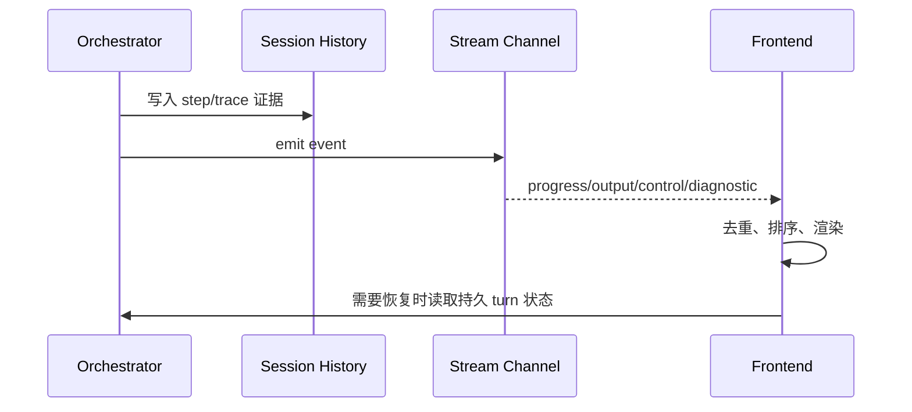
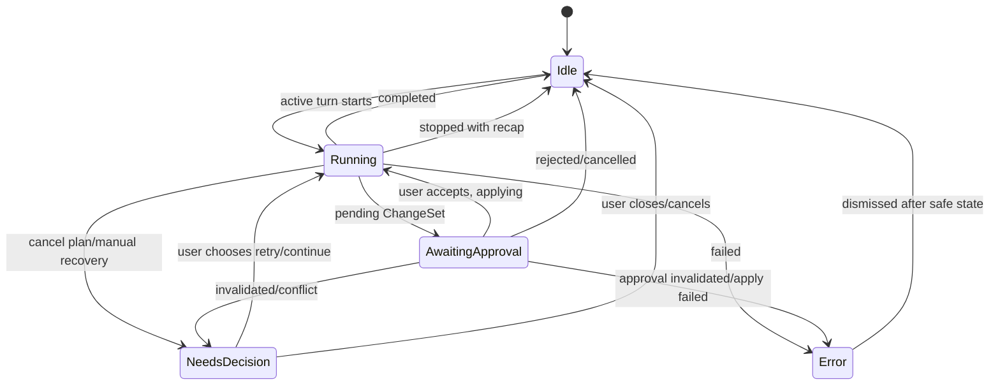
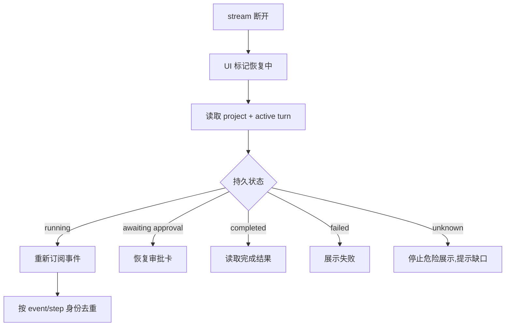

# S05 · Streaming UI Protocol

这篇只管“用户如何看见系统正在做什么”。它不是业务状态源,也不是调试日志全集。Streaming UI Protocol 的职责是把持久 turn 状态和过程事件翻译成可恢复、可去重、不过度打扰写作的前端反馈。

## 驾驶舱原则

UI 像驾驶舱,不是黑盒日志流。

| UI 元素 | 承担什么 | 不承担什么 |
|---|---|---|
| 状态点 | 当前 turn 的粗状态:空闲、运行、待审批、错误 | 细节日志 |
| Trace | 系统做过的关键步骤和诊断证据 | 业务真相 |
| Recap | turn 结束后的用户级回执和续接入口 | 作品事实源或 Git 历史 |
| 审批卡 | 用户需要审定的具体变更 | 自动写入许可 |
| 错误提示 | 失败原因和可恢复动作 | 技术栈堆栈全文 |

真正的业务结果来自 [S04](./S04-turn-orchestration.md) 和 [S01](./S01-project-storage.md)。事件流只是把这些结果展示出来。

## 一条事件如何抵达 UI

事件可以丢、重复、乱序。持久 turn 状态不能丢。前端每次恢复都以持久状态校正自己。

生产和开发调试都通过桌面壳内的 stream channel。renderer 只是订阅者:它可以断线、刷新、热更新或重连,但不能因为连接关闭就取消 Runner,也不能因为本地仍有 partial text 就宣称任务完成。事件源来自常驻执行宿主,业务结果仍回到持久 turn 状态和存储结果。

## 事件分层

| 层 | 例子 | UI 展示 |
|---|---|---|
| progress | routing、querying、generating、reindexing | 状态点和短句 |
| output | 草稿文本片段、报告摘要、查询结果 | 正文/面板可见内容 |
| control | awaiting approval、completed、cancel requested、recap ready、retry available | 审批卡、按钮、状态切换、recap 提示 |
| diagnostic | tool run、LLM call、JSON retry、用量、错误 | Trace / Developer Mode |

完整字段进 appendix。根层要求每个事件都能关联 project、turn、step 或 trace 身份,否则无法去重和恢复。

## 状态点映射

状态点不能从单个 progress event 推断最终结果。它读取 turn 状态,事件只触发刷新。

`NeedsDecision` 是用户必须处理的中间投影,不是错误弹窗。它覆盖 cancel plan、manual recovery、approval invalidated、lease lost、tool 不可取消和 interrupted run。UI 必须展示可选动作和风险,不能自动选“重试”或“丢弃”。

## 心跳与 watchdog

长任务必须有 host heartbeat 和 step heartbeat 两层信号:

| 信号 | UI 表现 | 不能做什么 |
|---|---|---|
| step heartbeat 正常 | 显示当前角色/阶段仍在运行 | 用心跳伪装进度百分比。 |
| step heartbeat 超时但 host 正常 | 显示“等待外部调用/工具安全点” | 直接判失败或重复提交。 |
| host heartbeat 丢失 | 进入 recovering/interrupted 投影 | 把 renderer 断线当 run 取消。 |
| host 恢复但 run 无 final result | 显示 interrupted 和可用 checkpoint | 自动重放危险动作。 |

watchdog 只能推动状态进入 recovering、interrupted、timeout 或 needs decision;最终业务结果仍以 S03/S04/S01 持久状态为准。

## 流式输出的红线

| 内容 | 能否流式展示 | 何时进入业务状态 |
|---|---|---|
| 讨论文本 | 可以 | 展示即可 |
| 章节草稿 | 可以展示为草稿流 | 完整结果通过校验后 |
| JSON 分析 | 不逐字展示 | schema 和业务校验通过后 |
| ChangeSet | 不展示半成品为审批 | ChangeSet 完整可解释后 |
| 错误 | 可以即时提示 | 持久状态确认后 |

“正在分析”是合法 UI;“半截 JSON 被当作报告”不是。

## 断线恢复流程

恢复不会重跑 Agent,也不会重新提交用户输入。它只恢复展示和后续订阅。

## Trace 的可读性约定

Trace 不是越多越好。每条 trace 应能回答一个问题:

| 问题 | Trace 应展示 |
|---|---|
| 系统现在在干什么 | 当前 step 和 Agent 角色 |
| 为什么拿这些上下文 | context package 来源摘要 |
| 为什么这些段落受影响 | impact analysis 来源 |
| 为什么失败 | 工具/模型/schema/存储的失败点 |
| 哪些能力降级 | 索引过期、语义召回不可用、日志缺失 |

Developer Mode 可以看更多诊断,但普通 Trace 应服务作者理解,不是堆内部字段。Trace 作为用户可读产品能力的完整闭环见 [M09 · Trace Observability](./M09-trace-observability.md)。

## 事件事故处理

| 事故 | UI 处理 |
|---|---|
| 事件重复 | 按身份去重,不重复插入文本或审批 |
| 事件乱序 | 临时排序,最终以持久状态校正 |
| stream 断开 | 进入恢复流程 |
| 执行宿主重启 | UI 进入恢复中,从持久 turn/journal 读取最后状态 |
| Trace 写入失败 | 展示诊断不完整 |
| awaiting approval 到达 | 停止“自动运行中”的文案 |
| cancel requested | 显示正在取消,等待 turn 最终状态 |
| interrupted run | 显示可恢复/可重试入口和最后可信 step |
| ApplyFailed | 保留审批卡和 journal 状态,展示重试/恢复/关闭入口 |
| post-apply reindex failed | 显示“作品已保存,索引降级”,提供 repair 入口 |
| recap ready | 状态点展示一句回执,Trace / Activity 可打开完整 recap |

## Recap 展示协议

Recap 由持久 turn 结果触发,不是前端从事件流临时拼出来。事件流只通知 UI 有一条 recap ready;UI 恢复时必须从持久状态读取 recap。

| UI 位置 | 展示 |
|---|---|
| 状态点旁 | 最近 recap 的一句话,如“已停止 · 没有修改 · 查看 recap” |
| Trace 面板 | 完整 recap,包含状态、影响、可用结果、未完成和下一步 |
| 输入条上方 | 只有可续接时展示“继续剩余步骤 / 重新运行”等动作 |

完整产品语义见 [M17 · Turn Recap And Continuation](./M17-turn-recap-and-continuation.md)。

## FAQ

**Q: 为什么事件流不能当事实源?**

A: 因为浏览器可能刷新、断线、重复接收事件。业务结果必须在持久 turn 和存储状态中。

**Q: 用户能不能看到所有 tool call?**

A: 普通 Trace 只展示有解释价值的步骤;Developer Mode 可以展示更细诊断。

**Q: running 状态下可以显示文本吗?**

A: 可以,但文本是运行中的输出片段。它是否成为草稿、报告或审批内容,取决于完整校验后的结果。

**Q: 断线后要不要自动重试生成?**

A: 不默认重试。先恢复 turn 状态;只有用户明确重试或状态允许时才重跑。

**Q: 错误提示应该技术化还是产品化?**

A: 普通 UI 解释用户能采取什么动作;技术细节归 Trace/Developer Mode。

## Appendix

- [appendix/event-catalog](./appendix/A03-event-catalog.md) 保存事件枚举、字段和订阅明细。
- [appendix/testing-matrix](./appendix/V01-test-matrix.md) 保存断线、恢复、重复事件和错误展示验证项。
