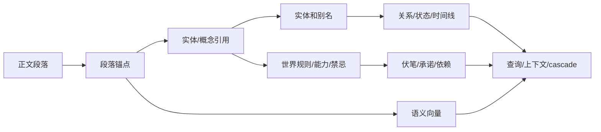
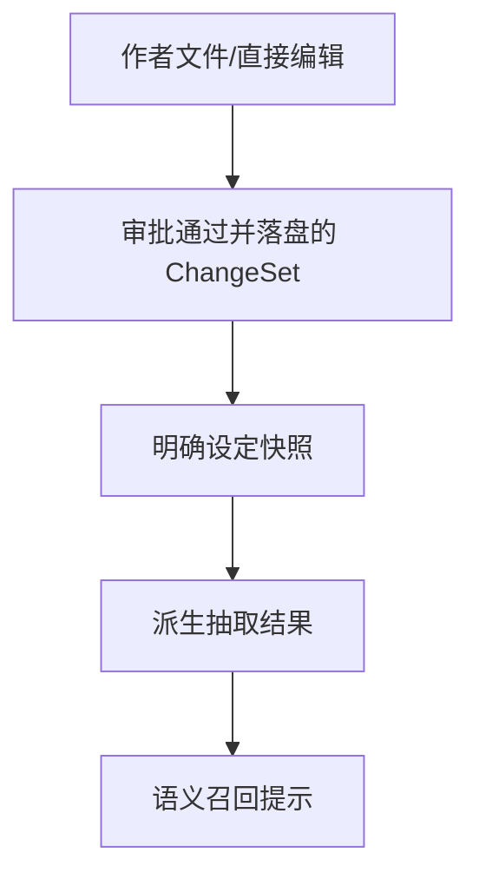
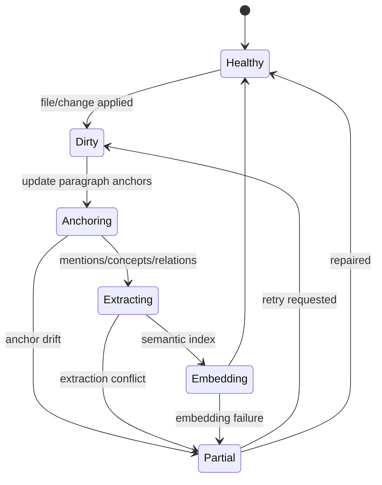

# S06 · Knowledge Graph

这篇解释系统如何把小说正文和设定变成可查询、可引用、可用于一致性判断的知识图谱。它不是第二份小说,也不是模型总结出的“真相库”。它是从作者事实派生出来的一组索引。

## 从一段正文到可用事实

每条派生事实都应能追溯到作者文件、审批记录或段落锚点。追溯不清的内容不能作为高风险生成依据。

## 图谱里的对象

| 对象 | 回答的问题 | 典型用途 |
|---|---|---|
| entity | 谁/哪里/什么东西 | 高亮、关系、状态查询 |
| alias | 同一个对象有哪些叫法 | 召回和消歧 |
| concept | 世界规则、能力体系、禁忌、设定约束是什么 | 守则和一致性检查 |
| relation | 两个对象是什么关系 | 角色关系、阵营、敌友变化 |
| timeline | 某对象什么时候发生了什么 | 章节连续性 |
| dependency | 哪些伏笔/承诺/禁忌依赖哪些文本 | cascade 和兑现检查 |
| anchor | 事实落在哪个文件哪段 | 跳转、引用、rollback |
| embedding | 哪些段落语义相关 | 语义召回 |

对象定义的字段明细不在根层。根层只定义它们的职责和失败后果。

## 事实优先级

越上层越权威。派生抽取不能覆盖作者文件;embedding 只能提示相关段落,不能单独断言事实。

## Reindex 是维护健康度,不是重写作品

局部 reindex 优先。能保留的锚点保留,小幅编辑迁移,大幅重写或删除导致相关引用失效。

## 锚点失稳的连锁反应

| 锚点状态 | 查询 | 高亮/旁注 | 影响分析 | Agent 写作 |
|---|---|---|---|---|
| healthy | 正常返回来源 | 正常展示 | 可用 | 可作为上下文 |
| migrated | 返回新位置并记录迁移 | 正常或轻提示 | 可用但记录版本 | 可用 |
| stale | 标记低置信 | 弱化/隐藏 | 保守扩大范围 | 高风险任务需补证据 |
| missing | 不返回为可靠来源 | 不展示 | 需重建或人工确认 | 不作为关键事实 |

段落锚点是图谱可信度的地基。锚点不稳,下游必须跟着降级。

## 冲突不是自动修复信号

如果抽取发现“同一角色在同一时间既失明又正常视物”,系统不能自动改正文。它应该:

1. 保留作者文件事实。
2. 记录冲突来源和段落锚点。
3. 把冲突交给一致性报告或审批。
4. 等用户决定是否修改。

图谱的职责是发现和解释冲突,不是替作者裁决设定。

## 谁消费图谱

| 消费方 | 使用方式 | 失败时降级 |
|---|---|---|
| Context And Query | 装配事实、查询来源、语义召回 | 缺失关键事实则阻断高风险 Agent |
| Turn Orchestration | cascade 候选范围、审批冲突 | 低置信候选进入审批 |
| Creative Engine | 守则、人设、伏笔兑现 | 不展示假通过 |
| Editor Interaction | 高亮、旁注、跳转 | 弱化或隐藏过期提示 |
| Project Storage | 文件变更后触发 reindex | 作品事实保留,索引过期 |

## 事故表

| 事故 | 系统状态 | 用户可见 |
|---|---|---|
| embedding provider 不可用 | 语义召回降级 | 精确查询仍可用,语义结果不足 |
| entity 抽取冲突 | 图谱局部 partial | 冲突报告带来源 |
| 派生写入越权 | 操作阻断 | 错误提示和 trace |
| 索引健康度过低 | 高风险生成阻断或要求确认 | “当前索引不足以保证一致性” |
| 旧锚点指向删除段落 | 相关引用失效 | 跳转/高亮不可用 |

## FAQ

**Q: 图谱里的事实会不会比正文更新?**

A: 不应该。图谱派生自正文和审批后事实。它可以标记待刷新,不能超前改写事实。

**Q: embedding 找到的段落能不能直接当证据?**

A: 不能。embedding 只是召回方式;证据必须回到原文段落、设定文件或审批记录。

**Q: 为什么关系、时间线和依赖都需要?**

A: 它们回答不同问题:关系说明对象连接,时间线说明变化顺序,依赖说明改一处会影响哪些承诺和伏笔。

**Q: reindex 失败时写作要全部停止吗?**

A: 不一定。低风险讨论可继续;依赖完整一致性的写作、cascade、守则判断需要阻断或降级。

**Q: 图谱是否允许人工修正?**

A: 可以通过作者文件或明确设置/审批修正主权事实;不应直接手改派生索引来制造真相。

## Appendix

- [appendix/schema-tables](./appendix/A01-schema-tables.md) 保存知识图谱、锚点、embedding 和派生索引表结构。
- [appendix/tool-catalog](./appendix/A04-tool-catalog.md) 保存 reindex、查询和索引工具明细。
