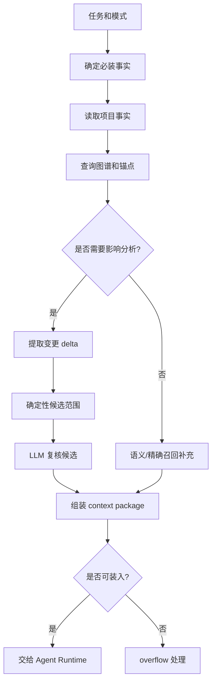
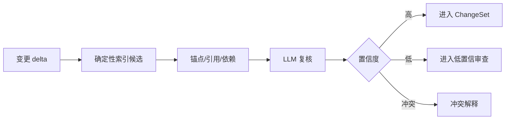
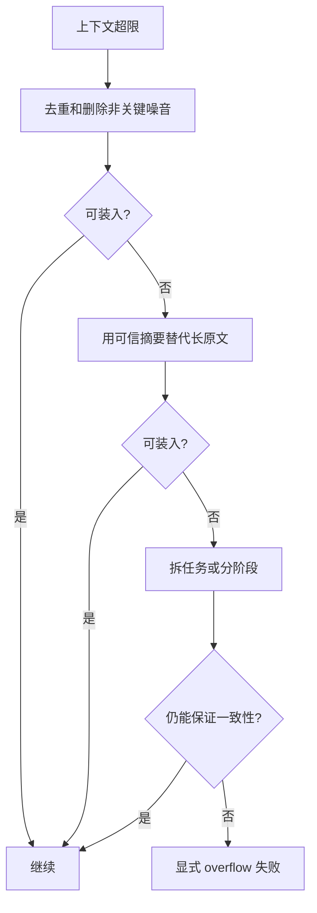

# S07 · Context And Query

这篇把上下文装配写成一份“证据包配方”。Agent 写得稳不稳,主要取决于它拿到的事实是否完整、干净、可追溯。Context And Query 的职责是给不同 Agent 准备不同证据包,并让用户查询和 Agent 查询读同一套事实。

## 上下文不是越多越好

一个好 context package 要同时满足四件事:

| 要求 | 含义 |
|---|---|
| 足够 | 不漏掉角色状态、世界规则、伏笔、当前章节目标 |
| 精准 | 不塞无关全文和过程日志 |
| 可追溯 | 每个关键事实有来源 |
| 可失败 | 放不下或缺证据时明确失败 |

静默裁剪关键事实会制造最难发现的错误:Agent 看起来正常输出,但已经在错误世界里写作。

## 证据包装配流程

LLM 可以复核候选、总结材料、解释原因,但不能独占影响范围主权。

## 优先级阶梯

| 优先级 | 内容 | 是否可裁 |
|---|---|---|
| 1 | 用户当前显式指令 | 不可裁 |
| 2 | 当前章节/选区/待修改段落 | 不可裁 |
| 3 | 项目核心事实:角色、关系、世界规则、伏笔、承诺 | 不可静默裁 |
| 4 | 已触发守则和风险 | 不可静默裁 |
| 5 | 影响范围内原文和锚点 | 只能用可信摘要替代 |
| 6 | 近期会话历史 | 可摘要/裁剪 |
| 7 | 用户经验和风格偏好 | 可按权重裁剪 |
| 8 | 语义召回补充材料 | 可裁剪 |

“可裁剪”不等于随便丢。裁剪策略和缺口要能在 Trace 中解释。

## Per-Agent 证据包

| Agent | 必装事实 | 特别禁止 |
|---|---|---|
| Writer | 本章目标、当前章节上下文、角色状态、世界规则、伏笔、最近章节、守则、用户偏好 | 过程日志、无关全文噪音 |
| Validator | 待写入 diff、相关设定、依赖、守则、来源段落 | 没有来源的模型猜测 |
| ReaderPanel | 本章文本、必要前情、读者 persona 配置 | 内部工具日志和未隔离 persona 指令 |
| Humanizer | 待改写文本、不可改事实、风格偏好、章节语境 | 可诱导改剧情的无关材料 |
| Router | 用户输入、当前模式、pending 状态、可用命令 | 大段正文全文 |
| Query Assistant | 查询词、查询类型、项目事实来源 | 无引用事实回答 |

## 影响分析的裁判链

确定性候选负责召回,LLM 负责判断“是否真受影响”和解释原因。没有来源的 LLM 扩展不能直接扩大影响范围,只能作为低置信建议进入审查。

## 用户查询和 Agent 查询同源

| 查询 | 返回必须包含 | 不能返回 |
|---|---|---|
| 某角色当前状态 | 状态、来源章节/段落、更新时间 | 无来源总结 |
| 某伏笔出现位置 | 引用列表、锚点、上下文片段 | 模糊“可能出现过” |
| 关系查询 | 关系类型、证据、时间线 | 单纯模型推断 |
| 语义搜索 | 命中段落、相似原因、置信提示 | 当作最终事实 |
| 改动影响 | 候选项、来源、置信度、解释 | “全书都可能影响”的空话 |

查不到时,系统说“当前项目事实中未找到”,而不是编一个合理答案。

Universal Search 使用本篇的 fact query 和 semantic recall 作为底层能力,但它不是本篇的替代品。Search 的入口、排序、分组、hover preview 和快捷键语义见 [M01 · Universal Search](./M01-universal-search.md)。

## Overflow 决策树

不可裁内容包括当前指令、待修改段落、角色核心状态、世界规则、已触发守则、受影响依赖和必要来源。

## FAQ

**Q: 为什么用户查询和 Agent 查询要共用事实来源?**

A: 否则用户看到的答案和 Agent 写作依据会不一致,很难解释错误来自哪里。

**Q: LLM 不能新增影响项会不会漏召回?**

A: LLM 可以提出低置信建议,但不能无来源地成为主权候选。真正影响范围要能追溯到索引、锚点、依赖或原文。

**Q: overflow 时为什么不直接截断最旧内容?**

A: 长篇一致性里“旧内容”可能正是伏笔或世界规则。裁剪必须按事实重要性,不是按时间。

**Q: 经验和风格偏好算关键事实吗?**

A: 它们重要,但优先级低于当前指令和项目事实。冲突时不能让经验覆盖事实。

**Q: 查询无结果时能让模型推断吗?**

A: 可以给“推测建议”但必须标明非项目事实;不能当成事实答案或写作依据。

## Appendix

- [appendix/tool-catalog](./appendix/A04-tool-catalog.md) 保存 analyzeImpact、assembleContext、queryFacts 等工具参数。
- [appendix/json-schemas](./appendix/A02-json-schemas.md) 保存 context package、impact result 和 query result schema。
