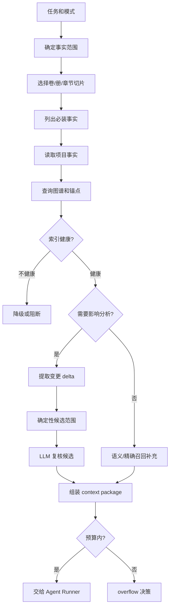
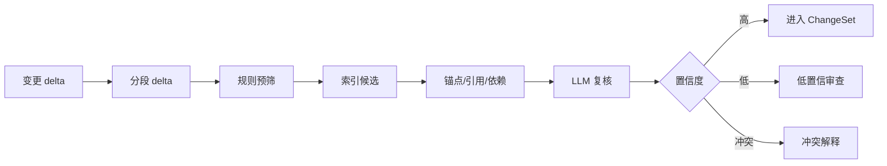
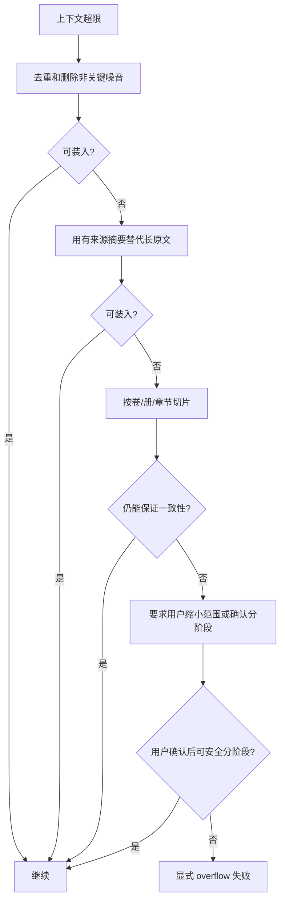

# S07 · Context Management

这篇把上下文管理写成一套“证据包供应链”。它负责把本次任务真正需要的项目事实、原文、锚点、用户经验和缺口说明组装成 context package,交给 [S03 · Agent Runner](./S03-agent-runner.md) 使用。

Context Management 不写 prompt 模板,不决定工具权限,不评判 golden 是否通过。它只回答一件事:这次运行有没有拿齐足够、精准、可追溯且可失败的材料。

## Context package 的四个条件

| 条件 | 含义 | 失败时 |
|---|---|---|
| 足够 | 不漏掉角色状态、世界规则、伏笔、当前章节目标和已触发风险 | 返回缺口,不让 Agent 在错误世界里写作。 |
| 精准 | 不塞无关全文、过程日志和陈旧召回 | 降低噪音,必要时要求用户缩小任务。 |
| 可追溯 | 每个关键事实有来源、锚点或版本 | 无来源内容只能标为推测,不能作为事实。 |
| 可失败 | 放不下、证据冲突或索引不健康时明确失败 | 交给 S04/S05 展示 overflow 或索引降级。 |

静默裁剪关键事实会制造最难发现的错误:模型看起来正常输出,但已经在错误世界里创作。

## 证据包装配流程

LLM 可以复核候选、总结材料、解释原因,但不能独占影响范围主权。真正进入 context package 的事实必须能追溯到作者文件、审批后事实、索引、锚点或用户当前指令。

## 优先级阶梯

| 优先级 | 内容 | 是否可裁 |
|---|---|---|
| 1 | 用户当前显式指令 | 不可裁 |
| 2 | 当前章节、选区、待修改段落 | 不可裁 |
| 3 | 项目核心事实:角色、关系、世界规则、伏笔、承诺 | 不可静默裁 |
| 4 | 已触发守则、风险和阻断状态 | 不可静默裁 |
| 5 | 影响范围内原文、锚点和依赖 | 只能用可信摘要替代 |
| 6 | 当前卷/册摘要和跨卷必装事实 | 可用受控摘要,不可丢失来源 |
| 7 | 近期会话历史 | 可摘要/裁剪 |
| 8 | 用户经验和风格偏好 | 可按权重裁剪 |
| 9 | 语义召回补充材料 | 可裁剪 |

“可裁剪”不等于随便丢。裁剪策略、替代摘要和缺口必须进入 Trace 或 context gap,让用户和 harness 能解释这次 Agent 为什么这样写。

## Long-form partition 策略

百万字长篇不能依赖“把历史全塞进 1M context”。本系统把分卷/分册/章节切片当作一等架构,不是 overflow 后的临时补丁。

| 层级 | 作用 | Context 规则 |
|---|---|---|
| project core | 全书不变或高稳定事实:世界规则、主角底层设定、金手指代价、主要关系 | 高风险写作和跨卷改动必装。 |
| volume arc | 当前卷主题、阶段目标、主要冲突、已兑现/未兑现承诺 | 当前卷写作必装,跨卷引用时装摘要和来源。 |
| book/part slice | 分册或大段剧情的局部线索、人物状态和事件链 | 影响分析命中时装入,否则用可信摘要。 |
| chapter window | 当前章节、相邻章节、待改段落和直接依赖段落 | 写作、改写和审批解释必装。 |
| recall tail | 语义召回命中的远端片段 | 作为候选证据,必须带来源和置信提示。 |

跨卷必装事实包括:角色身份和关系、不可逆事件、伏笔承诺、能力代价、世界规则、已审批的重大改动和未关闭 obligation。系统可以摘要旧卷,但摘要必须保留来源指针和摘要版本,不能变成无源“记忆”。

## Per-Agent 证据包

| Agent | 必装事实 | 特别禁止 |
|---|---|---|
| Writer | 本章目标、当前章节上下文、角色状态、世界规则、伏笔、最近章节、守则、用户偏好 | 过程日志、无关全文噪音 |
| Validator | 待写入 diff、相关设定、依赖、守则、来源段落、未关闭 obligation | 没有来源的模型猜测 |
| ReaderPanel | 本章文本、必要前情、读者 persona 配置、已触发风险 | 内部工具日志和未隔离 persona 指令 |
| Humanizer | 待改写文本、不可改事实、风格偏好、章节语境 | 可诱导改剧情的无关材料 |
| Router | 用户输入、当前模式、pending 状态、可用命令 | 大段正文全文 |
| Query Assistant | 查询词、查询类型、项目事实来源 | 无引用事实回答 |

Agent 能力、开关和角色展示归 [M13 · Agent Team Controls](./M13-agent-team-controls.md)。本篇只规定每类 Agent 的上下文材料边界。

## 影响分析裁判链

`extractSemanticDelta` 不能成为单点赌注。中长篇正文或大范围设定变化必须先分段提取 delta,再用规则预筛和索引候选找影响范围;LLM 只复核“是否真受影响”和解释原因。单次 delta 不稳定时,系统降级为分段 delta、规则预筛或人工确认,不能把一次模型判断当作全书影响真相。

没有来源的 LLM 扩展不能直接扩大影响范围,只能作为低置信建议进入审查。

## 能力成立性 gate

影响分析裁判链在真实长篇语料上通过 spike 之前,不能被实现当作已经成立的产品能力。实施前必须在 [V03](./appendix/V03-external-spikes.md) 记录三类原始证据:

| gate | 需要证明 | 不达标时 |
|---|---|---|
| 影响分析召回/精确 | 已知变更能找回应该受影响的章节、锚点、设定和伏笔,同时给出可审查的漏召回与误召回样例 | 改为分阶段人工审查,或把“全书连带改”收窄为已声明事实、显式依赖和可追踪引用范围内的候选提示 |
| 分段 delta 稳定性 | 大段设定/正文变更被切分后,语义 delta、锚点归属和依赖分类重复运行不会大幅漂移 | `extractSemanticDelta` 降级为低置信建议,必须由规则预筛、索引候选或用户确认接管 |
| cascade 成本与延迟 | 中等规模和全书级 cascade 的 token、耗时、stream 心跳、reindex 影响和用户等待可被 preflight 解释 | cascade 改为分批执行、用户 checkpoint 和可中断队列,不能承诺一次性全书处理 |

这些 gate 未通过时,Runner 仍可生成局部 proposal,但 S04/S05 必须把能力状态展示为 `needs data` 或低置信,不能把未验证能力包装成“已全书检查”。对应 golden 和 fixture 归 [V02](./appendix/V02-golden-cases.md)。

## 用户查询和 Agent 查询同源

| 查询 | 返回必须包含 | 不能返回 |
|---|---|---|
| 某角色当前状态 | 状态、来源章节/段落、更新时间 | 无来源总结 |
| 某伏笔出现位置 | 引用列表、锚点、上下文片段 | 模糊“可能出现过” |
| 关系查询 | 关系类型、证据、时间线 | 单纯模型推断 |
| 语义搜索 | 命中段落、相似原因、置信提示 | 当作最终事实 |
| 改动影响 | 候选项、来源、置信度、解释 | “全书都可能影响”的空话 |

查不到时,系统说“当前项目事实中未找到”,而不是编一个合理答案。Universal Search 的入口、排序、分组、hover preview 和快捷键语义见 [M01 · Universal Search](./M01-universal-search.md)。

## Overflow 决策树

overflow 不是模型错误,而是证据包无法满足一致性承诺。用户可见解释至少包含:超限原因、已保留的必装事实、被摘要或裁剪的材料、可选分阶段方案和不能继续的风险。

不可裁内容包括当前指令、待修改段落、角色核心状态、世界规则、已触发守则、未关闭 obligation、受影响依赖和必要来源。

## 与 prompt / harness / golden 的边界

| 事项 | 本篇负责 | 不负责 |
|---|---|---|
| context priority | 定义事实优先级和裁剪规则 | prompt 顺序和系统消息模板 |
| context gap | 说明缺哪些事实、为什么不能继续 | 决定 UI 文案或审批策略 |
| context package id | 生成可追溯输入包 | 保存完整 replay 档案 |
| context 变更验收 | 暴露差异和风险 | 判断 golden 是否阻断合入 |

Prompt 主权见 [S08](./S08-prompt-system.md),回放和 IO 记录见 [S10](./S10-llm-quality-harness.md),质量门禁见 [S11](./S11-evaluation-and-golden-regression.md)。

## FAQ

**Q: 为什么用户查询和 Agent 查询要共用事实来源?**

A: 否则用户看到的答案和 Agent 写作依据会不一致,很难解释错误来自哪里。

**Q: LLM 不能新增影响项会不会漏召回?**

A: LLM 可以提出低置信建议,但不能无来源地成为主权候选。真正影响范围要能追溯到索引、锚点、依赖或原文。

**Q: overflow 时为什么不直接截断最旧内容?**

A: 长篇一致性里“旧内容”可能正是伏笔或世界规则。裁剪必须按事实重要性、分卷边界和来源可靠性,不是按时间。

**Q: 分卷摘要会不会污染事实?**

A: 摘要是派生材料,不能覆盖作者文件和审批后事实。摘要必须带来源和版本,高风险改动命中原文时必须回查原文。

**Q: 查询无结果时能让模型推断吗?**

A: 可以给“推测建议”但必须标明非项目事实;不能当成事实答案或写作依据。

## Appendix

- [A02 · JSON Schemas](./appendix/A02-json-schemas.md) 保存 context package、impact result、query result、context gap 和 overflow envelope schema。
- [A04 · Tool Catalog](./appendix/A04-tool-catalog.md) 保存 analyzeImpact、assembleContext、queryFacts 等工具参数;工具权限和失败语义由 [S09](./S09-agent-tooling-boundary.md) 定义。
- [V01 · Test Matrix](./appendix/V01-test-matrix.md) 保存 context overflow、long-form partition、impact analysis 和 query source 的验证矩阵。
