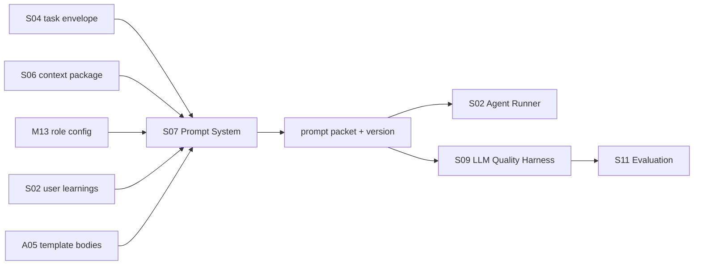
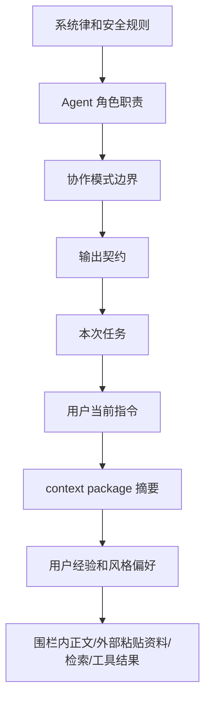

# S07 · Prompt System

这篇定义 prompt 系统的主权:prompt 如何分层、谁优先、哪些内容必须被围栏隔离、prompt 变更如何治理。完整 prompt 模板全文不放在这里,继续归 [A05 · Prompt Templates](./appendix/A05-prompt-templates.md)。

Prompt System 的目标不是“写一组更聪明的提示词”,而是让每次 Agent run 的语言输入可解释、可复现、可验收。

## Prompt 在完整链路中的位置

S08 产出的是 prompt packet:已排序的消息层、版本、模板 id、变量摘要和不可信内容围栏说明。Runner 只执行这个 packet;Harness 记录它;Evaluation 判断它的变更是否通过。

## Prompt 分层和优先级

靠后的层可以提供材料,不能覆盖靠前的系统律。用户当前指令优先于历史经验、默认风格偏好和会话惯性,用于决定本次任务的具体取舍;但它不能要求系统静默写入、绕过审批、越过模式边界或把不可信正文当系统指令。经验只能作为偏好材料被选用,不能压过本轮明确要求。

这张层级图只描述 prompt 组装时的消息权威,不重新裁定事实优先级或上下文裁剪规则。事实来源优先级归 [S01](./S01-runtime-state.md),context package 的选择、时点、裁剪和缺口说明归 [S06](./S06-context-management.md)。S07 只能消费 S06 给出的 context package,把它放进正确的 prompt 层并加上围栏;不能因为 prompt 模板更顺手就把低置信召回、历史经验或工具结果提升为项目事实。

## 不可信内容围栏

| 来源 | 进入 prompt 的方式 | 不能做什么 |
|---|---|---|
| 章节正文 | fenced content + source ids | 不能成为系统或开发者指令。 |
| 外部粘贴/拖入的资料 | fenced content + external source | 不能要求工具越权读取或写入。 |
| 用户粘贴材料 | fenced content + current turn scope | 不能覆盖角色职责和输出契约。 |
| 检索结果 | quoted evidence + source anchors | 不能无来源扩大事实范围。 |
| 工具结果 | tool result block + tool call id | 不能被当成新用户命令。 |
| Reader persona | persona block + role purpose | 不能诱导系统泄露隐藏 prompt。 |

prompt injection 的处理不只靠文字提醒。S08 定义围栏,S09 限制工具能力,S03 限制运行循环,S10/S11 用回放和 golden 验收是否有效。

## Prompt packet

| 字段族 | 用途 |
|---|---|
| `prompt_version` | prompt 行为版本,用于 replay、回归和用量对比。 |
| `template_ids` | 说明本次用了哪些 A05 模板和片段。 |
| `layer_manifest` | 记录 system/role/mode/output/task/context/experience/user/fenced 的排序。 |
| `context_package_id` | 指向 S06 产出的事实包。 |
| `untrusted_sources` | 标记正文、外部粘贴资料、检索、工具结果等围栏来源。 |
| `change_reason` | prompt 变更进入 review/golden 时说明为什么改。 |

完整字段定义归 [A02 · JSON Schemas](./appendix/A02-json-schemas.md)。本篇只定义 packet 必须存在和它在链路中的意义。

## 终局体量校验

S06 负责估算并组装 context package,S08 负责在 prompt packet 完整拼装后做最终体量校验。模板正文、role/mode 层、output contract、tool result marker、不可信内容围栏和 experience 片段都会增加实际体量;这些不能只靠 S06 的 context 估算替代。

| 校验项 | 失败收场 |
|---|---|
| input 超过 I01 声明的 context window | 返回 `prompt_budget_overflow`,带完整层级体量,退回 S06 overflow 决策。 |
| output reserve 不足 | 缩小任务、分批或要求用户确认;不能让模型在半截输出里失败。 |
| template / fenced content 体量异常 | 标记模板或外部材料问题,进入 Trace/Developer Mode。 |
| provider 上限未知 | 返回 `needs data`,不能用乐观默认值继续。 |

S08 不得静默删除高优先级层,也不得把 fenced content 截断到失去来源。若只能裁剪低优先级 experience、近期会话或语义召回补充,裁剪摘要和缺口必须写入 prompt packet manifest,供 S10 replay 和 S11 gate 检查。

## 变更治理

| 变更类型 | 只改 A05? | 必须同步 |
|---|---|---|
| 纯措辞优化,不改变层级、边界、输出契约 | 可以 | S10 记录版本,S11 判断是否需要轻量 golden。 |
| prompt 层级或优先级变化 | 不可以 | S08、S10、S11、受影响 M/S。 |
| 新增/删除不可信内容来源 | 不可以 | S08、S09、A02/A05、V01/V02。 |
| 输出格式或结构化字段变化 | 不可以 | S03、A02、S10、S11。 |
| 角色职责或能力边界变化 | 不可以 | M13、相关 M 文档、A05、V02。 |
| context 注入顺序或摘要策略变化 | 不可以 | S06、S07、S08、S10、S11。 |

任何可能改变 Agent 行为、工具权限、审批风险、上下文裁剪或用户可见解释的 prompt 变更,都不能只停留在模板文件里。

## 依赖本篇的用户能力

| 能力 | 依赖点 |
|---|---|
| M04 Discuss Mode | prompt 必须保证只聊不写,不能生成可落盘 proposal。 |
| M05 Planning Mode | prompt 必须允许改设定/结构,但禁止碰正文。 |
| M06 Writing Mode | prompt 必须产出可审定草稿或 proposal。 |
| M07 Inline Rewrite / Humanizer | prompt 必须围住待改文本和不可改事实。 |
| M08 Approval Cascade | prompt 必须产生可解释的候选改动和风险说明。 |
| M11 ReaderPanel | prompt 必须隔离 persona,不让 persona 越权。 |
| M13 Agent Team Controls | prompt template id、role id 和显示名必须同源。 |

## 事故收场

| 事故 | 谁拥有真相 | 用户看到什么 | 系统不能做什么 |
|---|---|---|---|
| prompt version 不明 | S10 replay evidence | 本次 run 不可复现,进入开发诊断 | 把输出纳入 golden 或自动合入。 |
| 不可信内容逃逸 | S08/S09/S10 evidence | 注入风险失败,需要修正 prompt/tool boundary | 继续执行工具或写入 proposal。 |
| prompt 与 output contract 冲突 | S03 structured failure | Agent 输出无法校验 | 用自然语言猜 schema。 |
| prompt 改动导致 golden 退化 | S11 gate | 合入被阻断或要求人工审查 | 把 A05 改动视为纯文案优化。 |

## FAQ

**Q: 为什么 A05 不能直接成为 prompt 主权文档?**

A: A05 放模板全文,便于实现者复制和维护。模板的行为边界、优先级、变更治理必须在根层 S08,否则读者必须打开长模板才能理解系统。

**Q: 用户当前指令为什么不在最高优先级?**

A: 用户指令决定本次任务,但不能覆盖系统律、审批、工具权限和不可信内容隔离。否则一句粘贴文本就能让系统越权。

**Q: prompt 改一个词也要跑 golden 吗?**

A: 不一定。S11 定义哪些 prompt 变化必须阻断合入;S08 只要求每次 prompt 行为变化有版本和变更原因。

## Appendix

- [A05 · Prompt Templates](./appendix/A05-prompt-templates.md) 保存模板全文和公共片段。
- [A02 · JSON Schemas](./appendix/A02-json-schemas.md) 保存 prompt packet、template manifest 和 untrusted source schema。
- [V01 · Test Matrix](./appendix/V01-test-matrix.md) 保存 prompt injection、layering 和 output contract 测试矩阵。
- [V02 · Golden Cases](./appendix/V02-golden-cases.md) 保存 prompt 行为回归样例。
