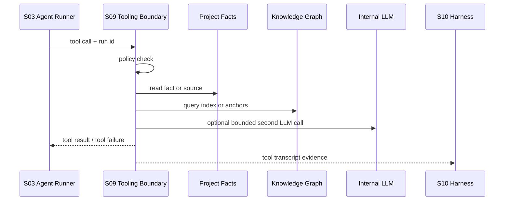

# S09 · Agent Tooling Boundary

这篇定义 Agent 能调用什么工具、工具能做什么、失败如何回到 Runner、工具内部二次 LLM 调用如何受控。工具参数全量枚举不放这里,继续归 [A04 · Tool Catalog](./appendix/A04-tool-catalog.md)。

Tooling Boundary 的核心原则是:工具帮助 Agent 看见事实、构造提议和解释风险,但工具不能绕过作者审定、不能直接写盘、不能生成隐藏的第二条写入链路。

## 工具在链路里的位置

Runner 执行 tool loop,但工具是否允许、是否可读、是否可生成 proposal、是否允许二次 LLM 调用,由 S09 定义。

## 工具分类

| 类型 | 能做什么 | 不能做什么 |
|---|---|---|
| read tools | 读取项目事实、章节、索引、会话摘要 | 读取 workspace 外文件或隐藏系统文件。 |
| query tools | 返回带来源的事实、引用、锚点、语义命中 | 用无来源模型推断替代事实。 |
| proposal tools | 构造 ChangeSet、inline suggestion、risk report | 直接写盘、标记审批通过、关闭 obligation。 |
| internal tools | 摘要、结构化提取、影响复核、格式校验 | 产生用户不可见的写入链路。 |
| platform tools | provider、filesystem、diagnostics 等接入能力 | 绕过 platform/I/R 的失败收场。 |

工具可以输出建议,不能输出已经生效的作品事实。任何可改变作品的工具结果都必须进入 S04 审定路径。

Validator、Checker 和 BeatAnalyzer 的工具边界如下:

| 名称 | 主权 | 工具职责 |
|---|---|---|
| Validator | `validator` 角色 | 复核事实、依赖、连带影响、阻断级一致性和落盘前置条件。 |
| Checker | `checker` 角色 | 解释节奏、爽点、守则和表达风险,形成审批说明。 |
| BeatAnalyzer | `checker` 内部工具 | 输出结构诊断信号,不得独立审批、独立写盘或作为 canonical role id。 |

Validator 输出的阻断级结论必须带 source refs、检查范围、failure envelope 和可解决条件。Checker/BeatAnalyzer 输出的叙事风险必须带证据片段和置信状态;证据不足时返回 partial 或 needs-data,不能让 Runner 当成成功通过。

## 工具结果信封

每个工具结果都必须带有:

| 字段族 | 作用 |
|---|---|
| `tool_call_id` | 绑定本次 Runner step,防止被当成新用户指令。 |
| `tool_name` / `tool_version` | 支持 replay 和回归定位。 |
| `source_refs` | 指向文件、段落、事实、索引或 provider 证据。 |
| `permission_class` | read/query/proposal/internal/platform。 |
| `result_status` | success/partial/failure。 |
| `failure_kind` | policy denied、source missing、provider failed、schema failed 等。 |
| `user_visible_summary` | 工具失败或降级时可被 Trace/Recap 使用的解释。 |

完整 schema 归 A02/A04。S09 只规定工具结果不能是裸字符串,也不能把失败藏进自然语言。

## 工具幂等与缓存声明

每个工具必须声明幂等性和缓存资格,供 S03 在同一 run 内决定是否复用结果。S09 只定义工具边界;缓存生命周期、step 记录和 retry 语义由 S03 执行。

| 声明 | 含义 |
|---|---|
| `pure_read` | 只读且由 source_refs/fingerprint 完整约束;同一 run 内可缓存。 |
| `derived_read` | 依赖索引、摘要或二次 LLM 的派生结果;只有 freshness marker、prompt/model profile 和 source_refs 未变时可缓存。 |
| `proposal_builder` | 生成 ChangeSet、inline suggestion 或 risk report;可复用为解释证据,但进入审批前必须重新校验 precondition。 |
| `platform_side_effect` | 触发 provider、filesystem、diagnostics、backup、restore 等外部状态;不得用缓存结果替代执行或安全检查。 |

缓存命中返回的仍是工具结果信封,并且必须标明 reused source、原始 tool_call_id 和用户可见摘要。工具不能自行隐藏缓存、绕过 S10 transcript,也不能把 stale 或 partial 结果升级成 fresh success。

## 工具取消与超时

每个工具必须声明 cancelability。S03 收到 stop signal 后按这里的声明等待、取消或交给 S04 manual recovery。

| cancelability | 适用 | stop 后收场 |
|---|---|---|
| immediate | 只读查询、可中断分析、未提交外部 side effect 的二次 LLM | 立即停止,返回 stopped tool result。 |
| safe-point | 文件扫描、reindex 批次、批量 embedding、诊断导出预览 | 到下一个安全点停止,返回已完成范围和未完成范围。 |
| non-cancellable | provider in-flight、外部系统不可撤销请求、已开始写入的 platform 操作 | 标记 waiting/unknown,超时后进入 interrupted 或 manual recovery。 |

工具超时必须区分 `tool_timeout`、`provider_timeout`、`host_watchdog_timeout` 和 `user_cancelled`。只有可证明 transient 的超时才进入 retry budget;不可取消工具的未知状态不能被包装成成功或普通失败,必须让 S04/S05 展示“需要决定”或“等待安全收场”。

## 二次 LLM 调用边界

工具内部允许使用模型做摘要、候选复核或格式化,但必须满足四条约束:

| 约束 | 说明 |
|---|---|
| bounded input | 输入只能来自本次 tool call 的显式材料,不能自行扩大上下文。 |
| declared purpose | 工具必须声明二次 LLM 用途:summary、delta、judge、format。 |
| structured output | 输出需要 schema 或明确 failure,不能返回自由发挥结论。 |
| replay evidence | 输入摘要、prompt version、model profile、输出和失败必须进入 S10。 |

二次 LLM 不能调用写入工具,不能创建新的 approval chain,不能把低置信判断升级成高置信事实。

## 失败如何收场

| 事故 | 真相归谁 | 系统能做 | 系统不能做 |
|---|---|---|---|
| 工具越权 | S09 policy | 拒绝工具调用,记录 policy failure | 让模型换一种话术继续越权。 |
| 来源缺失 | S01/S06/S07 | 返回 source missing,提示索引或文件缺口 | 编一个无来源事实。 |
| 工具 partial | tool transcript | 标记 partial,让 S04/S05 展示降级 | 当成完整成功继续审批。 |
| 二次 LLM 失败 | S10 replay evidence | 返回 bounded failure | 隐藏失败并输出模糊摘要。 |
| proposal tool 输出可疑 | S04/S11 | 进入低置信审查或阻断 gate | 直接落盘。 |

## 与其他 S 层的边界

| 文档 | 关系 |
|---|---|
| S03 Agent Runner | 执行 tool loop,但不定义工具权限。 |
| S04 Turn Orchestration | 接收 proposal/failure,决定审批、取消和 recap。 |
| S07 Context Management | 定义 context 和查询事实边界,通过工具参数实现。 |
| S08 Prompt System | 把工具结果作为不可信/低优先级输入围栏。 |
| S10 LLM Quality Harness | 记录工具 transcript 和二次 LLM 调用。 |
| S11 Evaluation | 定义工具权限/失败语义变更的回归门禁。 |
| S14 Editor And Interaction | 消费查询、命令和批阅工具结果,不拥有工具权限。 |

## 依赖本篇的用户能力

| 能力 | 依赖点 |
|---|---|
| M01 Universal Search | 查询工具必须返回来源、分组和降级状态。 |
| M03 Fact Query | 事实查询不能输出无来源结论。 |
| M06 Writing Mode | 写作工具只能生成草稿/proposal。 |
| M08 Approval Cascade | 影响分析和 ChangeSet 工具不能直接审批。 |
| M09 Trace Observability | Trace 需要工具结果信封和失败摘要。 |
| M14 Settings / Developer Mode | Developer Mode 展示工具 transcript,普通用户只看摘要。 |

## FAQ

**Q: 为什么工具不能直接写盘,即使用户已经授权了 Agent?**

A: 用户授权的是一批具体变更进入审定,不是授权工具绕过审定。写盘主权在 S01/S04。

**Q: 工具结果为什么也算不可信内容?**

A: 工具结果可能来自正文、导入资料、外部 provider 或二次 LLM。它必须带来源和权限,不能自动升级成系统指令。

**Q: 二次 LLM 工具是不是隐藏 Agent?**

A: 如果没有边界和记录,就是隐藏 Agent。本篇要求它有 bounded input、declared purpose、structured output 和 replay evidence。

## Appendix

- [A04 · Tool Catalog](./appendix/A04-tool-catalog.md) 保存工具参数、命令和快捷键明细。
- [A02 · JSON Schemas](./appendix/A02-json-schemas.md) 保存 tool result envelope、tool failure 和 proposal schema。
- [A03 · Event Catalog](./appendix/A03-event-catalog.md) 保存 tool call、tool result、tool failure 和 trace 事件字段。
- [V01 · Test Matrix](./appendix/V01-test-matrix.md) 保存工具权限、来源、失败和二次 LLM 调用测试。
