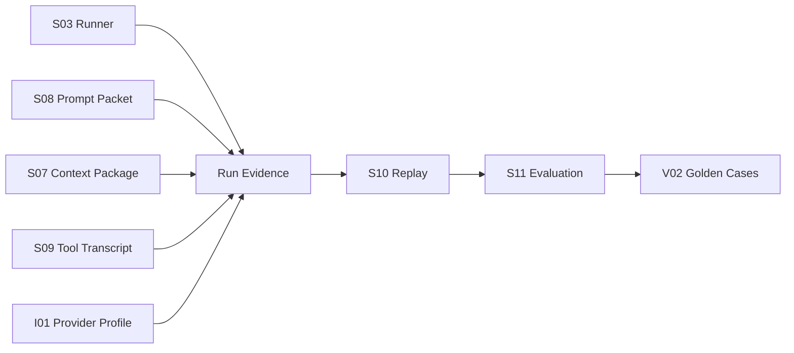
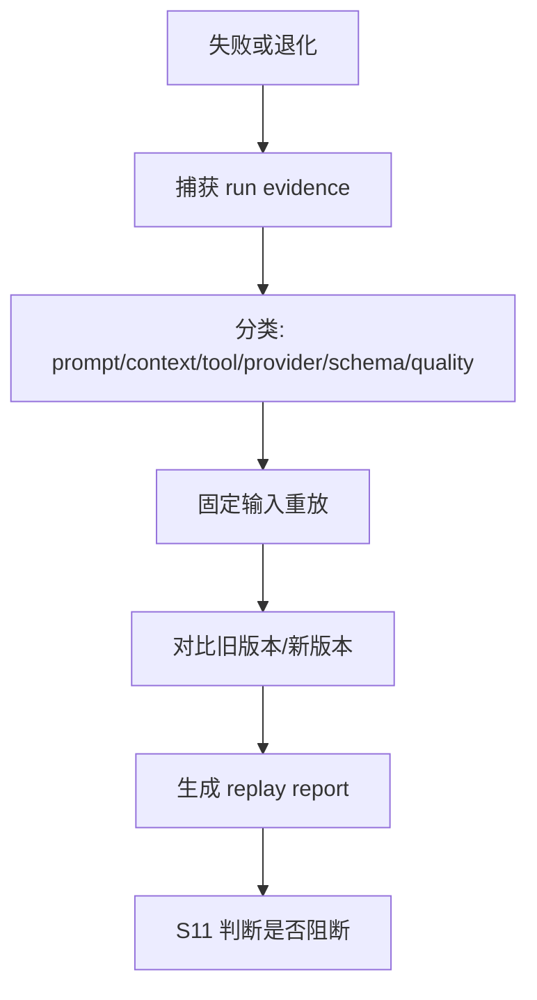

# S10 · LLM Quality Harness

这篇定义 LLM quality harness:它如何运行真实/模拟任务、记录输入输出、复现失败、为质量门禁提供证据。Harness 是实验室和记录仪,不是质量标准本身;哪些结果通过、阻断或需要人工审查,由 [S11 · Evaluation And Golden Regression](./S11-evaluation-and-golden-regression.md) 定义。

## Harness 在链路中的位置

一次 Agent run 如果不能被 harness 解释,就不能作为 prompt/context/tool 改动的质量证据。

## 可复现输入输出包

Harness 记录的是可复现 run 的最小证据包,不是全量隐私日志。

| 证据 | 必须包含 |
|---|---|
| task envelope | turn id、role id、mode、output contract、用户意图摘要。 |
| prompt packet | prompt version、template ids、layer manifest、不可信来源摘要。 |
| context package | context package id、事实来源、裁剪/摘要/overflow 说明。 |
| tool transcript | tool call id、tool name、参数摘要、source refs、结果或失败。 |
| model profile | provider、model family、能力开关、结构化输出方式、流式方式。 |
| runner steps | model calls、tool calls、retry、stop/cancel、final status。 |
| output | answer/report/review/proposal/failure 的结构化结果。 |
| judgment hooks | S11 所需指标、人工注释、golden case id。 |

敏感正文和用户资料默认只保存引用、摘要或测试 fixture;需要保存全文时必须进入 Developer Mode 或测试 fixture 明确授权。

## 真实任务与模拟任务

| 类型 | 用途 | 限制 |
|---|---|---|
| real task replay | 复现用户真实失败、回归线上行为、定位 prompt/context/tool 问题 | 默认脱敏;不能把私有全文提交到共享 golden。 |
| simulated task | 稳定测试注入、边界条件、prompt injection、工具失败 | 必须标明是 fixture,不能伪装成真实作品。 |
| synthetic stress | 长上下文、overflow、分卷、索引降级和 retry budget 压测 | 只能证明技术边界,不能证明创作品质。 |
| golden task | 由 S11 管理的回归样例 | 期望和门禁不在 S10 定义。 |

真实任务帮助定位,模拟任务保证可重复,golden task 才能阻断合入。

## Failure replay 剧本

以下失败必须可回放:

| 失败 | Harness 需要保留什么 |
|---|---|
| JSON/schema failure | 原始输出摘要、schema、retry errors、最终 failure。 |
| tool failure | tool call id、policy、source refs、failure kind。 |
| context overflow | context priority、裁剪/摘要记录、用户可见 overflow 说明。 |
| prompt injection | 不可信来源、围栏位置、模型越权输出。 |
| low-source hallucination | 输出事实、缺失来源、query/tool transcript。 |
| second LLM failure | 工具内二次调用输入摘要、purpose、schema、failure。 |
| doom-loop | retry attempts、原因、预算、停止点。 |

## Harness 不做什么

| 不做 | 原因 |
|---|---|
| 不替代 S11 判断质量是否通过 | Harness 只提供证据和可复现执行。 |
| 不保存无限日志 | 隐私和成本必须受控。 |
| 不把真实用户作品自动加入 golden | golden 需要脱敏、授权和稳定期望。 |
| 不允许缺 evidence 的成功结论 | 无证据的成功不能成为回归依据。 |
| 不直接改 prompt/context/tool | 它只报告差异和失败。 |

## 依赖本篇的变更

以下改动必须让 harness 能记录和重放:

| 改动 | 最小证据 |
|---|---|
| runner loop / retry | step、retry、stop condition、failure envelope。 |
| context priority / overflow | context package id、裁剪/摘要/缺口说明。 |
| prompt template / layering | prompt version、template ids、layer manifest。 |
| tool permission / result schema | tool policy id、tool transcript、failure kind。 |
| provider route / structured output | model profile、response mode、provider failure。 |
| creative/reader/humanizer quality | input fixture、expected signals、output report。 |

## FAQ

**Q: Harness 是不是测试框架?**

A: 它是 LLM run 的记录和回放契约。具体测试矩阵、命令和用例组织归 V01;质量门禁归 S11。

**Q: 为什么不直接把所有 run 全量存下来?**

A: 用户作品和 prompt 可能包含敏感内容。Harness 保存可复现最小证据,需要全文时必须显式进入测试 fixture 或 Developer Mode。

**Q: 没有真实模型也能跑 harness 吗?**

A: 可以跑模拟任务和 fixture replay,但 provider 能力、token 用量和真实模型退化仍需要 V03 或真实 run 证据。

## Appendix

- [A02 · JSON Schemas](./appendix/A02-json-schemas.md) 保存 run evidence、replay report 和 judgment hook schema。
- [A03 · Event Catalog](./appendix/A03-event-catalog.md) 保存 harness capture、replay、comparison 事件。
- [V01 · Test Matrix](./appendix/V01-test-matrix.md) 保存 harness 测试矩阵和命令归口。
- [V02 · Golden Cases](./appendix/V02-golden-cases.md) 保存可复用 golden case 明细。
- [V03 · External Spikes](./appendix/V03-external-spikes.md) 保存 provider、SDK 和 native 行为实查证据。
