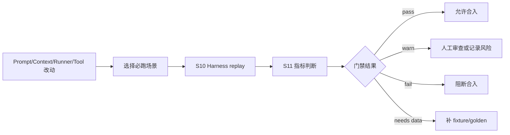

# S11 · Evaluation And Golden Regression

这篇定义 LLM 质量门禁:哪些 prompt/context/runner/tool/quality 改动必须跑 golden,哪些指标会阻断合入,失败后如何收场。Golden case 明细继续归 [V02 · Golden Cases](./appendix/V02-golden-cases.md),测试矩阵和命令归 [V01 · Test Matrix](./appendix/V01-test-matrix.md)。

S11 不追求给小说打总分。它只判断系统契约有没有退化:结构是否合法、来源是否完整、边界是否守住、风险是否被正确解释。

## Gate 在链路中的位置

S10 负责跑和记录,S11 负责判断和处置。

## 哪些改动必须跑 golden

| 改动 | 必跑原因 |
|---|---|
| prompt 层级、模板、角色职责或输出契约变化 | 可能改变 Agent 行为和越权概率。 |
| context 优先级、裁剪、摘要、overflow 策略变化 | 可能漏装关键事实或制造幻觉。 |
| tool 权限、工具结果 schema、二次 LLM 调用变化 | 可能绕过审批或吞掉工具失败。 |
| runner loop、retry、stop/cancel、structured output 变化 | 可能造成 doom-loop、坏 JSON 继续编排或取消失效。 |
| Creative Engine、ReaderPanel、Humanizer 风险阈值变化 | 可能误阻断、漏阻断或改变用户决策依据。 |
| provider 或结构化输出能力路线变化 | 可能影响所有 Agent run 的可靠性。 |

纯文案调整可以走轻量检查,但只要行为可能变化,必须进入 S10 replay 和 S11 gate。

## 指标层级

| 层级 | 通过条件 | 失败处置 |
|---|---|---|
| structure | 输出满足 schema,关键字段完整,失败有 failure envelope | 阻断。 |
| source fidelity | 事实、引用、风险和影响范围有来源或明确标注推测 | 阻断或降级为人工审查。 |
| boundary safety | 不越过模式、角色、工具、审批和写入边界 | 阻断。 |
| context discipline | 没有静默裁关键事实,overflow/摘要可解释 | 阻断或补 fixture。 |
| creative risk signal | 守则、ReaderPanel、Humanizer 风险与证据一致 | 退化时人工审查,严重漏报阻断。 |
| user-visible explanation | 失败、风险、低置信和降级能被用户理解 | warn 或阻断,取决于是否影响写入。 |

质量门禁不是“模型输出更好看”。只要系统边界、安全、来源或失败语义退化,即使文字更流畅也不能通过。

## 判定机制与 re-baseline

每个 gate 指标必须声明判定方式:

| 指标 | 判定方式 |
|---|---|
| structure | schema 校验、必填字段、failure envelope 和反序列化测试。 |
| source fidelity | 来源锚点覆盖率、无来源事实计数、推测标记是否存在。 |
| boundary safety | 模式/工具/审批越权样例的红线断言。 |
| context discipline | 必装事实是否保留、overflow envelope 是否解释裁剪。 |
| creative risk signal | fixture 中已知风险是否命中、误报样例是否被标为低置信或可忽略。 |
| user-visible explanation | 失败/降级文案是否说明可采取动作和责任边界。 |

Golden re-baseline 只允许在三种情况下发生:产品契约明确改变、provider/model 行为升级后旧输出不可比、用户误报/漏报 calibration 样例证明旧期望不合理。Re-baseline 必须记录旧期望、新期望、接受理由、关联 spec 和人工审查人;不能因为当前输出“看起来也行”就更新 golden。

阻断合入需要执行载体。实现阶段必须提供一个本地 gate 命令或等价 CI step,输出 pass/warn/fail/needs data 和失败清单;没有命令前,对应能力只能标为 `needs data`,不能宣称质量门禁已自动运转。

## Golden case 分组

| 分组 | 覆盖 |
|---|---|
| runner contracts | structured output、retry、tool loop、cancel/stop。 |
| prompt safety | prompt injection、persona 隔离、不可信内容围栏。 |
| context fidelity | 必装事实、long-form partition、overflow、query source。 |
| tooling boundary | tool permission、tool failure、second LLM boundary。 |
| approval safety | ChangeSet dependency、residual obligation、writing-blocked。 |
| creative quality | 五大守则、ReaderPanel、Humanizer 越权。 |
| platform spikes | provider、SDK、native binding、watcher 行为证据。 |

每个分组的样例、输入和预期输出在 V02/V03 中维护。本篇只定义为什么这些分组会成为门禁。

## 门禁结果

| 结果 | 含义 | 后续动作 |
|---|---|---|
| pass | 必跑场景通过,无新增阻断风险 | 可合入,记录版本。 |
| warn | 用户解释、成本或轻微质量指标退化,不影响主权边界 | 需要人工记录接受理由。 |
| fail | schema、来源、边界、审批、安全或关键质量退化 | 阻断合入。 |
| needs data | 没有足够 fixture/golden 判断 | 先补 V02/V03,不能凭主观判断通过。 |

任何 fail 都必须能追溯到 S10 replay report。无法复现的失败先归 S10/Harness 补证据,再回到 S11 判断。

## 与 TODO / implementation 的关系

实施前验证项不应该漂在 TODO 里。只要一个风险已有主权文档和验证口径,它就进入 V01/V03:

| 风险 | 归口 |
|---|---|
| DeepSeek cache control / provider 行为 | V03 原始 spike + I01/S08/S10/S11。 |
| 1M context token 成本 | V03/V01 + S07/S10/S11。 |
| AI SDK stopWhen/tool marker/onStepFinish | V03/V01 + S03/S10/S11。 |
| watcher/native binding/desktop shell 事实 | V03 + platform/I/R。 |
| LLM golden/test strategy | S10/S11 + V01/V02。 |

TODO 只保留没有主权文档、没有验证入口、或需要用户重新裁决的开放问题。

## 依赖本篇的用户能力

| 能力 | 门禁关注 |
|---|---|
| M06 Writing Mode | 草稿结构、事实来源、审批前不落盘。 |
| M07 Inline Rewrite / Humanizer | 只改表达、不改事实、差异解释。 |
| M08 Approval Cascade | dependency group、residual obligation、阻断级一致性。 |
| M09 Trace Observability | 过程证据足以解释失败和降级。 |
| M11 ReaderPanel | 不打总分,风险和证据一致。 |
| M13 Agent Team Controls | role id、开关、prompt 名称和成本归因一致。 |

## FAQ

**Q: Golden 是不是会固定创作风格,让输出僵化?**

A: Golden 固定的是系统契约和风险行为,不是要求每次生成相同句子。创作类 golden 看结构、来源、边界和风险信号,不按字面全文比对。

**Q: 没有 golden 的新能力能不能合入?**

A: 能,但必须先在 V01 定义最低验证矩阵;一旦能力影响 prompt/context/tool/审批/写入,就要补最小 golden 或明确人工审查口径。

**Q: 为什么 warn 也要记录?**

A: LLM 质量会渐进退化。warn 记录接受理由,后续同类退化叠加时才能追溯。

## Appendix

- [V01 · Test Matrix](./appendix/V01-test-matrix.md) 保存必跑测试矩阵、命令和覆盖范围。
- [V02 · Golden Cases](./appendix/V02-golden-cases.md) 保存 golden case 明细、输入、期望和失败样例。
- [V03 · External Spikes](./appendix/V03-external-spikes.md) 保存 provider、SDK、native、watcher 和 desktop shell 实查证据。
- [A02 · JSON Schemas](./appendix/A02-json-schemas.md) 保存 evaluation result、gate decision 和 golden manifest schema。
