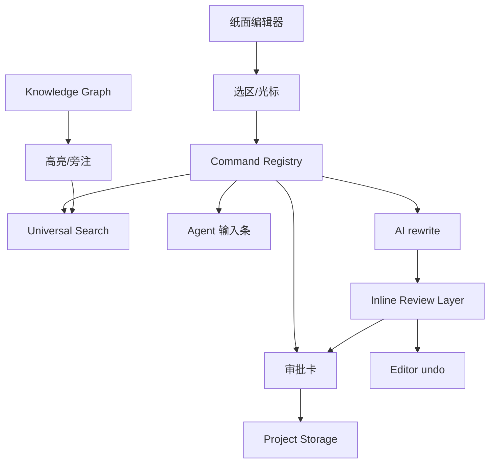
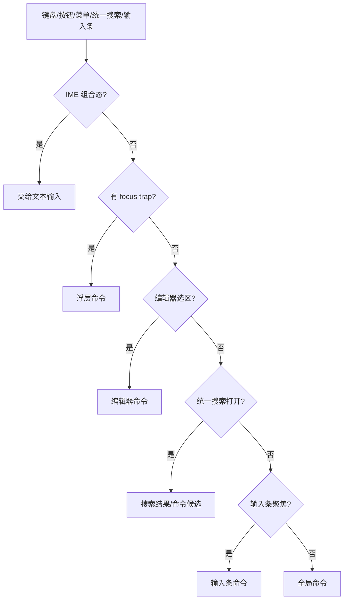
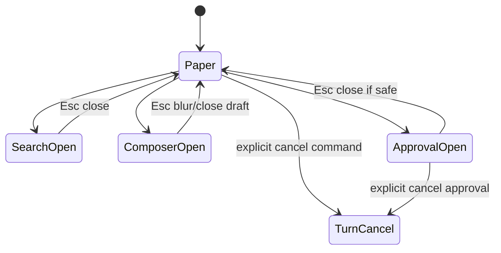

# S13 · Editor And Interaction

这篇把编辑器写成“命令路由面”。正文纸面是主角,高亮、批阅层、旁注、统一搜索、输入条、审批卡和快捷键都只是围绕纸面工作的入口。它们不能抢焦点,不能制造不可撤销的 AI 替换,也不能把派生提示伪装成正文事实。

## 交互表面的地图

所有入口最终都应该落到命令系统或 turn orchestration,而不是各自直接操作正文。

## 正文事实边界

| 在编辑器里看到的东西 | 是否正文事实 | 说明 |
|---|---|---|
| 用户直接输入的正文 | 是 | 保存后进入项目文件 |
| AI inline review | 否,直到接受 | 近文批注,接受后进入 editor undo |
| AI 改写 proposal | 否,直到审批接受 | 跨文档/事实/剧情/设定变化进入 ChangeSet |
| 实体高亮 | 否 | 来自派生索引 |
| 旁注 | 否 | 解释来源或风险 |
| violation marker | 否 | 风险提示 |
| 统一搜索内事实答案 | 否 | 带来源的事实展示 |

编辑器可以展示很多层信息,但只有用户输入、inline review 接受后的替换和审批后落盘的内容改变作品事实。Inline review 接受后的替换先进入编辑器本地 undo bridge:在保存或 light apply 提交前,它仍然像一次本地编辑,可以用普通编辑器 undo 撤掉。只要该替换已经被保存并入账为 light apply,它就不再允许通过普通 undo 改写旧历史。

## 命令解析顺序

快捷键不是全局暴力监听。当前焦点上下文拥有优先权。

## 快捷键优先级矩阵

编辑器是写作主界面,快捷键必须先尊重输入,再谈全局命令。桌面壳只负责登记系统入口;是否执行由当前焦点、IME、浮层和命令危险等级共同裁决。

| 当前上下文 | 可处理的命令 | 禁止触发 | 失败收场 |
|---|---|---|---|
| IME 组合态 | 文本输入、候选词选择 | 统一搜索、Agent 输入条、审批接受 | 不触发命令,不清空组合态 |
| 正文编辑焦点 | 编辑器文本命令、inline review 局部操作 | 全局写入命令抢占选区 | 保留选区和输入状态,提示可从统一搜索或输入条执行 |
| Agent 输入条聚焦 | 输入条编辑、提交当前指令 | 统一搜索抢走文本、危险命令直接落盘 | 命令禁用或要求先 blur |
| 审批卡 / modal focus trap | 卡片声明的导航、选择、确认/拒绝 | 背景编辑、全局写入、静默批量接受 | 保持 focus trap,只显示不可用原因 |
| 只读状态 | 搜索、打开、查看 Trace/Recap | 写正文、应用审批、受限设置 | 提示当前项目状态不可写或需先处理阻断项 |
| pending approval 存在 | 打开/跳转审批、只读搜索讨论 | 新建写入 turn、跨文档改写、直接全部同意 | 提示先处理审批 |

无法判断当前焦点、IME 状态或项目可写状态时,默认按只读处理。任何快捷键都不能在不展示审批卡的情况下接受 ChangeSet,也不能在受限操作确认前执行破坏性动作。

## 命令登记表

每个命令都必须声明:

| 字段 | 为什么需要 |
|---|---|
| 可用上下文 | 防止命令在错误界面触发 |
| 焦点需求 | 防止抢输入 |
| 是否危险 | 触发确认或审批 |
| 是否调用 Agent | 进入 turn 生命周期 |
| 是否修改正文 | 进入 inline review、undo 或审批路径 |
| 失败提示 | 用户知道如何恢复 |

完整命令清单归 appendix;根层只定义命令治理规则。

## 统一搜索内事实答案不是输入条

| 能力 | 统一搜索(Universal Search) | 搜索内事实答案 | Agent 输入条 |
|---|---|---|---|
| 目标 | 找任何项目对象并导航,查看事实答案和来源 | 查项目事实 | 发起讨论/规划/写作 |
| 快捷键 | `Shift+Shift` | 无独立入口,由 Search/选区路由进入 | `Cmd+L` |
| 输入来源 | 名称、别名、阵营、概念、章节片段、事实问题 | Search 输入、选区、高亮、结果详情 | 用户自然语言指令 |
| 输出 | 分组结果 + hover preview + 打开动作 + 事实答案 | 带来源的事实答案 | 回答、报告、proposal |
| 写入能力 | 无;危险动作转审批 | 无 | 可能触发审批路径 |
| pending approval 时 | 可查可打开,危险动作禁用 | 可查 | 只读讨论可继续;会写入或切模式的输入需阻止并提示先处理审批 |

作者侧顶层搜索入口只有 Universal Search。事实答案只是 Search 内的结果详情/嵌入面板,不得再通过 `Cmd+E` 或独立模态形成第二个搜索入口。它与 Agent 输入条必须继续分开,避免用户分不清“我是在查项目事实”还是“我在让 Agent 做事”。

待审期间的交互口径以 [S03](./S03-turn-orchestration.md) 为准:落盘类锁定、只读放行。编辑器必须禁用会写入正文、接受跨文档改写、生成新 ChangeSet、改变模式权限或影响审批前置条件的入口;查询、搜索、打开文档、Trace 和只读讨论仍可用,并在必要时标注“基于当前待审状态”。

Universal Search 的完整设计见 [M01 · Universal Search](./M01-universal-search.md)。本篇只保留它在编辑器焦点和命令路由中的位置。

## Esc 和取消

Esc 先关闭最上层界面,不默认取消正在运行的 turn。取消 turn 需要明确命令,并进入 [S03](./S03-turn-orchestration.md) 的统一取消语义。

取消入口不能自己决定“停止、放弃还是撤销”。输入条、状态点、统一搜索命令候选和 Router action 都只发起取消请求;Orchestrator 根据 turn 状态生成用户可确认的 cancel plan。运行中且没有 durable change 的停止可以无确认完成,并在过程面板留下回执。

## 外部编辑和 undo

| 场景 | 处理 |
|---|---|
| 外部文件变化 | 提示重载/保留/手动合并,相关审批失效 |
| AI rewrite 替换选区 | 句内安全改写走 inline review;接受后先进入提交前 undo bridge,保存入账后转为 light apply 历史 |
| 审批落盘后撤销 | 生成反向修改 proposal,不是普通编辑器 undo |
| 已提交 light apply 后撤销 | 生成新的反向 light apply,不修改旧写入记录 |
| 高亮索引过期 | 弱化或隐藏 |
| 统一搜索事实答案失败 | 保留输入和类型 |

编辑器 undo 只解决提交前的本地文本操作。直接输入、inline accept、Humanizer 小改接受后,只要仍停留在编辑器缓冲区或未提交保存,可以走普通 undo;一旦保存成功并生成写入记录,撤销就必须走 forward-only 修正语义。审批后落盘同样属于系统变更,需要 forward-only 修正语义。

用户侧不暴露 Git 式回退。已提交 light apply 的“撤销这次小改”表现为一条新的反向 light apply,仍然重新触发保存、写入记录和 reindex;审批落盘后的“撤销这次修改”表现为一条新的反向修改提案,仍需审批;“恢复为历史内容”表现为一条恢复提案,同样向前追加。相关用户时间线见 [M17](./M17-turn-recap-and-continuation.md)。

## 批阅层范围

| 范围 | 编辑器呈现 | 操作 |
|---|---|---|
| 句内 / 小选区 | 细下划线、轻底色、删除线/新增线、近文小注 | 在文字附近接受、拒绝、重试 |
| 单文档段落级 | 段落轻标记;必要时使用当前页旁注 | 展开段落建议或接受安全项 |
| 跨文档 / 跨章节 | 当前命中位置的轻量锚点和 cascade 编号 | 跳到 Approval Cascade 对应项 |

跨文档变更不能在当前页旁注中裁决。旁注最多服务当前文档的段落级问题;跨文档只在正文中标出命中位置,完整解释、逐项选择和收场归 Approval Cascade。

## FAQ

**Q: 为什么 Esc 不直接取消 Agent?**

A: 因为 Esc 常用于关闭浮层或退出输入。取消 Agent 是危险动作,要显式触发并进入统一 cancel。

**Q: 高亮不准时怎么办?**

A: 弱化或隐藏,提示索引状态。不能把过期高亮当最新事实。

**Q: AI 改写能不能像普通输入一样进入 undo?**

A: 轻量选区改写可以,但撤销分两个阶段:提交前是普通编辑器 undo;保存入账后是新的反向 light apply。高风险或跨文件改写应走 Approval Cascade。

**Q: 统一搜索、输入条和快捷键谁是主入口?**

A: 作者侧顶层入口是 Universal Search,自然语言入口是输入条。Command Registry 是内部登记表;快捷键、按钮、菜单、统一搜索命令候选只是触发方式。

**Q: IME 为什么要特别写进 spec?**

A: 中文写作里 IME 组合态很常见。抢键会直接破坏写作体验,属于核心交互契约。

## Appendix

- [appendix/tool-catalog](./appendix/A04-tool-catalog.md) 保存命令、快捷键和查询工具明细。
- [appendix/event-catalog](./appendix/A03-event-catalog.md) 保存 UI 交互事件。
- [appendix/testing-matrix](./appendix/V01-test-matrix.md) 保存 IME、focus trap、undo 和冲突测试。
