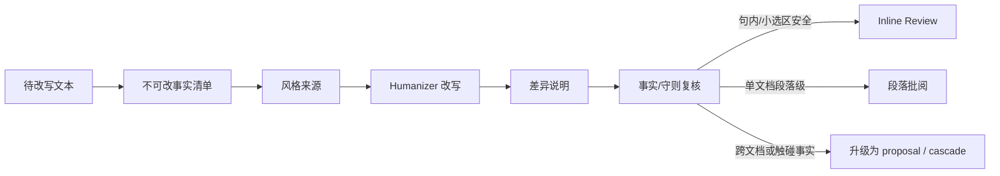
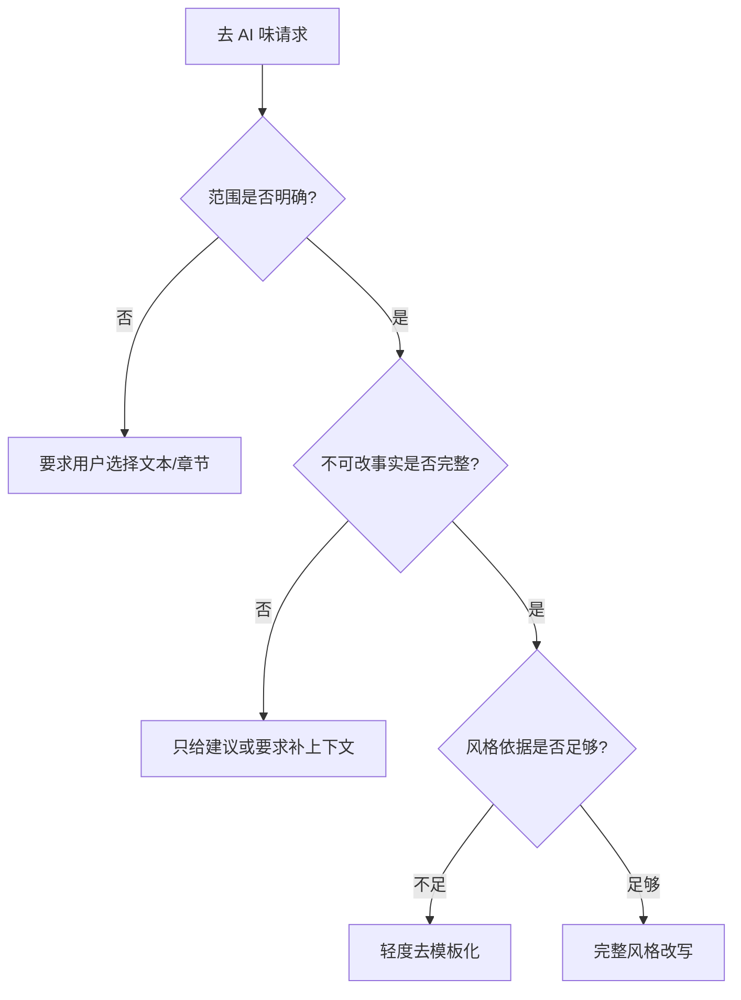
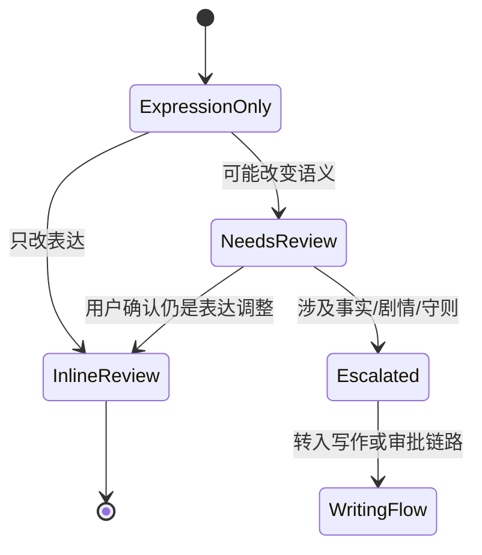

# S13 · Style And Humanizer

这篇只讲表达层。Humanizer 的使命是让文字更像作者、更像这本书、更少 AI 腔;它不是剧情医生,也不是设定编辑器。只要改写触碰事实,它就离开了自己的权限范围。

## 一条分界线

| 可以改 | 不能改 |
|---|---|
| 句式长短、停顿、节奏 | 人物做过什么 |
| 口语感、网感、叙述贴合度 | 人物关系和立场 |
| 情绪强弱、描写密度 | 能力边界和世界规则 |
| 去模板化表达 | 伏笔、承诺、章节结局 |
| 更贴近用户范文 | 守则风险结论 |

如果“更好读”的代价是剧情变了,那不是 Humanizer 成功,而是越权。

## 改写管线

Humanizer 的常见输出是 inline review,不是审批卡。只有句内或小选区、只改表达且复核安全时,它才能在文字附近给出修订痕迹和接受动作。单文档段落级建议可以进入当前页旁注;跨文档、跨章节、事实、剧情、设定或守则阻断级变化必须升级为 proposal / cascade。

## 风格来源的可信度

| 来源 | 能影响什么 | 风险 |
|---|---|---|
| 用户当前指令 | 本次表达取向 | 与旧经验冲突时当前指令优先 |
| 用户范文 | 句式、语气、节奏 | 范文不足时过拟合 |
| 历史采纳改写 | 稳定偏好 | 可能带入过时偏好 |
| Settings 风格偏好 | 默认表达规则 | 不能覆盖事实 |
| Reflector 经验 | 细粒度手感 | 需要可见、可调、可删;不能压过当前指令 |

风格是表达约束,不是事实来源。

## 改写前必须知道什么

高风险正文没有不可改事实清单时,不能自动重写。

## 差异说明必须说人话

| 差异类型 | 展示方式 |
|---|---|
| 节奏调整 | “缩短了解释句,把动作提前” |
| 情绪增强 | “把内心独白改成外显动作” |
| 口语化 | “减少书面连接词,加强对话感” |
| 描写压缩 | “删去重复景物描写” |
| 风格贴合 | “沿用你常用的短句收尾方式” |
| 风险触碰 | “这里可能改变了角色动机,需确认” |

用户需要知道改写改变了什么,而不是只看到一段“更顺”的文字。

Inline review 的说明必须贴近被标记文本。只有单文档段落级问题才允许使用旁注;跨文档问题只能在当前命中处留下 cascade 锚点,完整解释和决策进入 Approval Cascade。

## 越权判定

判定标准不是“改动大不大”,而是“是否改变读者会理解到的事实”。一句话重写得很短也可能越权;一整段润色如果只改节奏也可以是表达层。

## Humanizer 与其他层的关系

| 对方 | 关系 |
|---|---|
| Context Management | 提供不可改事实、章节语境、风格经验 |
| Creative Engine | 复核改写是否触发守则风险 |
| Turn Orchestration | 承接升级后的 proposal 或审批项 |
| Editor Interaction | 承接 inline review、近文批注、undo、diff 展示 |
| Runtime State | 提供和管理风格经验 |

## 失败收场

| 失败 | 收场 |
|---|---|
| 改写改变事实 | 作废或升级为 proposal / cascade |
| 风格依据不足 | 降级为轻度去模板化并说明 |
| 风格漂移 | 保留原文,允许调整风格后重试 |
| 输出不可解析 | 不进入正文、inline review 和审批 |
| 与当前指令冲突 | 当前指令优先 |
| 与守则冲突 | 交给 Creative Engine 风险处理 |

## FAQ

**Q: Humanizer 能不能顺手补剧情漏洞?**

A: 不能。补剧情属于创作/设定修改,要走 Writer/Validator 和审批路径。

**Q: 用户框选一段正文让它“更爽”,算不算 Humanizer?**

A: 如果只改表达算 Humanizer;如果改变事件推进、胜负结果或角色选择,就升级为写作 proposal。

**Q: 范文很少时怎么办?**

A: 标记依据不足,做轻度去模板化,不要强行拟合一个不存在的风格。

**Q: 改写能不能直接替换编辑器选区?**

A: 可以,但只限明确安全的 inline review:用户在文字附近看到修订痕迹并接受后替换,且可 editor undo。高风险、跨段或跨文档改写应进入段落批阅或 Approval Cascade。

**Q: “去 AI 味”如何验证?**

A: 看差异是否集中在表达层,并通过事实/守则复核。不是用一个抽象 AI 味分数决定。

## Appendix

- [appendix/prompt-templates](./appendix/A05-prompt-templates.md) 保存 Humanizer prompt 和风格片段。
- [appendix/json-schemas](./appendix/A02-json-schemas.md) 保存改写输出和差异 schema。
