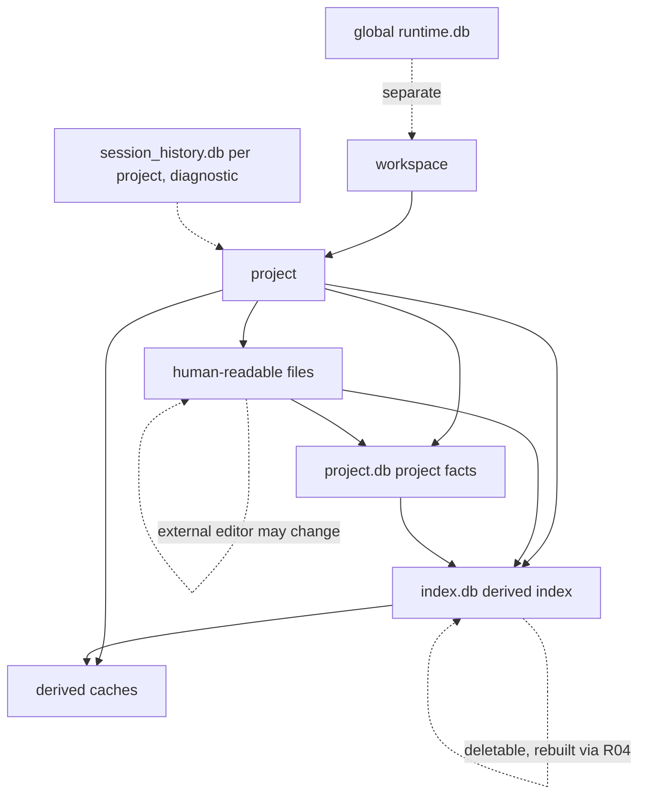
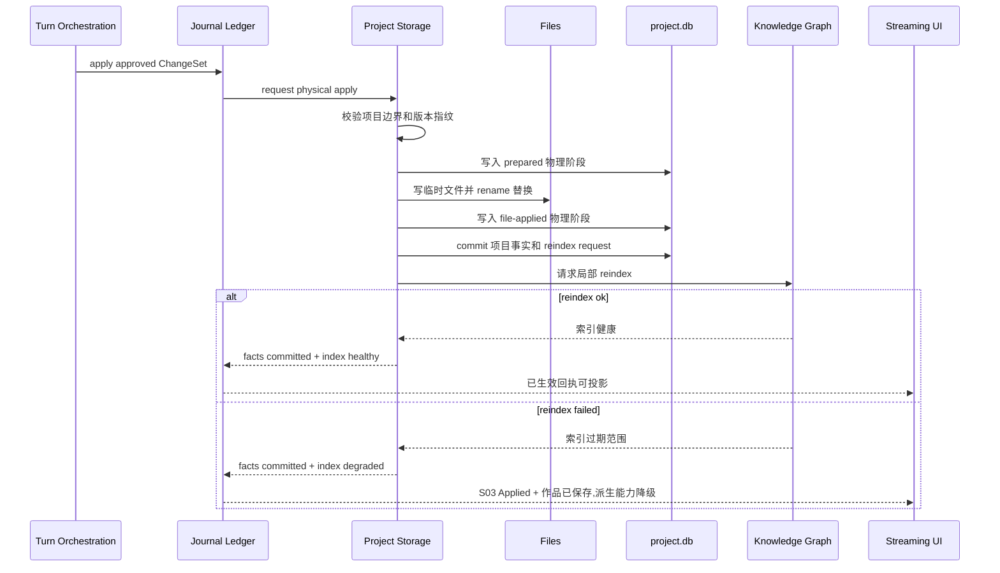
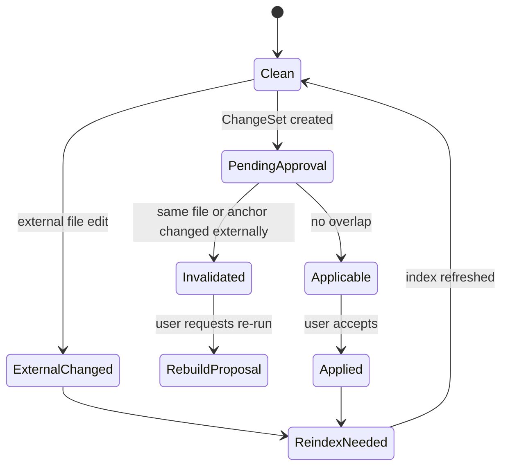

# S14 · Project Storage

这篇不是审批账本设计,而是一份“项目物理存储与落盘协议”。它解释作者文件、项目事实库和派生索引如何安全落盘,以及在外部编辑、写入失败、索引失败时存储层向上游返回哪些可信信号。

审批裁定、写入账本、light apply、恢复记录、反向修正、危险操作审计和 Recap/Activity 投影由 [S15 · 决策与写入账本](./S15-journal-and-ledger.md) 统一管理。S14 只拥有物理文件、数据库分库、fingerprint ledger、fencing token、原子替换和 reindex 请求。

## 两个开场事故

先用两个事故定义存储层。

| 事故 | 如果设计错误 | 本篇要求 |
|---|---|---|
| 作者在外部编辑器改了同一章,同时应用里还有一个待审批改写 | AI 提议被直接套到新文件上,覆盖作者刚改的内容 | 外部编辑让相关审批失效,用户重新审定 |
| 审批通过后文件写成功,索引刷新失败 | UI 显示“全部完成”,但查询和高亮还在旧事实上 | 作品事实生效,索引标记过期,下游能力显式降级 |

Project Storage 的核心价值不是“把数据存起来”,而是让每个事故都有可信的收场。

## 项目写入权

应用是单实例单窗口(见 [I05](./platform/I05-desktop-shell-contract.md)):一台机器同一时刻只有一个桌面壳窗口和一个常驻执行宿主。二次启动应用只聚焦既有窗口,可以把打开路径交给既有实例处理,但不得创建第二窗口。

存储层因此不设计“窗口写入权切换”“只读副窗口”或多窗口仲裁。当前窗口就是唯一交互入口;所有会改变作者文件、项目事实库或派生索引水位的动作,都必须从这个窗口提交给常驻执行宿主。

renderer 不能直接写项目文件或数据库,只能提交命令、展示状态和读取持久结果。任何绕过唯一窗口与执行宿主的写入,都视为外部编辑:系统不抢写、不猜 merge、不用“最后写入者获胜”,而是让命中的待审批内容失效,交回用户重新审定。

宿主崩溃后的残留写入防护仍需要一个持久写入身份。它只用于拒绝旧宿主延迟写入和启动恢复扫描,不是多窗口 lease、接管协议或权限切换机制。具体字段和恢复细节放在 appendix,本篇只保留用户可感知结论:同一项目只有一个可写入口,写入结果必须可解释。

## 物理真源与派生库

| 对象 | 落在哪个库 | 例子 | 是否作品真源 | 读者需要知道什么 |
|---|---|---|---|---|
| 作者文件 | 文件系统(Markdown) | 章节、设定、角色、大纲、项目元信息 | 是 | 可以被人直接打开、迁移、审查 |
| 项目事实库 | `project.db` | 已接受的 ChangeSet、账本记录、审批终态、obligation、文件指纹 ledger、持久 turn 状态 | 是 | 解释“这次变更何时生效”;账本语义见 S15,损坏保护见 S16 |
| 项目索引 | `index.db` | 实体、别名、概念、关系、时间线、依赖、锚点、embedding、卷摘要、搜索缓存 | 否 | 只帮助查询和生成,不能覆盖文件;整库可删,由 R04 全量重建 |
| 运行时历史 | runtime.db / session_history.db | thread、trace、tool run、用量 | 否 | 不属于项目存储主权 |

作者文件和项目事实库共同构成作品真源。派生索引是真源的目录和检索卡片,不是第二套事实。每项目把真源库和派生索引物理拆成两个数据库文件,正是为了让“项目事实库损坏”和“索引损坏”有不同的命运:前者是事故,后者只是一次重建。

## 落盘阶段和崩溃信号

所有会改变作者文件或项目事实库的动作,都必须从 S15 创建的账本入口进入 S14。S14 的职责是把一次已授权写入变成可校验的物理阶段,并把结果返回给 S15/S03。

| 阶段 | S14 写什么 | 崩溃后给上游什么信号 |
|---|---|---|
| prepared | 校验项目边界、fencing token、输入指纹、临时文件路径和恢复策略 | 若未 touching 原文件,返回可关闭的未生效写入。 |
| file-applied | 临时文件已 rename 替换,输出指纹和 write token 已知 | 启动扫描必须识别为自写结果,返回前滚项目事实的恢复信号。 |
| facts-committed | 项目事实、文件指纹、watcher 水位和 reindex request 已提交 | 允许 S15/S03 投影为事实已生效;若 reindex 失败,进入 degraded/repair,不回滚作者文件。 |

跨文件 ChangeSet 不是文件系统原子事务。S14 可以报告“部分文件已替换、项目事实尚未提交”的中间状态,但不能自行决定用户侧如何解释。S15 根据这些阶段生成恢复记录;S03 决定 turn terminal result;S04 只展示对应恢复入口。

写入阶段不是 turn 终态。S14 只向 S15/S03 返回物理阶段、已生效文件、项目事实提交状态、reindex request 和恢复建议;最终 turn 结果必须取自 [S03 · Canonical turn terminal enum](./S03-turn-orchestration.md#canonical-turn-terminal-enum)。S14 不另行定义 `success`、`done`、`abandoned` 或 `recovered` 作为 turn 终态。

## 轻量写入事务

作者直接输入、普通保存、小选区 inline accept 和 Humanizer 就地接受不需要整批审批卡,但仍然是作品事实写入。它们由 S15 建立 light apply 账本入口,再走 S14 的同一套物理落盘协议:

| 来源 | 是否生成 ChangeSet | 必须入账 |
|---|---|---|
| 作者直接编辑并保存 | 不生成审批 ChangeSet | 文件指纹校验、原子替换、watcher 水位、reindex request。 |
| inline review accept | 生成轻量 accepted edit,不进入 cascade card | 原文范围的指纹校验、提交前 undo bridge 校验、输出指纹。 |
| Humanizer 小改接受 | 生成轻量 accepted edit | diff 范围文件校验、不可改事实校验结果引用、reindex request。 |

Light apply 与审批 apply 共用 fencing token、fingerprint ledger、物理阶段和 reindex/degraded 收场。差别只在用户交互重量:小改就地审定,大改整批审批。任何 light apply 若触及跨文件、设定、关系、伏笔、事实库治理或阻断级风险,必须由 S15/S03 升级为 ChangeSet 或 planning prerequisite,不能继续伪装成轻量保存。

Undo bridge 只存在于提交前。Inline review 或 Humanizer 小改被接受后,在保存或 light apply 提交前仍是编辑器缓冲区里的本地替换,可以被普通 editor undo 移除,也不会进入 S14 落盘。保存成功后,撤销由 S15 生成新的反向 light apply entry,再重新触发 S14 落盘和 reindex。

## 文件指纹与自写回声

每个作者源文件都有持久 fingerprint ledger,记录文件身份、内容指纹、mtime/size 辅助信息、最近一次已确认 watcher 水位、最近一次系统写入 token 和写入完成后的指纹。指纹是判断外部编辑、审批失效和离线窗口重开的基线;mtime/size 只能作为快速筛选,不能单独证明文件未变。

系统写文件时必须生成 write token。watcher 收到同一文件事件后,只有当事件能匹配当前 owner、write token、目标指纹和水位推进,才可标记为自写回声;否则按外部编辑处理。自写回声只能消除重复 reindex 和误报,不能跳过写入结果入账。

外部编辑判定遵循三条规则:

| 判定 | 存储层处理 |
|---|---|
| 指纹不同且无匹配 write token | 外部编辑,命中 pending approval 时使相关审批失效。 |
| 指纹不同但匹配当前 write token | 自写回声,推进指纹 ledger 和 watcher 水位。 |
| 指纹 ledger 缺失或不可信 | 进入 reconcile,相关索引至少标记 stale;高风险写入先阻断。 |

文件与项目事实库冲突时,作者文件优先表达当前正文事实;项目事实库负责解释审批历史、版本指纹、obligation 和 S15 账本记录。不能为了让旧审批历史看起来一致而覆盖作者文件。

## 项目事实库损坏

项目事实库损坏和派生索引损坏不是一回事。`index.db` 损坏、丢失或版本不兼容时,按 [R04](./platform/R04-index-health-and-repair.md) 重建;作者仍可写作,只是依赖索引的查询、引用和高亮能力降级。

`project.db` 损坏时,审批历史、obligation、版本指纹和 S15 账本记录可能无法从 Markdown 文件完整重建。项目事实库损坏或不可信时,进入 [S16 · File Version And Edit Safety](./S16-file-version-and-edit-safety.md) 的 protected facts ledger:作者文件仍可读,但高风险 Agent 写入、审批 apply、跨文件 cascade 和自动治理裁决必须阻断,直到系统以当前文件重建最小可验证 ledger 并完成重新校验。

两条底线不变:作者文件仍是可取用的正文事实;系统不能把派生索引重建结果伪装成丢失的审批历史或用户裁定。

## 项目拓扑

运行时会话可以引用项目,但不能成为项目事实。过程历史可以解释一次操作,但不能恢复章节正文。这个隔离让“带走项目文件”和“调试系统过程”不混在一起。

## 落盘剧本

审批通过后的写入必须像事务剧本一样走完,不能边走边宣称完成。

关键点是:落盘成功和 reindex 成功不是同一件事。作品可以已经保存,索引仍然过期;UI 必须区分这两种状态。

## 文件可以被人读,但不能被随意解释

作者文件承担迁移和审查价值,因此正文、设定和大纲要保持人类可读。系统依赖 frontmatter 或等价元信息来识别文件身份、类型、版本和派生属性。

| 情况 | 存储层处理 |
|---|---|
| frontmatter 合法 | 文件进入项目事实和索引刷新路径 |
| frontmatter 缺失但可识别 | 提示修复或进入受限识别流程 |
| frontmatter 损坏 | 阻断高风险生成,不把文件当可信事实 |
| 文件标记为派生 | 防止派生内容伪装成作者原始事实 |
| 编码/换行不一致 | 只做不改变语义的归一化 |

文件可读不等于模型可随意相信。外部粘贴或拖入的资料、用户粘贴正文和外部编辑内容仍是普通内容,不能变成系统指令。

## 外部编辑的冲突判定

系统不自动把旧 proposal 套到新文件。只要外部编辑命中同一文件、同一段落锚点或同一版本指纹,相关审批就失效。

## 失败收场表

| 失败现场 | 已生效的东西 | 用户看到 | 可重试动作 |
|---|---|---|---|
| 路径越界或 workspace 不可写 | 无 | 无法写入项目位置 | 修复路径/权限后重试 |
| 文件写失败 | 无或部分临时状态 | 审批未生效 | 从失败点重试或取消 |
| 项目事实库写失败 | S14 物理阶段决定是否 file-applied | 落盘未完成,进入恢复 | 启动扫描前滚/放弃/人工处理 |
| reindex 失败 | 作者文件已生效 | 索引过期,查询/高亮降级 | 重新索引 |
| internal recovery 快照缺失 | 已生效变更保留 | 无法自动生成反向修正 | 交由 S15 生成人工恢复记录并重新索引 |
| 外部编辑冲突 | 外部文件事实优先 | 待审批内容失效 | 重新生成 proposal |
| 项目事实库真源损坏 | 作者文件仍优先 | 进入 S16 的项目记录保护状态 | 重建最小可验证 ledger 或人工处理 |

## 与其他 spec 的握手

| 对方 | Project Storage 给它什么 | Project Storage 从它要什么 |
|---|---|---|
| [S03](./S03-turn-orchestration.md) | 落盘结果、恢复建议和冲突状态 | canonical turn terminal result、已审批 ChangeSet 和事务意图 |
| [S15](./S15-journal-and-ledger.md) | 物理阶段、文件指纹、reindex request 和恢复扫描结果 | decision/write/light apply/recovery 账本入口和投影要求 |
| [S05](./S05-knowledge-graph.md) | 文件变更范围、版本、派生写入边界 | reindex 健康度和过期范围 |
| [S06](./S06-context-management.md) | 可查询的项目事实入口 | 不要把查询结果反写文件 |
| [S13](./S13-editor-and-interaction.md) | 外部编辑、保存、冲突提示 | 用户直接编辑产生的文件变更 |
| [M14](./M14-settings.md) | workspace/project 生命周期结果 | 删除等危险操作确认 |
| [I03](./platform/I03-filesystem-and-watcher.md) | watcher cursor、外部编辑事件和崩溃防护信号 | 平台层不能绕过存储写入权 |
| [R01](./platform/R01-project-lifecycle.md) | 打开、关闭、二次启动聚焦和恢复流程 | 项目 open/close 必须尊重单窗口与 fencing 校验 |

## FAQ

**Q: 文件和数据库谁是真源?**

A: 作者可读文件和项目事实库是真源。真源记录在 `project.db`,派生索引在 `index.db`,两者物理分库;具体表的库归属在 appendix 展开。

**Q: reindex 失败为什么不回滚作品文件?**

A: 因为作者文件已经是作品事实。索引失败影响查询和辅助能力,不应自动撤销作者刚审定的内容。

**Q: 外部编辑是不是应该自动 merge?**

A: 不应该默认自动 merge。小说正文的语义改动很难安全合并,命中待审批区域时应让 proposal 失效并重新审定。

**Q: 过程历史能不能恢复项目?**

A: 不能。过程历史只解释系统做过什么;项目恢复以作者文件、项目事实库和 S15 账本记录为准。

**Q: 为什么要标记派生文件?**

A: 防止摘要、报告、缓存或重建产物被误当成作者原创事实,从而污染后续生成。

## Appendix

- [appendix/schema-tables](./appendix/A01-schema-tables.md) 保存文件、frontmatter、项目事实库、派生索引和迁移字段明细。
- [appendix/migration-notes](./appendix/A06-migration-notes.md) 保存 native binding、WAL、连接和迁移审计。
