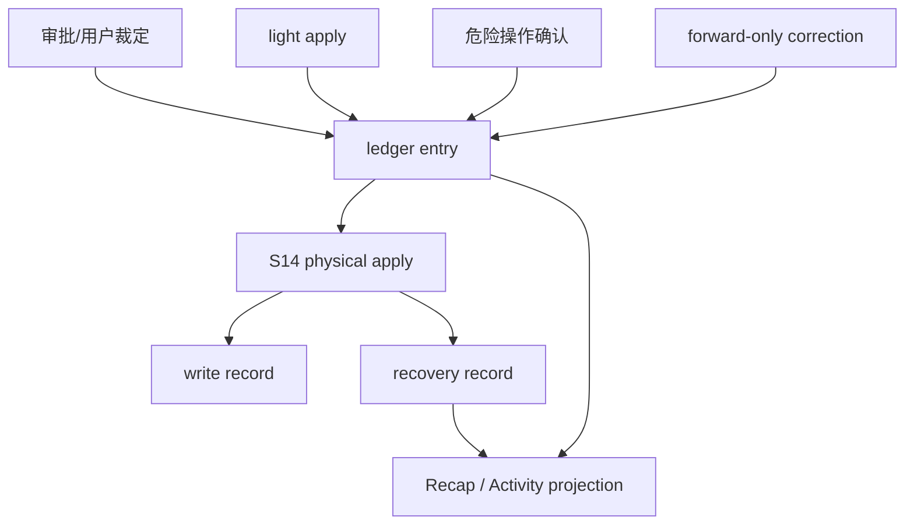

# S15 · 决策与写入账本

这篇定义 Open Novel 的决策与写入账本。它不是 UI 名称,也不是普通日志表;它是把“作者裁定了什么、系统实际写了什么、事故后如何恢复、用户后来怎样更正”统一成可追溯事实的系统层。

作者可见 UI 不说 journal。作者看到的是审批结果、保存回执、恢复入口、活动记录和更正说明。内部账本的职责是让这些可见结果有同一个真源,而不是由审批卡、Storage、Trace 或 Recap 各自拼历史。

## 为什么独立成系统

S14 只回答文件和数据库怎么安全落盘;S03 只回答 turn 怎么收口;M17 只回答作者怎么看回执。缺少独立账本时,同一件事会被多处重复解释:

| 事故 | 没有账本会怎样 | S15 的收场 |
|---|---|---|
| 用户接受审批后文件写到一半崩溃 | UI 只能猜“已接受”还是“已保存” | 账本保留裁定、写入阶段、恢复策略和下一步入口 |
| inline accept 保存后用户要撤销 | 旧记录被改写或当作 editor undo | 生成反向修正账本项,向前追加 |
| reindex 失败但作品已保存 | Recap 可能说完成,Search 却读旧索引 | 写入账本标记事实已生效,索引投影为 degraded |
| 危险操作被确认后失败 | Settings、Storage、Activity 各说一套 | 危险操作审计、执行结果和用户回执引用同一记录 |

账本的价值不是多存一份日志,而是让系统在失败、恢复和更正时不能撒谎。

## 主权边界

| 系统 | 拥有什么 | 不拥有什么 |
|---|---|---|
| S15 决策与写入账本 | 审批裁定、写入记录、light apply、恢复记录、反向修正、危险操作审计、Recap/Activity 投影 | 文件原子写细节、UI 文案布局、模型过程日志 |
| S14 Project Storage | 项目文件、数据库物理分库、fingerprint ledger、fencing、原子替换、reindex 请求 | 审批语义、用户裁定语义、Recap/Activity 生成规则 |
| S03 Turn Orchestration | turn 生命周期、canonical terminal result、cancel plan、并发和模式闸门 | 持久账本结构和回执投影内容 |
| S04 Streaming UI Protocol | 状态点、Trace、恢复驾驶舱和事件订阅 | 业务事实源、账本改写、回执拼装 |
| M17 Turn Recap | 作者可读回执和活动时间线体验 | 内部账本阶段、表结构、恢复扫描算法 |

S15 是“相关记录管理”的唯一模块:审批裁定、写入记录、恢复记录、危险操作审计和 Recap/Activity 投影都在这里归口。其他系统只能引用账本记录,不能复制一套独立历史。

## 账本记录族

| 记录族 | 来源 | 作用 |
|---|---|---|
| decision record | 审批卡、cancel plan、危险操作确认、作者直接裁定 | 记录用户到底批准、拒绝、取消或确认了什么 |
| write/apply record | 已接受 ChangeSet、light apply、恢复前滚 | 记录写入阶段、输入/输出指纹、S14 回执、reindex 水位 |
| light apply record | 作者保存、inline accept、Humanizer 小改接受 | 让无需大审批卡的小写入仍有裁定、保存和撤销依据 |
| recovery record | 崩溃扫描、写入失败、manual recovery | 记录已知事实、禁止自动重放原因和用户可选恢复路径 |
| correction record | 反向修改、恢复到历史内容、回执更正 | 向前追加新事实或新说明,不改写旧记录 |
| danger audit record | 删除、清理、迁移、凭据移除、诊断导出等危险操作 | 记录确认范围、执行结果和可追溯回执 |
| projection record | Recap、Activity、pending item、recovery note | 把内部账本转换成作者可读历史 |

同一用户动作可以产生多条记录,但必须共享 `ledger_entry_id`、`turn_id`、`project_id` 和来源指针。实现可以拆表,但语义上它们属于同一个账本模块。

## 审批裁定

审批裁定记录是 ChangeSet 生命周期的事实源。它必须至少说明:

| 字段族 | 行为意义 |
|---|---|
| decision kind | accepted、rejected、cancelled、partially accepted、edited accepted 等用户裁定 |
| actor/source | 用户、系统恢复流程或迁移流程;AI 不能伪造成用户裁定 |
| scope | approval id、atomic group、item 范围、影响文件和锚点 |
| rationale | 拒绝理由、取消原因、用户备注或危险操作确认说明 |
| precondition snapshot | 裁定时的文件指纹、事实水位、风险状态和索引健康 |
| downstream obligation | 被搁置、关闭、重做、阻断或需要后续追踪的项目状态 |

S03 负责把裁定接进 turn 状态机;M08 负责让用户看懂卡片;S15 负责让裁定不可倒改、可恢复、可投影。

## 写入账本阶段

S14 提供物理落盘阶段,S15 把这些阶段记成用户可解释的写入账本。阶段名不是 turn 终态,不能替代 S03 canonical terminal result。

| 阶段 | 由谁推进 | 写入账本含义 | 崩溃后收场 |
|---|---|---|---|
| `prepared` | S15 发起,S14 校验 | 已记录意图、裁定、前置条件、fencing token、输入指纹和恢复策略 | 若未 touching 原文件,关闭为未生效;生成未保存回执或恢复说明 |
| `file_applied` | S14 回执 | 临时文件已原子替换,输出指纹已知 | 启动扫描必须按自写结果前滚,不能误判为外部编辑 |
| `facts_committed` | S15 + S14 | `project.db` 中裁定、写入事实、obligation 和投影水位已提交 | 允许投影为已生效;reindex 可以仍是 stale/degraded |
| `projection_committed` | S15 | Recap/Activity/recovery note 指针已入账 | UI 可展示回执;投影失败不回滚已生效作品 |
| `reindex_requested` | S14/S05 | 派生索引刷新请求已入队或完成 | 索引失败只降级派生能力,不倒退事实生效 |

跨文件 ChangeSet 不是文件系统原子事务。账本允许记录“部分文件已替换、事实提交未完成”的中间事实,但用户侧只能看到整批成功、整批失败、或需要恢复处理。系统必须阻断后续危险写入,直到 S15 能给出可解释收场。

## Light Apply

Light apply 是同一个账本模块的轻量入口,不是绕过账本。

| 来源 | 账本要求 | 升级条件 |
|---|---|---|
| 作者直接编辑并保存 | 记录 editor action、文件指纹、保存范围、activity 摘要和 reindex request | 命中外部冲突、事实库治理或阻断风险 |
| inline review accept | 记录建议 id、原文范围、用户接受版本、提交前 undo bridge 和风险重检结果 | 跨文件、设定、关系、伏笔、事实变化或 dependency group |
| Humanizer 小改接受 | 记录 diff、风格来源、不可改事实校验和 reindex request | 改变事实、角色关系、章节事件或守则阻断项 |

提交前的 editor undo 不进写入账本。提交后撤销必须生成新的反向 light apply 或 ChangeSet,并追加 correction record;旧记录保持只读。

## 恢复记录

恢复记录回答“系统知道哪些事实、哪些不能自动做、用户能选什么”。

| 恢复类型 | 记录内容 | 用户可见投影 |
|---|---|---|
| prepared abandoned | 尚未触碰原文件,关闭未生效写入 | “未保存,可以重新运行或关闭” |
| file-applied forward | 文件已替换,事实库需前滚提交 | “检测到上次保存中断,正在恢复保存结果” |
| projection missing | 事实已提交但回执缺失 | “作品已保存,活动记录补写中/缺失” |
| unsafe manual recovery | 缺快照、指纹冲突或工具状态不可判定 | “需要处理恢复”,列出已知事实和禁止自动重放原因 |
| recovery cancelled | 用户确认放弃未生效部分 | “已取消剩余步骤”,已生效事实不回滚 |

恢复记录不允许重放危险动作。若需要改变作者文件或项目事实,必须生成新的审批或 light apply;若只是补投影,只能引用既有写入账本。

## 反向修正

Open Novel 不改写历史。所有撤销、恢复到历史内容和回执更正都向前追加:

| 用户意图 | 账本动作 | 约束 |
|---|---|---|
| 撤销这次修改 | 生成反向 ChangeSet 或反向 light apply | 改正文/设定必须审定;不能删除旧写入记录 |
| 恢复到某个历史内容 | 基于账本记录、快照和当前文件生成恢复提案 | 当前文件指纹必须重新校验 |
| 回执写错 | 追加 correction recap / author note | 原 projection 保留并标记被更正 |
| 关闭待恢复事项 | 追加 recovery decision | 已生效事实不因关闭而回滚 |

反向修正的目标是让项目达到新的当前状态,不是让账本看起来从未发生过事故。

## 危险操作审计

危险操作不是作品正文写入,但同样需要账本。它们包括项目删除/归档、清理经验、清理缓存、凭据移除、迁移、诊断包导出、手工修复确认等。

危险操作账本必须记录:

| 字段族 | 行为意义 |
|---|---|
| confirmation scope | 用户确认的对象、范围、不可逆提示和二次确认文案版本 |
| preflight result | active turn、pending approval、未保存编辑、权限和路径检查 |
| execution result | 成功、部分完成、失败、可重试性和剩余风险 |
| privacy/security audit | 凭据、诊断包、脱敏、导出位置和阻断原因 |
| projection | Activity/Recap 是否展示,展示成什么用户语言 |

危险操作不能因为有审计记录就绕过 S03/S14/R01/R03/R05 的前置检查。账本记录的是裁定和结果,不是许可本身。

## Recap / Activity 投影

S15 拥有 Recap/Activity 的事实来源;M17 拥有作者体验和展示规则。投影只从账本记录和 S03 terminal result 生成,不能由前端事件流临时拼装。

| 投影 | 触发 | 说明 |
|---|---|---|
| pending activity item | `AwaitingApproval`、恢复待处理、危险操作待确认 | 不是 terminal recap,只显示待处理范围 |
| turn recap | S03 terminal result 达到 M17 定义的可回执状态 | 引用 decision/write/recovery 记录,说明影响和下一步 |
| recovery note | `Interrupted`、`ManualRecoveryOpened`、写入阶段未知 | 说明最后可信事实、恢复选项和禁止自动重放原因 |
| light activity | Fact Query 结果、直接保存、小改接受等轻量动作 | 不声称项目完成一次 turn,只记录可追溯活动 |
| correction recap | 反向修正或回执更正完成 | 引用被更正记录和新裁定 |

作者看到“回执、恢复、活动记录、备注、更正”,看不到 journal、ledger entry、write phase 这类内部名词。

## 与 S03 终态的关系

S15 不定义 turn 终态。它向 S03 提供账本记录状态、恢复建议和投影可用性;S03 仍然是 `Completed`、`StoppedNoChange`、`Cancelled`、`Rejected`、`Applied`、`ApplyFailed`、`FailedTerminal`、`Interrupted`、`ManualRecoveryOpened` 的唯一权威。

| 账本状态 | S03 可能投影 | 说明 |
|---|---|---|
| decision rejected | `Rejected` | proposal 未写入,拒绝理由可进入 redo context |
| prepared closed before file write | `Cancelled` 或 `ApplyFailed` | 取决于用户是否已接受以及 cancel plan 结果 |
| facts_committed | `Applied` | 作品事实已生效;reindex 可降级 |
| file_applied but facts unknown | `ApplyFailed` 或 `ManualRecoveryOpened` | 需要恢复扫描判断前滚或人工处理 |
| run heartbeat unknown before durable decision | `Interrupted` | 不生成成功或停止 recap |
| recovery completed by new action | 新 turn 的 terminal result | 不修改原 turn 终态 |

## 失败收场

| 失败 | 账本处理 | 用户不能被告知 |
|---|---|---|
| decision record 写入失败 | 不进入 Applying;保留审批卡和错误 | “已接受并保存” |
| S14 file apply 失败 | 写入记录停在 prepared 或失败阶段 | “作品已保存” |
| facts commit 失败 | 按 file_applied/facts 状态进入恢复 | “未发生任何事” |
| projection 写入失败 | 事实结果保留,活动记录标缺失或待补写 | 伪造已入 Activity |
| recovery 扫描不确定 | 打开 manual recovery,列出未知项 | 自动重放写入 |
| danger audit 写入失败 | 危险操作不执行或进入明确失败 | 静默完成危险操作 |

## FAQ

**Q: 这是不是把 S14 的职责搬走?**

A: 不是。S14 仍定义物理文件、数据库、fingerprint、fencing、原子替换和 reindex 协议。S15 定义这些动作在用户裁定和恢复历史中的含义。

**Q: 为什么 Recap/Activity 也归账本?**

A: 因为回执和活动记录必须引用真实裁定、写入和恢复记录。M17 负责用户怎么读,S15 负责它们不能从事件流临时拼出来。

**Q: 用户会看到 Journal 吗?**

A: 不会。产品语言是审批、保存回执、恢复、活动记录和更正。Journal/ledger 是内部系统边界。

**Q: 账本能恢复正文吗?**

A: 账本能解释和发起恢复,但正文当前事实仍以作者文件和已提交项目事实为准。需要改正文时,恢复必须生成新的审定动作。

## Appendix

- [appendix/schema-tables](./appendix/A01-schema-tables.md) 保存 ledger、decision、write/apply、recovery、projection 和 danger audit 字段族。
- [appendix/json-schemas](./appendix/A02-json-schemas.md) 保存账本记录、恢复记录、投影 payload 和 correction request schema。
- [appendix/event-catalog](./appendix/A03-event-catalog.md) 保存 decision/write/recovery/projection 事件字段。
- [appendix/testing-matrix](./appendix/V01-test-matrix.md) 保存账本 append-only、light apply、恢复、危险操作和 Recap/Activity 投影验证项。
