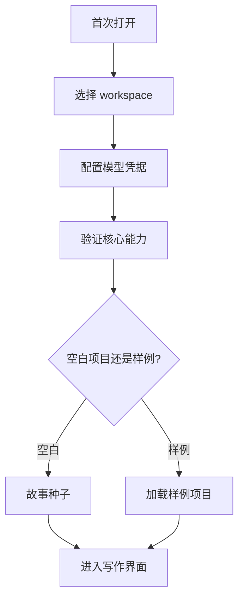
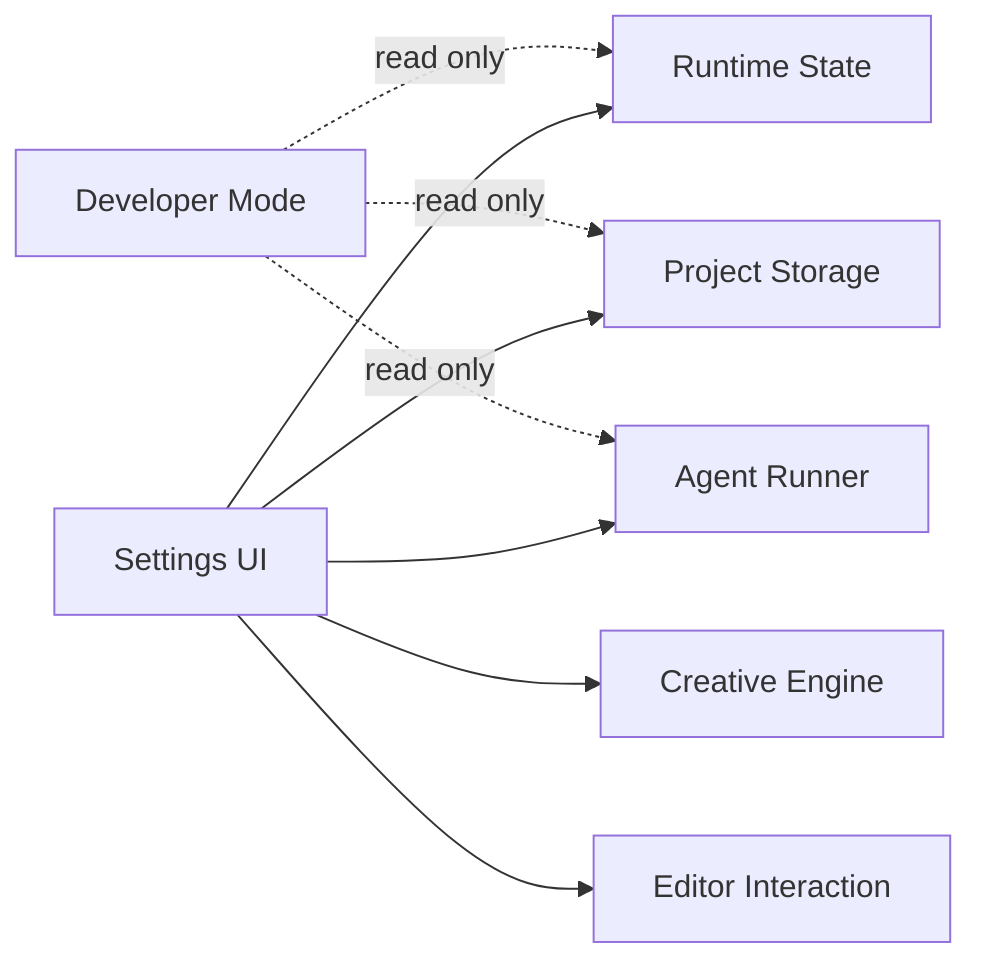
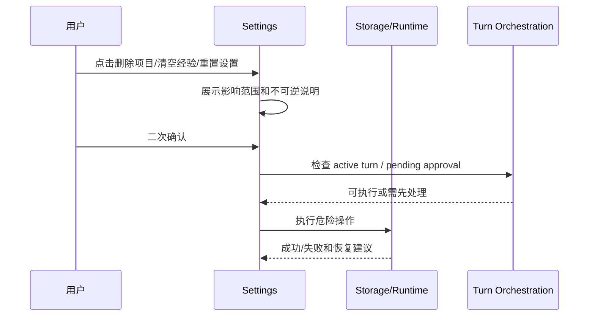

# S15 · Settings And Onboarding

这篇把 Settings 写成控制面板,不是内部参数仓库。它只放用户能理解、能控制、且会改变产品行为的东西。Onboarding 则只负责把用户带到第一个可写项目,不把所有高级开关塞进首启。

## 首启路径

首启只验证核心路径:能保存项目、能调用模型、能进入写作界面。高级 Agent 档位、风格细节、Developer Mode 留给 Settings。

## Settings 分区

| 分区 | 用户问题 | 放什么 |
|---|---|---|
| Workspace | 我的项目放在哪里 | 路径、项目列表 |
| Model | AI 能不能用 | 凭据、连通性、可用模型 |
| Agents | 哪些角色参与、强度如何 | 角色开关、档位、Reflector 学习 |
| Assistant Persona | 助手怎么说话和协作 | 语气、详略、主动性、提醒强度 |
| Style | 文字像不像我 | 风格偏好、范文、Humanizer 相关经验 |
| Rules | 风险提示多严格 | 五大守则阈值、提示偏好 |
| Memory | 系统学到了什么 | 经验查看、权重、关闭、删除 |
| Usage | 花了多少 | 用量、预算、成本提示 |
| Developer | 出问题怎么查 | Trace、过程日志、索引健康度、审计结果 |

内部 retry 常数、SQL 字段、prompt 片段、包版本和 native binding 细节不作为普通设置暴露。

Assistant Persona 只改变助手表达和协作方式,不改变系统规则、项目事实、审批边界或守则阈值。它可以影响回答是简短还是展开、是否主动列选项、提醒频率和称呼风格;不能让 Discuss 写盘、让 Humanizer 改剧情、让 Validator 降低阻断级风险,也不能覆盖用户当前显式指令。

## 模型凭据主权

Settings 只展示和管理 provider 可用性,不拥有 secret。API key、token 和 provider secret 的主权在桌面壳安全凭据库;项目文件、诊断包、Trace 和 Activity 只能保存不可反推 secret 的引用、状态和最近验证结果。

| 用户动作 | Settings 承诺 | 凭据主权边界 |
|---|---|---|
| 新增 / 更新 provider 凭据 | 写入成功后显示 provider 可用或待验证 | 只有桌面壳可写入安全凭据库;写入失败时不保存假配置 |
| 验证 provider | 展示连通性、模型可用性和最近失败原因 | renderer 只能拿到可用状态,不能拿到 secret 明文 |
| 删除凭据 | provider 立即变为未配置,相关 Agent 能力禁用 | 删除安全凭据和本地引用;历史项目事实、recap、审批记录不被删除 |
| 迁移旧凭据 | 明确提示迁移来源和迁移结果 | 旧明文来源写入安全凭据库并清除后才算完成;清除失败时保持 provider 禁用 |
| provider 失效 | 显示“需要重新配置/重新授权” | 不重试写盘、不把失败解释成模型输出为空、不自动切换到另一个 secret |

provider 失效包括 keychain 不可读、secret 被删除、provider 返回认证失败、权限范围不足或迁移未完成。失效只影响后续需要该 provider 的能力:已有正文、项目事实、审批历史和 Recap 不回滚;运行中尚未产生 durable change 的 turn 失败并生成 recap;已经进入 pending approval 的 ChangeSet 继续可查看,但不能用失效 provider 继续扩写或重做。

## 控制面板边界图

Developer Mode 是只读诊断入口。它不能绕过审批,不能从过程日志恢复作品事实。

## 经验管理的用户语义

| 用户动作 | 系统含义 |
|---|---|
| 开启 Reflector | turn 完成后可学习新经验 |
| 关闭 Reflector | 不再学习新经验 |
| 关闭某条经验 | 后续不注入该经验 |
| 调高/调低经验 | 改变 context builder 选用权重 |
| 删除经验 | 从长期经验中移除 |
| 清空经验 | 危险操作,需要确认范围 |

“关闭学习”不等于“忘掉已经学会的东西”。这点必须在 UI 文案和实现上都清楚。

## 危险操作工作流

危险操作不能和 active writable turn 抢主权。存在 pending approval 时,用户应先处理审批或明确放弃。

## 守则设置的边界

| 设置 | 可以 | 不可以 |
|---|---|---|
| 提示强度 | 调整提示频率和展示方式 | 让阻断级风险静默落盘 |
| 阈值 | 影响后续检测 | 自动改历史报告 |
| 自定义偏好 | 改变诊断解释口径 | 覆盖项目事实 |
| Agent 档位 | 调整分析深度 | 绕过审批主路径 |
| Assistant Persona | 调整协作语气和主动程度 | 改变写入权限或事实优先级 |

守则是产品契约,不是纯偏好。Settings 可以调节体验,不能让系统变成无提示的静默改稿器。

## 设置失败收场

| 失败 | 用户可见 | 系统状态 |
|---|---|---|
| workspace 不可写 | 首启无法完成 | 不创建假项目 |
| 凭据不可用 | 模型未配置 | 不标记 ready |
| 凭据写入失败 | provider 保持未配置 | 不保存 secret 到项目或 settings 文件 |
| 凭据删除失败 | provider 标记需要处理 | 不继续使用残留 secret |
| 旧凭据迁移未完成 | 提示迁移失败和清理建议 | 不把明文来源继续当可用凭据 |
| provider 认证失效 | 需要重新配置/重新授权 | 不自动换 provider 写盘 |
| 设置保存失败 | 保存失败并保留原值 | 不显示为已生效 |
| 经验更新失败 | 经验未改变 | context 继续用旧状态 |
| 删除失败 | 显示残留范围 | 不从列表假删除 |
| Debug 数据缺失 | 诊断不完整 | 不影响作品事实 |

## FAQ

**Q: 为什么首启不让用户配置所有 Agent?**

A: 首启目标是进入可用项目。高级控制放在 Settings,避免首启变成参数考试。

**Q: 用户能不能完全不用经验?**

A: 可以关闭或删除经验注入;但关闭 Reflector 只是不学新经验,不是自动停用旧经验。

**Q: Developer Mode 能不能修数据库?**

A: 根层契约里它是只读诊断入口。修复工具若存在,必须有独立危险操作和确认。

**Q: 删除项目是否也删除运行时历史?**

A: UI 必须说明删除范围。项目文件、派生索引、运行时历史和经验是否删除要分别确认或按明确规则执行。

**Q: 模型凭据验证失败时能否进入离线模式?**

A: 可以进入不依赖模型的只读/编辑能力,但不能把 Agent 能力显示为可用。

## Appendix

- [appendix/schema-tables](./appendix/A01-schema-tables.md) 保存设置、经验和项目生命周期存储明细。
- [appendix/testing-matrix](./appendix/V01-test-matrix.md) 保存 onboarding、settings、danger action 和 debug 面板验证项。
