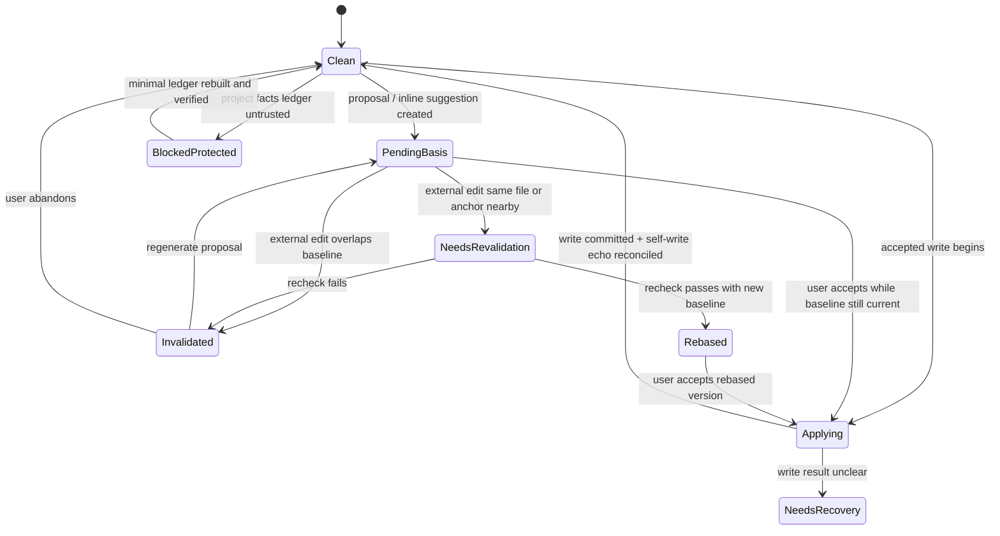

# S16 · File Version And Edit Safety

这篇定义“文件被外部修改后,系统是否仍能正确修改该文件”的统一契约。它合并文件指纹、自写回声、watcher 对账、外部编辑冲突、待审批/inline suggestion 失效、重新校验/重基准和项目事实库损坏保护。

S16 不暴露数据库或索引术语给作者。用户只需要知道:文件已外部修改、旧建议依据已过期、需要重新校验或重新生成。

## 负责什么

| 本篇负责 | 不负责 |
|---|---|
| 判断某次可写动作的文件版本依据是否仍可信 | 设计数据库表结构 |
| 区分系统自写回声和外部编辑 | 替用户自动合并小说语义冲突 |
| 让 pending approval、inline suggestion 和 near-text action 在来源变化后失效 | 决定审批 UI 视觉样式 |
| 定义重新校验、重基准和放弃旧建议的收场 | 重建派生索引的具体 job |
| 保护项目事实库损坏时的写入边界 | 用索引重建伪造丢失审批历史 |

S14 仍负责写入记录和存储事务;I03 负责平台 watcher/cursor;R04 负责派生索引健康和修复。S16 是“是否还能安全修改这个文件”的主权位置。

## 核心问题

系统每次准备改文件前都必须回答四个问题:

| 问题 | 必须有的答案 |
|---|---|
| 我打算改的是哪一个文件版本 | 文件身份、内容指纹、watcher 水位和生成建议时的基线。 |
| 这个版本是否仍是当前文件 | 当前指纹与基线一致,或已完成重基准。 |
| 变化是不是系统自己刚写入造成的 | write token、文件身份、写后指纹和 watcher 水位同时匹配。 |
| 如果不可信,用户看到什么 | “文件已外部修改,需要重新校验”,并给出重新分析、放弃或人工处理入口。 |

mtime/size 只能帮助快速筛选,不能单独证明文件未变。所有会落盘的动作都以内容指纹为准。

## 主权对象

| 对象 | 含义 |
|---|---|
| file version baseline | 某个建议、审批或写入意图创建时看到的文件身份、内容指纹、anchor 和 watcher 水位。 |
| write echo token | 系统写文件时生成的一次性标识,用于把后续 watcher 事件识别为自写回声。 |
| external edit conflict | 当前文件指纹已偏离基线,且不能证明是系统自写。 |
| edit safety state | clean、stale、invalidated、needs-revalidation、rebased、blocked-protected 中的一种投影。 |
| revalidation result | 重新校验旧建议是否仍可应用的结果:仍适用、需要重基准、必须重新生成或放弃。 |
| protected facts ledger | 项目事实库损坏或不可信时的保护状态,禁止高风险自动写入。 |

这些对象可以有表、schema 和事件明细,但行为语义只在本篇定义。

## 状态机

`Invalidated` 和 `NeedsRevalidation` 不是 turn 终态。它们是 pending activity 或可写动作的安全状态;最终 turn 结果仍引用 S03 的 canonical terminal enum。

## 外部编辑判定

| 判定 | 条件 | 系统动作 |
|---|---|---|
| unchanged | 当前内容指纹与基线一致 | 允许继续既有审批、inline accept 或 apply preflight。 |
| self-write echo | write token、文件身份、写后指纹、fencing token 和 watcher 水位同时匹配 | 推进 ledger/cursor,不触发失效,但仍完成写入记录入账。 |
| external edit | 指纹变化且无法匹配当前系统写入 | 标记受影响文件 stale,命中 pending 基线时进入失效或重新校验。 |
| unknown | ledger 缺失、水位不可信、watcher 漏事件或项目刚恢复 | 先 reconcile;高风险写入阻断,只读查看和人工编辑可继续。 |

系统不能把“进程里刚写过”当作自写证明。只有持久 write token 与写后指纹同时命中,才可消除外部编辑误报。

## pending approval 失效

Approval Cascade 创建时,每个 approval item 必须带 file version baseline。用户接受前必须重新比对:

| 命中情况 | 收场 |
|---|---|
| 同一文件、同一 anchor 或 dependency group 被外部编辑覆盖 | 卡片进入 `Invalidated`,不能继续接受。 |
| 同一文件变化但目标 anchor 可重新定位且语义未变 | 卡片进入 `NeedsRevalidation`,轻量重检通过后生成新基线。 |
| 变化只影响无关文件或无关 group | 原卡保留,但影响分析需记录已排除范围。 |
| 项目事实库处于保护状态 | 所有高风险审批 apply 阻断,只能查看、复制理由、重新分析或放弃。 |

用户看到的文案应围绕“文件已外部修改,需要重新校验”。UI 不说“数据库损坏”“索引水位”或内部健康字段。

## inline suggestion 失效

Inline Rewrite、Humanizer 和 near-text action 的未决标记也必须带基线。它们比审批卡更接近原文,因此失效规则更保守:

| 场景 | 行为 |
|---|---|
| 选区原文仍完全匹配 | 允许接受,接受后走 light apply。 |
| 选区被外部编辑覆盖 | suggestion 失效,只能重新生成或复制建议文本。 |
| 选区附近变化但原文可重新定位 | 进入重新校验;通过后更新高亮位置和基线。 |
| 保存前 editor undo 移除建议 | 不生成写入记录,也不产生外部冲突。 |

系统不能把旧 diff 强行套到新选区。若无法证明同一语义位置仍存在,就必须让建议失效。

## 重新校验与重基准

重新校验不是自动接受。它只回答旧建议能否在新文件版本上继续作为候选存在。

| 结果 | 意义 | 下一步 |
|---|---|---|
| still-valid | anchor 和语义都仍匹配 | 更新 baseline,保留用户原决策入口。 |
| needs-rebase | anchor 可定位,但 diff 或影响范围需要重算 | 生成 rebased suggestion / ChangeSet,用户重新审定。 |
| regenerate | 来源变化使旧建议不再可信 | 丢弃旧 apply 入口,重新分析。 |
| abandon | 用户不再处理 | 关闭 pending 项,保留最小历史解释。 |

重基准后的对象必须有新 baseline 和可追溯来源。旧对象不得被原地改写成“从未失效”。

## 项目事实库保护

项目事实库承载审批历史、obligation、版本指纹、恢复记录和项目级裁决。它损坏或不可信时,作者文件仍是可读正文事实,但系统不能继续假装自己知道旧审批和指纹历史。

保护状态的规则:

| 允许 | 阻断 |
|---|---|
| 打开作者文件、阅读、导出、人工编辑当前文件 | 高风险 Agent 写入、审批 apply、跨文件 cascade、自动治理裁决 |
| 重建最小可验证 ledger:项目身份、文件清单、当前内容指纹、schema 版本 | 用 `index.db` 重建丢失审批历史或 obligation 解决状态 |
| 重新扫描文件并标记索引 stale / repair needed | 为了匹配旧账本而覆盖作者文件 |
| 展示“项目记录需要重新校验”并提供诊断/恢复入口 | 向用户暴露内部表名或把事故说成普通索引过期 |

最小 ledger 重建完成后,系统只能恢复“从当前文件版本继续工作”的能力。丢失的历史裁决若没有可验证来源,必须保持缺失说明,不能由模型补写。

## 用户可见语言

| 内部状态 | 用户文案方向 |
|---|---|
| external edit conflict | 文件已在外部修改,这条建议需要重新校验。 |
| pending approval invalidated | 待审批内容依据的文件版本已变化,请重新分析后再决定。 |
| inline suggestion invalidated | 原选区已变化,建议不能直接套用。 |
| reconcile pending | 正在检查项目文件变化,完成前暂不能应用高风险修改。 |
| protected facts ledger | 项目记录需要重新校验,当前只能基于文件继续阅读和人工编辑。 |

用户界面不把 `project.db`、`index.db`、ledger、watermark、fingerprint 字段名作为主文案。Developer/Trace 可以展示脱敏技术细节,但不能改变作者主流程语言。

## 与其他 spec 的握手

| 对方 | S16 给它什么 | S16 从它要什么 |
|---|---|---|
| [S14](./S14-project-storage.md) | apply 前版本校验、失效结果、保护状态 | 写入记录阶段、write token、fingerprint ledger |
| [S05](./S05-knowledge-graph.md) | 外部编辑后的 stale/reindex 范围和锚点失效输入 | anchor diff、reindex 健康度 |
| [S06](./S06-context-management.md) | context package 的版本可信度和缺口 | 任务影响范围、证据来源 |
| [M07](./M07-inline-rewrite-and-humanizer.md) | inline suggestion 失效/重基准规则 | suggestion baseline 和选区锚点 |
| [M08](./M08-approval-cascade.md) | approval item 失效/重校验规则 | ChangeSet、dependency group 和用户决策 |
| [M16](./M16-project-library-and-navigation.md) | 项目切换 preflight 的外部冲突与保护状态 | project-scoped pending/recovery 状态 |
| [I03](./platform/I03-filesystem-and-watcher.md) | watcher 事件如何解释 | cursor、水位、文件事件、reconcile 结果 |
| [R04](./platform/R04-index-health-and-repair.md) | 事实库保护不是索引修复 | repair job 状态和索引降级范围 |

## 测试清单

| 场景 | 预期 |
|---|---|
| 自写 watcher 回声 | token、指纹和水位匹配时不触发外部冲突。 |
| pending approval 被外部编辑命中 | 卡片失效,不能继续接受。 |
| inline suggestion 选区被外部覆盖 | 建议失效,不强行 apply diff。 |
| 离线编辑后打开项目 | 先 reconcile,命中项 stale/invalidated,高风险写入等待校验。 |
| 重基准成功 | 生成新 baseline,旧对象保留失效历史。 |
| 项目事实库保护 | 作者文件可读,高风险写入阻断,索引重建不能伪造审批历史。 |

## Appendix

- [A01 · Schema Tables](./appendix/A01-schema-tables.md) 保存 file version baseline、edit safety state、protected ledger 等字段族明细。
- [A02 · JSON Schemas](./appendix/A02-json-schemas.md) 保存 invalidation、revalidation、rebase 和 protection payload。
- [A03 · Event Catalog](./appendix/A03-event-catalog.md) 保存 watcher reconcile、edit safety changed 和 approval/suggestion invalidated 事件。
- [V01 · Test Matrix](./appendix/V01-test-matrix.md) 保存文件版本、编辑安全和事实库保护的验收场景。
