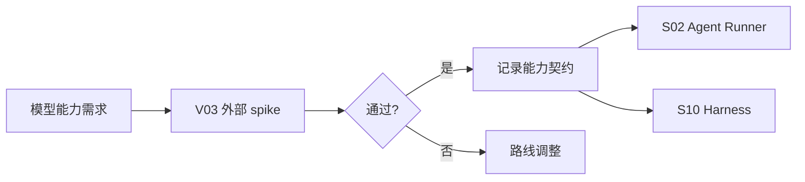

# I01 · LLM Provider Contract

LLM Provider Contract 定义 Open Novel 如何接入模型服务。它不决定产品能力,而是证明模型边界真的支持 [S02 Agent Runner](../S02-agent-runner.md)、[S07 Prompt System](../S07-prompt-system.md)、[S09 LLM Quality Harness](../S09-llm-quality-harness.md) 和 [S11 Evaluation](../S10-evaluation-and-golden-regression.md) 需要的调用形态。

## 集成边界

| 能力 | 必须确认 |
|---|---|
| Text generation | 普通自然语言输出稳定 |
| JSON mode | 结构化输出可校验、可 retry |
| Streaming | token/step/error 可映射到 [S04](../S04-streaming-ui-protocol.md) |
| Context length | 支持长篇上下文策略 |
| Prompt cache / stable header | cache 字段或稳定 prompt header 降级可被 S08/S10 记录 |
| Embedding | 语义召回模型、维度、批量限制、限流和降级可被 S06/A01 绑定 |
| Replay evidence | provider 响应、错误和用量指标能进入 harness |
| Provider fallback | 降级必须显式,不能静默换模型 |

## 上限和限流主权

Provider contract 拥有模型侧 context window、输出上限、限流和失败分类的事实来源。S07 可以估算 context 体量,S04 可以生成 preflight,但模型上限和 provider 约束必须来自 I01/V03 的审计结果,不能散落在审批 UI 或 prompt 模板里。

| provider 事实 | 影响 |
|---|---|
| context window 和输出上限 | 决定 S08 终局体量校验和 S07 overflow 收场 |
| streaming / rate limit / concurrency | 决定 S04 是否排队、分批或延迟执行 |
| transient / terminal failure taxonomy | 决定 S03 retry budget 和 S05 用户可见失败 |
| fallback 模型差异 | 决定是否允许降级;上下文和输出稳定性改变时必须显式确认 |

任何 provider 上限未知时,全书级 cascade 的 preflight 状态必须是 `needs data` 或 `blocked`,不能用乐观上限继续。

## 运行时失败分类

I01 拥有 provider runtime failure taxonomy。S03 可以执行 retry budget,S05 可以展示错误,但失败是否 transient、是否可退避、是否会消耗用户额度,必须来自这里和 V03 的实查。

| failure kind | transient | S03 处理 | 用户可见收场 |
|---|---|---|---|
| rate_limited | 通常是 | 按 provider reset/退避窗口重试;超出 retry budget 后停止 | 排队/稍后重试,不生成新 turn。 |
| timeout | 可能是 | 若无 provider side effect,可重试;长任务保留 interrupted step | 显示超时和可重试点。 |
| server_5xx | 通常是 | provider retry budget 内重试 | 服务暂不可用;不静默换模型。 |
| context_overflow | 否 | 退回 S07 overflow;不能裁掉未知关键事实继续 | 要求缩小范围、分批或补摘要策略。 |
| invalid_request | 否 | 停止并记录 prompt/tool/schema 证据 | 配置或请求错误,进入开发诊断。 |
| auth_or_quota | 否 | 停止;不重试消耗额度 | 要求检查凭据、额度或 provider 设置。 |
| safety_or_policy | 否 | 停止;保留 provider 原因摘要 | 说明 provider 拒绝,不伪装成创作失败。 |
| stream_interrupted | 可能是 | 从持久 run/step 恢复;不能把 UI 断线当 provider 失败 | 展示恢复中或 interrupted。 |

Provider failure envelope 必须带 provider id、model profile、failure kind、transient 判定、retry-after/退避依据、attempt count、是否已产生 provider 侧消耗、是否可 replay、用户可采取动作。上下文超限必须单独传回 S07/S08,不能归入普通 transient retry。

## Embedding 能力契约

语义召回依赖 embedding provider,但 embedding 不是隐藏的附属能力。上线前必须记录:

| 项 | 用途 |
|---|---|
| embedding model id / version | 绑定 A01 向量维度和索引版本。 |
| dimension | 决定 embedding 表结构和迁移策略。 |
| max batch / rate limit | 决定 reindex 批量、preflight 和 repair 调度。 |
| drift policy | 模型升级后哪些索引必须重建,旧向量能否混用。 |
| degradation | provider 不可用时,语义召回缺失但精确查询仍可用。 |

Embedding 模型未知时,S06 只能声明语义召回 `needs data`;不能先落一个任意维度表结构,也不能让 ReaderPanel、影响分析或搜索把语义召回当已成立能力。

## 审计流

## 失败收场

| 失败 | 处理 |
|---|---|
| JSON mode 不可用 | 结构化 Agent 不上线或改路线 |
| streaming 缺事件 | UI 不声明可恢复细粒度状态 |
| 模型 ID 不可用 | 阻断配置,不静默替换旧模型 |
| cache 字段不识别 | 降级为稳定 prompt 头部 |
| embedding 模型未知 | 语义召回和向量索引不上线 |
| context overflow | 退回 S07 overflow,不重试模型 |
| rate limit / timeout | 按 taxonomy 重试或展示排队/重试点 |

## Appendix

版本和 spike 记录归 [A06](../appendix/A06-migration-notes.md) 与 [V03](../appendix/V03-external-spikes.md)。

## FAQ

**Q: Provider 不满足某个能力时能不能临时换模型?**

A: 不能静默替换。降级或换模型会改变上下文和输出稳定性,必须写入配置状态和 Trace。

**Q: 为什么 provider contract 不写完整 API 参数?**

A: 完整参数属于 A/V 明细。本篇只定义哪些能力会影响主路径,以及能力缺失时系统如何收场。
