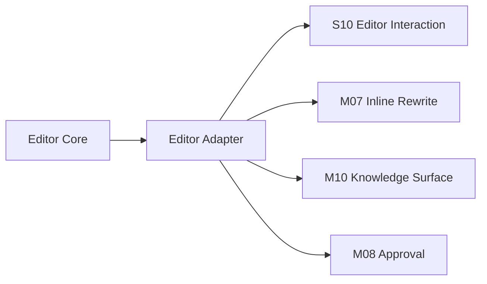

# I02 · Editor Adapter Contract

Editor Adapter Contract 定义编辑器内核与 Open Novel 命令系统之间的接口。它保护正文事实,避免 decorations、selection 和 AI replace 操作污染文档。

## 适配边界

| 接口 | 责任 |
|---|---|
| Selection | 提供稳定选区和光标上下文 |
| Decorations | 展示高亮、旁注、风险标记 |
| Replace Range | inline review 接受后替换文本;审批后批量改写由 storage / internal recovery 路径处理 |
| Undo Bridge | 区分本地 undo 和系统恢复 |
| IME Guard | 中文输入期间不抢快捷键 |

## 关系图

## 失败收场

| 失败 | 用户看到 | 系统不能做 |
|---|---|---|
| selection 失效 | 要求重新选择 | 替换错误范围 |
| decoration 错位 | 弱化或隐藏 | 改正文修显示 |
| undo 边界不明 | 禁止危险替换 | 混用系统恢复和 editor undo |
| IME 冲突 | 交给输入法 | 触发全局命令 |

## FAQ

**Q: Editor Adapter 是否拥有正文事实?**

A: 不拥有。它只提供选区、展示和替换能力;事实主权仍由项目文件、inline review 接受后的正文和审批后落盘决定。

**Q: 为什么 undo 和系统恢复要分开?**

A: undo 是编辑器局部编辑历史,系统恢复是审批和存储事务的收场。混用会让审批状态和文件状态不一致。
