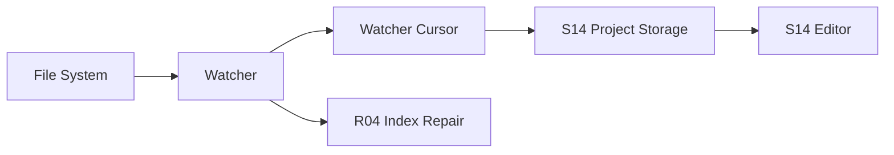

# I03 · Filesystem And Watcher

Filesystem And Watcher 定义本地文件、外部编辑器和 Open Novel 存储层之间的集成边界。

## 需要解决的问题

| 场景 | 风险 |
|---|---|
| 外部编辑 Markdown | UI 状态过期 |
| 文件被移动/删除 | 最近项和索引失效 |
| 写盘中断 | 半文件或假成功 |
| watcher 漏事件 | 索引健康度错误 |

## 集成流

## Watcher cursor 与水位

watcher 不是“收到事件就算完成”。平台层必须维护 cursor 和水位,让存储和索引知道自己看到的是不是完整文件世界。

| 对象 | 含义 |
|---|---|
| watcher cursor | 最近一次处理到的文件事件位置或扫描时间点。 |
| event watermark | 已确认进入存储/索引队列的最高事件水位。 |
| file fingerprint ledger | 每个作者源文件的持久指纹基线,用于离线外部编辑、审批失效和 reindex 范围判断。 |
| write token | 系统自写文件时生成的一次性标识,用于识别 watcher 回声。 |
| reconcile scan | 周期性或异常后的文件系统全量对账,用于弥补漏事件。 |
| stale range | 文件新于索引或 cursor 不可信的范围。 |
| lease signal | 窗口写入权切换与宿主崩溃恢复的平台信号。 |

漏事件、进程休眠、权限变化或 watcher crash 后,系统必须启动 reconcile scan。reconcile 完成前,索引健康不得显示 healthy。

## 自写回声与外部编辑

平台层不能只凭进程内状态判断“这是我自己写的”。每次系统写入作者源文件时,存储层提供 write token、目标文件身份、写前指纹和写后指纹;watcher 事件只有同时匹配 write token、当前 writable owner、文件身份和写后指纹,才算自写回声。

| 事件 | 平台投递 |
|---|---|
| 匹配当前 write token | 投递 self-write echo,推进 cursor 和 fingerprint ledger。 |
| 不匹配 write token 但指纹变化 | 投递 external edit,由 S01 判定审批失效和 reindex 范围。 |
| watcher 漏过系统写入完成事件 | reconcile scan 用 fingerprint ledger 补齐水位,不能把项目标为 healthy。 |
| 离线期间文件变化 | 下次打开先对账指纹,再允许高风险写入。 |

## 单窗口与崩溃防护

应用是单实例单窗口(见 [I05](./I05-desktop-shell-contract.md)):同一时刻只有一个作者窗口和一个常驻执行宿主,不存在第二窗口、只读窗口或跨窗口写入权竞争。

| 场景 | 平台行为 |
|---|---|
| 二次启动同项目 | 聚焦既有窗口并转交打开请求,不创建第二窗口。 |
| 切换项目 | 在同一窗口内完成;若存在 active turn、pending approval 或未保存编辑,先给出处理选择。 |
| 宿主崩溃后重启 | 新宿主持有新 fencing token,旧宿主残留的延迟写入被 storage 拒绝;先完成启动恢复扫描和 reconcile,再开放高风险写入。 |
| pending approval | 阻止写入和项目切换,只读查看继续可用且必须标注待审状态。 |

持久化的实例 id + fencing token 只用于崩溃防护:宿主异常退出后,新宿主启动时生成新 token,写入路径校验 token,任何携带旧 token 的延迟写入都必须被 storage 拒绝,并与 [S14](../S14-project-storage.md) 的启动恢复扫描衔接。不存在窗口间写入权切换,也不需要跨进程锁协议。

## 失败收场

| 失败 | 用户看到 | 系统不能做 |
|---|---|---|
| 外部冲突 | 重载/保留/合并选择 | silent overwrite |
| watcher 失效 | 索引健康 warning | 继续声称索引完整 |
| reconcile 未完成 | stale/degraded 状态 | 启用高风险 Agent 写入 |
| 原子写失败 | 写入失败和恢复建议 | 标记成功 |
| 路径越权 | 阻断 | 读写 workspace 外文件 |
| 旧宿主残留写入(崩溃后) | 恢复流程提示,写入被拒绝 | last-write-wins |

## FAQ

**Q: watcher 漏事件时是否意味着项目不能编辑?**

A: 不一定。正文编辑仍可继续,但派生索引必须标记 degraded,高风险查询和生成要降级或阻断。

**Q: 外部编辑冲突由谁裁决?**

A: 用户裁决。系统可以展示差异和建议,不能默认覆盖外部改动。
