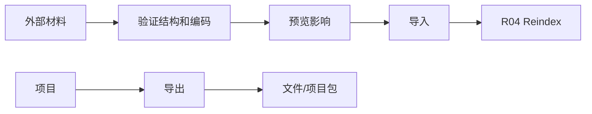

# I04 · Import Export Contract

Import Export Contract 定义项目如何进入和离开 Open Novel。导入导出是数据边界,不是创作能力。

## 入口和出口

| 操作 | 目标 |
|---|---|
| Import Markdown | 把旧稿转成项目结构 |
| Import Project Package | 恢复完整项目 |
| Export Manuscript | 导出成稿 |
| Export Project Package | 带走项目和元数据 |

## 合同

## 项目包 manifest

完整项目包必须包含 manifest。manifest 是导入、备份恢复和迁移的第一读取对象。

| 字段族 | 用途 |
|---|---|
| identity | project id、package id、项目标题、导出时间、生成应用版本。 |
| versions | schema version、index version、package format version、最低兼容应用版本。 |
| content | 作者文件清单、项目事实账本水位、pending approval 摘要、经验/分析是否随包、trace 是否包含。 |
| integrity | 文件指纹摘要、manifest 校验、包内路径边界。 |
| degraded | 是否来自 facts-degraded 或 partial restore 状态,以及不可恢复范围。 |

导入项目包时,系统先读 manifest 再进入 R03 版本检查。package format 不可读或 forward-compat 拒开时,只能解释原因并要求升级应用;不能猜测包结构。schema 可迁移时进入 R01 `Migrating` 态,index 不兼容时导入文件和事实后排入 R04 重建。

同一个 project id 重复导入时,默认创建副本或要求用户确认覆盖/恢复;不能静默合并到当前项目。覆盖当前项目必须走 R02 恢复前置,包括 writable lease、pending approval 处理和恢复预览。

## 失败收场

| 失败 | 用户看到 | 系统不能做 |
|---|---|---|
| 编码/结构不识别 | 停止并说明 | 乱猜章节结构 |
| manifest 不兼容 | 需要的应用/格式版本 | 猜测导入或降级写回 |
| 文件冲突 | 选择另存/覆盖/取消 | 默认覆盖 |
| 导出失败 | 保留项目状态 | 生成残缺包并称成功 |
| reindex 失败 | 导入成功但索引过期 | 假装导入全量可查 |

## FAQ

**Q: 导入是否一定要一次完成索引?**

A: 不一定。导入的文件事实可以成功,索引可以标记过期并进入 R04 修复;不能把索引失败伪装成全量可查。

**Q: 导出包能不能作为备份格式?**

A: 可以,但必须满足 R02 的校验和恢复预览要求;普通成稿导出不能冒充完整项目备份。
