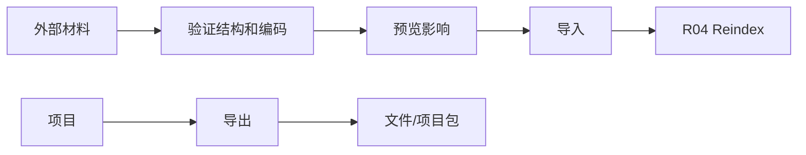

# I04 · Import Export Contract

Import Export Contract 定义项目如何进入和离开 Open Novel。导入导出是数据边界,不是创作能力。

## 入口和出口

| 操作 | 目标 |
|---|---|
| Import Markdown | 把旧稿转成项目结构 |
| Import Project Package | 恢复完整项目 |
| Export Manuscript | 导出成稿 |
| Export Project Package | 带走项目和元数据 |

## 合同

## 项目包 manifest

完整项目包必须包含 manifest。manifest 是导入、备份恢复和迁移的第一读取对象。

| 字段族 | 用途 |
|---|---|
| identity | project id、package id、项目标题、导出时间、生成应用版本。 |
| versions | schema version、index version、package format version、最低兼容应用版本。 |
| content | 作者文件清单、项目事实账本水位、pending approval 摘要、经验/分析是否随包、trace 是否包含。 |
| integrity | 文件指纹摘要、manifest 校验、包内路径边界。 |
| degraded | 是否来自 facts-degraded 或 partial restore 状态,以及不可恢复范围。 |

## 项目包内容承诺

Export Project Package 是“数据归你”的完整带走路径。它导出项目事实、作者文件和可解释历史,但不导出本机 secret、系统权限或诊断专用原始过程材料。

| 内容族 | 默认导出 | 用户可选 | 不允许 |
|---|---|---|---|
| 作者文件与项目事实 | 是 | 不可关闭 | 丢失事实账本却称完整项目包 |
| manifest 与完整性摘要 | 是 | 不可关闭 | 缺 manifest 的完整项目包 |
| 经验 / Reflector 学习项 | 是 | 可在预览中排除或只导出 active 项 | 跨项目混入未选择项目的经验 |
| 分析结果 / ReaderPanel / 质量报告摘要 | 是 | 可排除大体积详情 | 把诊断 Trace 当分析结果默认带走 |
| Recap / Activity 时间线 | 是 | 可排除作者备注的敏感正文片段 | 用 recap 替代项目事实 |
| 审批历史 / ChangeSet 决策 | 是 | 可排除 rejected proposal 正文快照,但保留决策摘要 | 导出后丢失 pending / applied / rejected 状态 |
| Settings 偏好 | 是 | 可只导出项目级偏好 | API key、provider token、keychain item、本机权限 |
| Trace / Debug 详情 | 否 | 显式勾选后进入诊断附件并脱敏 | 默认随项目包导出隐藏 prompt 全文或 provider payload |

导出预览必须按内容族展示数量、体积、敏感等级和是否可恢复。经验和分析默认随项目包,因为它们影响作者如何继续项目;trace 和 debug 详情默认不随包,因为它们服务排障而不是恢复。审批历史默认随包,因为它解释“哪些修改已经审定、哪些仍待处理、哪些被拒绝”,但导入后仍以项目事实和审批状态为准。

设置导出和项目包导出都必须剔除凭据。manifest 只能记录 provider 类型、显示名、能力状态和“需要重新配置凭据”;不能记录 secret 明文、secret 摘要、可用于重放认证的 token 或系统 keychain 路径。

导入项目包时,系统先读 manifest 再进入 R03 版本检查。package format 不可读或 forward-compat 拒开时,只能解释原因并要求升级应用;不能猜测包结构。schema 可迁移时进入 R01 `Migrating` 态,index 不兼容时导入文件和事实后排入 R04 重建。

同一个 project id 重复导入时,默认创建副本或要求用户确认覆盖/恢复;不能静默合并到当前项目。覆盖当前项目必须走 R02 恢复前置,包括 writable lease、pending approval 处理和恢复预览。

## 失败收场

| 失败 | 用户看到 | 系统不能做 |
|---|---|---|
| 编码/结构不识别 | 停止并说明 | 乱猜章节结构 |
| manifest 不兼容 | 需要的应用/格式版本 | 猜测导入或降级写回 |
| 文件冲突 | 选择另存/覆盖/取消 | 默认覆盖 |
| 导出预览发现凭据 | 阻断导出并指出内容族 | 脱敏后继续称完整导出 |
| 经验/分析导出失败 | 明确标记项目包不完整或要求重试/排除 | 静默丢弃仍称完整项目包 |
| 审批历史导出失败 | 保留项目状态并提示历史不可完整带走 | 只导出正文却声称审批可追溯 |
| 导出失败 | 保留项目状态 | 生成残缺包并称成功 |
| reindex 失败 | 导入成功但索引过期 | 假装导入全量可查 |

## FAQ

**Q: 导入是否一定要一次完成索引?**

A: 不一定。导入的文件事实可以成功,索引可以标记过期并进入 R04 修复;不能把索引失败伪装成全量可查。

**Q: 导出包能不能作为备份格式?**

A: 可以,但必须满足 R02 的校验和恢复预览要求;普通成稿导出不能冒充完整项目备份。

**Q: 为什么 trace 默认不随项目包?**

A: trace 是排障证据,可能包含过程材料和敏感上下文。项目继续创作需要的是项目事实、审批历史、recap、经验和分析摘要;trace 只有用户明确选择诊断附件时才导出并脱敏。
