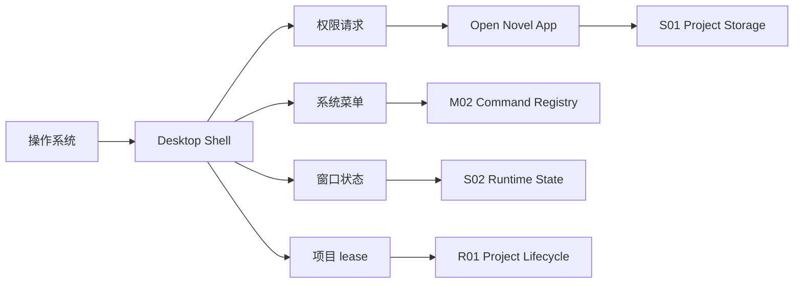

# I05 · Desktop Shell Contract

Desktop Shell Contract 定义本地桌面壳集成边界。Open Novel 的产品契约是本机单用户 workspace:本地 Web 路线必须可独立运行,桌面壳是生产交付包装层,负责文件权限、窗口、菜单、系统快捷键、更新和多实例写入权。

桌面壳不是第二套业务层。作品事实、写入事务、上下文、审批和索引健康仍由应用内 S/M/platform 契约拥有。

## 集成点

| 集成 | 约束 |
|---|---|
| 文件权限 | 用户明确选择 workspace |
| 系统快捷键 | 不抢 IME 和编辑器焦点 |
| 窗口状态 | 恢复不能改变业务事实;多窗口必须尊重项目 lease |
| 菜单命令 | 进入 Command Registry |
| 多实例 | 第二窗口默认只读;显式接管走 R01/I03 lease 语义 |
| 自动更新 | 进入 [R03](./R03-migration-and-upgrade.md) |

## 边界图

桌面壳只能承接系统能力和窗口外壳,不能拥有作品事实。任何菜单命令最终都要回到应用内 command registry。

## 失败收场

| 失败 | 处理 |
|---|---|
| 权限被拒 | 明确提示并停在安全状态 |
| 系统快捷键冲突 | 禁用或提示重绑 |
| 更新失败 | 保持旧版本可用 |
| 窗口恢复失败 | 不影响项目事实 |
| 多实例接管失败 | 保持第二窗口只读 |
| lease 丢失 | 禁用写入入口并要求重新加载 |

## FAQ

**Q: 本地 Web 和桌面壳到底谁是产品形态?**

A: 行为契约以本地单用户 workspace 为准。本地 Web 是必须可跑的应用形态,桌面壳是生产包装层,补足系统权限、菜单、窗口、更新和多实例 lease。

**Q: 为什么还需要 I05?**

A: 因为文件权限、系统快捷键、菜单、窗口和更新会影响作品主权和失败收场。提前定义边界能避免把壳层写成事实层。

**Q: 桌面壳能不能直接读写 workspace?**

A: 不能绕过应用存储层。壳层可以请求权限和传递路径,实际读写仍由 S01/I03 处理。
