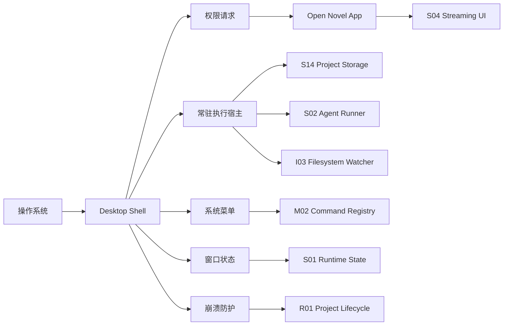

# I05 · Desktop Shell Contract

Desktop Shell Contract 定义本地桌面壳集成边界。Open Novel 的唯一主产品形态是本机桌面壳应用,桌面壳采用 Tauri,目标多端(macOS / Windows / Linux):壳内常驻执行宿主/sidecar 负责文件权限、单窗口、菜单、系统快捷键、更新、安全凭据、本地数据库连接、watcher、写入记录和长任务生命周期。常驻执行宿主以 Tauri 管理的 sidecar 进程承载;进程形态与 native binding 兼容性经 [V03](../appendix/V03-external-spikes.md) 实查后落定。

桌面壳不是第二套业务层。作品事实、写入事务、上下文、审批和索引健康仍由应用内 S/M/platform 契约拥有。壳层拥有的是本机能力和进程生命期,不是小说事实。

## 应用形态裁决

| 形态 | 职责 | 不承担什么 |
|---|---|---|
| 桌面壳生产形态(Tauri,多端 macOS / Windows / Linux) | 承载本机权限、keychain、全局菜单/快捷键、单实例锁、单窗口、SQLite/native binding、watcher、写入记录、runner 长任务和更新恢复;常驻执行宿主以 Tauri 管理的 sidecar 进程承载,进程形态与 native binding 兼容性经 V03 实查后落定 | 不绕过 S14/S03/S08 直接改作品事实,不把菜单命令变成隐式写入,不创建第二窗口 |
| 桌面壳开发模式 | 在同一桌面壳边界内提供 renderer 热更新、DevTools、dev build 诊断入口、mock provider 和本机调试日志 | 不引入基于普通浏览器的 Web 调试入口,不把开发进程中断写成生产失败语义,不把 Developer Mode 暴露给真实用户包 |
| Renderer UI | 发送用户命令、订阅 stream、展示持久 turn 状态和审批结果 | 不成为业务事实源,不用前端内存决定 run 是否成功或作品是否已写入 |

这不是 Web 与桌面双路线。实现可以先优化桌面壳开发模式的启动速度和热更新体验,但任何涉及凭据、安全写入、长任务、断线恢复、外部文件监听、二次启动聚焦或 dev build gate 的验收,都必须在桌面壳边界内完成。

## 单实例契约

应用只允许单实例单窗口:一台机器同一时刻只运行一个桌面壳进程、一个常驻执行宿主和一个主窗口。

| 约束 | 行为 |
|---|---|
| single-instance lock | 桌面壳启动时持有单实例锁;锁已被持有时新进程不得启动第二个宿主或第二个窗口 |
| 二次启动 | 再次启动应用只是聚焦既有窗口(并可携带打开路径转交既有窗口),不产生第二个进程或第二窗口 |
| 单窗口 | 同一时刻只有一个 renderer 主窗口;项目选择、项目切换和写作都在这个窗口内完成 |
| 跨用户 / 便携盘 | 不支持并发:同一台机器多个系统用户同时打开同一项目目录、或把项目放在便携盘上由多台机器同时打开,均不在支持范围内;系统按外部编辑冲突收场,不提供跨进程写入权协商 |

单实例单窗口裁决之后,跨进程 lease、窗口写入权切换和多窗口可写仲裁协议都不存在。持久化的实例 id + fencing token 只保留一种用途:宿主崩溃后的僵尸宿主防护——宿主异常退出后,新宿主接管时旧宿主残留的延迟写入必须被拒绝,并与 [S14](../S14-project-storage.md) 的启动恢复扫描衔接。

## 集成点

| 集成 | 约束 |
|---|---|
| 文件权限 | 用户明确选择或创建项目目录 |
| 安全凭据 | API key 和 provider secret 进入系统 keychain 或等价安全凭据库;不得明文写入项目 |
| 常驻执行宿主 | runner、watcher、写入记录、SQLite 连接和恢复流程在 sidecar/本机后台进程中运行,不绑定单个 renderer 生命周期 |
| 系统快捷键 | 不抢 IME 和编辑器焦点 |
| 窗口状态 | 恢复不能改变业务事实;二次启动只聚焦既有窗口 |
| 菜单命令 | 进入 Command Registry |
| 自动更新 | 进入 [R03](./R03-migration-and-upgrade.md) |

## 安全凭据库契约

桌面壳拥有 provider credential 的系统边界,应用层拥有 provider 配置和可用状态。secret 不进入项目目录、数据库明文字段、Trace、诊断包或 renderer 持久缓存,也不进入任何持久产物。

| 操作 | 壳层职责 | 应用层看到什么 |
|---|---|---|
| 写入 | 将 API key/token 写入系统 keychain 或等价安全凭据库,返回不可反推的 credential reference | provider 已配置、最近验证状态、可用模型摘要 |
| 读取 | 只在 sidecar/provider 调用前短暂取用 secret | 成功/失败和脱敏错误类别 |
| 删除 | 删除安全凭据和本地 credential reference | provider 变为未配置,相关能力禁用 |
| 迁移 | 从旧明文来源写入安全凭据库并清理旧来源 | 迁移完成、失败或需用户手动清理 |
| 诊断 | 拒绝把 secret 放进诊断包,只允许提供 provider 类型和需重配状态 | 诊断包预览显示“凭据已剔除” |

迁移旧凭据必须是一次可解释的安全收场:写入安全凭据库成功且旧明文来源清除成功,provider 才能恢复可用;任一步失败都保持 provider 禁用,并把旧来源位置以脱敏类别展示给用户。壳层不得为了兼容旧配置继续读取明文 settings。

provider 认证失败、keychain item 缺失或读取权限被系统撤回时,sidecar 必须返回“凭据失效”而不是普通模型失败。应用层可以保留 pending approval、recap 和项目事实,但需要 provider 的继续、重做、诊断复跑和 Agent turn 都必须提示重新配置。

## 系统快捷键冲突矩阵

系统快捷键由桌面壳登记,命令语义由 [M02](../M02-command-palette-and-quick-open.md) 和 [S13](../S13-editor-and-interaction.md) 裁决。壳层不能用全局监听绕过编辑器焦点或 IME 组合态。

| 冲突场景 | 优先级 | 收场 |
|---|---|---|
| IME 组合态正在输入 | IME 优先 | 快捷键不触发,不关闭浮层,不改正文 |
| 正文编辑器处理文本命令 | 编辑器优先 | 壳层命令延后或禁用,必要时提示可重绑 |
| modal / approval card 有 focus trap | 当前浮层优先 | 只处理浮层声明的命令,全局命令显示不可用 |
| 系统或其他应用占用快捷键 | 操作系统优先 | 登记失败时禁用该快捷键并提示重绑 |
| 二次启动 | 既有窗口优先 | 聚焦既有窗口并转交打开请求,不创建第二窗口 |
| pending approval 锁定写入 | 审批主权优先 | 只允许打开/跳转审批,不能直接接受或新建写入 turn |

快捷键冲突不是 silent fallback。用户必须能在 Settings 或命令说明里看到冲突原因、当前生效入口和重绑路径;如果无法判断焦点或 IME 状态,壳层按“不触发写入命令”收场。

## 边界图

桌面壳只能承接系统能力、窗口外壳和本机执行宿主,不能拥有作品事实。任何菜单命令最终都要回到应用内 command registry;任何写入最终都要回到 S14/S03 的审批和事务语义。

## 失败收场

| 失败 | 处理 |
|---|---|
| 权限被拒 | 明确提示并停在安全状态 |
| keychain 不可用 | 禁用需要 secret 的 provider,提示用户重新配置;不能把 secret 明文写入项目 |
| 凭据迁移失败 | provider 保持禁用,提示已完成和未完成的清理范围 |
| provider 凭据失效 | 运行中无 durable change 的 turn 失败并生成 recap;pending approval 保留可审但不能继续扩写 |
| sidecar 崩溃 | UI 进入恢复中,重连持久 turn/写入记录;不能用 renderer 内存补写结果 |
| 系统快捷键冲突 | 禁用或提示重绑,不能抢 IME/编辑器焦点 |
| 更新失败 | 保持旧版本可用 |
| 窗口恢复失败 | 不影响项目事实 |
| 二次启动 | 聚焦既有窗口并转交打开请求;不能创建第二窗口 |
| 宿主崩溃后重启接管旧残留 | 新宿主持有新 fencing token;旧宿主残留的延迟写入被拒绝,启动恢复扫描决定前滚或放弃 |

## FAQ

**Q: 开发调试要不要保留浏览器 Web 入口?**

A: 不保留。开发调试也走桌面壳开发模式,通过 renderer 热更新、DevTools、mock provider 和诊断日志提高效率,不再维护一套基于普通浏览器的 Web 语义。

**Q: 为什么还需要 I05?**

A: 因为文件权限、系统快捷键、菜单、窗口和更新会影响作品主权和失败收场。提前定义边界能避免把壳层写成事实层。

**Q: 桌面壳能不能直接读写项目目录?**

A: 不能绕过应用存储层。壳层可以请求权限和传递路径,实际读写仍由 S14/I03 处理。

**Q: renderer 崩溃或热更新会不会取消正在跑的 Agent?**

A: 不会。renderer 只是观察和命令入口;Runner、写入记录、watcher 和 SQLite 连接由常驻执行宿主承接。

**Q: 桌面壳能不能把 API key 放进设置文件?**

A: 不能。设置文件只保存 provider 配置与重配状态,secret 只能存在系统安全凭据库。

**Q: 为什么应用只允许单实例单窗口?**

A: 单实例单窗口直接删掉跨进程竞争、多窗口写入权切换和只读窗口同步问题。项目选择、项目切换、写作和审批都在同一个窗口内完成。崩溃防护并不因此消失——它由启动恢复扫描加 fencing token 残留校验承担:新宿主启动时持有新 token,旧宿主任何残留的延迟写入都会因 token 过期被拒绝。
