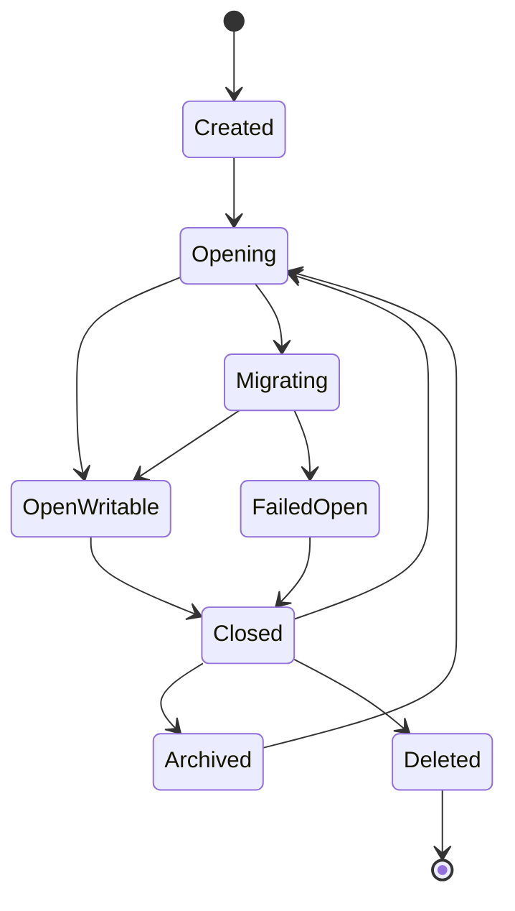

# R01 · Project Lifecycle

Project Lifecycle 定义项目如何创建、打开、关闭、归档和删除。它是可靠性流程,不是日常写作能力。

## 生命周期

应用是单实例单窗口(见 [I05](./I05-desktop-shell-contract.md)):同一时刻只有一个主窗口,项目选择、项目切换、写作和审批都在这个窗口内完成。R01 不提供第二窗口、只读窗口或可写权切换状态。宿主崩溃属于异常退出:下次 `Opening` 时由启动恢复扫描与 fencing token 校验完成恢复(见 [S14](../S14-project-storage.md)),不需要独立状态。

## 操作边界

| 操作 | 必须检查 |
|---|---|
| 创建 | workspace 可写、模板完整 |
| 打开 | 文件存在、schema 兼容、索引健康、无未完成写入恢复、S16 文件版本对账完成或进入明确保护状态 |
| 迁移 | 当前窗口持有写入权、用户已确认迁移提示(见 R03)、无 Applying 事务、pending approval 已处理 |
| 关闭 | active turn、pending approval、未保存内容 |
| 归档 | 不影响可恢复数据 |
| 删除 | 二次确认和明确不可恢复提示 |

## 失败收场

| 失败 | 用户看到 | 系统不能做 |
|---|---|---|
| 打开失败 | 原因和修复建议 | 创建假项目 |
| migration 失败 | 当前阶段和拒开原因 | 继续以半迁移状态写入 |
| 关闭冲突 | 先处理 turn/approval | 丢 pending |
| 宿主崩溃后重启 | 恢复流程入口;恢复扫描完成前不开放高风险写入 | 接受旧宿主残留写入(fencing token 拒绝)、最后写入覆盖 |
| 文件版本对账未完成 | 显示正在检查项目文件变化;高风险写入暂不可用 | 跳过 S16 校验直接应用旧审批或建议 |
| 删除失败 | 残留范围 | 列表假删除 |
| 异常退出 | 下次恢复到持久状态 | 用 UI 内存恢复事实 |

## FAQ

**Q: 关闭项目是否会自动取消正在运行的 turn?**

A: 不会静默取消。系统必须要求用户先完成、取消或保存恢复点,否则关闭动作会破坏事务边界。

**Q: 同一个项目能不能开两个窗口?**

A: 不能。项目选择、项目切换、写作和审批都在同一个主窗口里完成;二次启动只聚焦既有窗口并转交打开请求。

**Q: 归档和删除的区别是什么?**

A: 归档是从日常列表移走但保持可恢复;删除是破坏性动作,必须有二次确认和明确不可恢复提示。
