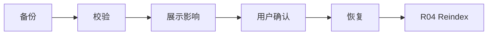

# R02 · Backup Restore

Backup Restore 定义项目备份、恢复点和失败恢复。它保护用户数据归属,不替代 Git 或云同步。

## 备份类型

| 类型 | 内容 |
|---|---|
| Manual Backup | 用户主动导出项目包 |
| Safety Snapshot | 危险操作前快照 |
| Migration Backup | schema 升级前备份 |
| Restore Point | 可选择恢复的已知状态 |

## 备份一致性点

备份必须从一致性静止点生成,不能在 Applying、restore、migration、repair 写入阶段或文件写入未入账时捕获半状态。

生成备份前必须满足:

| 前置 | 要求 |
|---|---|
| writable lease | 当前窗口拥有有效 fencing token;只读窗口只能导出成稿,不能生成恢复用备份。 |
| active writable turn | 不存在正在 Applying 的事务;运行中 turn 必须停在未产生 durable change 的点或先完成/取消。 |
| pending approval | 可被备份记录,但 manifest 必须标出 pending 状态和关联文件指纹;不得把 pending 当作已生效事实。 |
| file/fact watermark | 作者文件 fingerprint ledger、项目事实账本水位、watcher cursor 和 repair job 水位已持久化。 |
| facts health | `facts-degraded` 项目不能生成“完整可恢复”备份,只能生成带 degraded 标记的抢救包。 |

备份 manifest 至少记录 project id、package id、schema version、index version、package format version、生成应用版本、文件指纹摘要、事实账本水位、watcher 水位、repair 水位、pending approval 摘要和 degraded 标记。恢复时必须用这些水位校验备份是否来自完整静止点。

## 恢复流

## 恢复前置

恢复会同时改变作者文件和项目事实,因此必须接入项目事务语义。

| 前置 | 恢复行为 |
|---|---|
| writable lease | 必须拥有当前项目有效 fencing token;否则只能预览备份内容。 |
| active turn | 可写 turn 必须暂停、完成或取消;不得在 Applying 中覆盖项目。 |
| pending approval | 用户必须选择保留为失效记录、放弃或先处理;恢复不能静默丢 pending。 |
| backup manifest | 校验 project id、版本、文件指纹摘要、事实账本水位和 degraded 标记。 |
| restore preview | 展示将覆盖的文件、将失效的审批/obligation、恢复后的 reindex 范围。 |

恢复完成后,相关审批一律按新文件指纹重新判定;无法证明仍适用的审批进入 invalidated。恢复必须排入 R04 reindex 或 repair job;reindex 失败时项目事实仍可恢复成功,但查询、影响分析和高风险生成进入 stale/degraded。

## 失败收场

| 失败 | 用户看到 | 系统不能做 |
|---|---|---|
| 备份损坏 | 不可恢复原因 | 覆盖当前项目 |
| 无一致性静止点 | 哪个 turn/事务/repair 阻断备份 | 生成号称完整的恢复点 |
| 恢复前置不满足 | 需处理的 lease、turn 或 pending approval | 越过事务边界强制恢复 |
| 恢复中断 | 保留原项目或明确部分状态 | 两边都标成功 |
| reindex 失败 | 数据恢复成功但索引过期 | 声称全量可查 |

## FAQ

**Q: 备份是否包含派生索引?**

A: 可以包含用于加速恢复,但索引不是事实来源。恢复后仍要校验健康度,必要时重建。

**Q: 恢复失败时系统应该回到哪里?**

A: 回到可解释的最近安全状态:原项目未被覆盖,或清楚标出已恢复/未恢复的范围。
