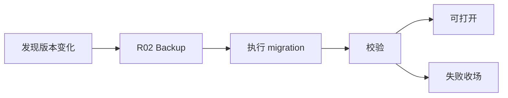

# R03 · Migration And Upgrade

Migration And Upgrade 定义本地数据结构和应用版本升级的可靠性流程。

## 原则

| 原则 | 含义 |
|---|---|
| 先备份 | 升级前有恢复点 |
| 单向明确 | migration 不伪装可逆 |
| 可见进度 | 长迁移展示阶段 |
| 失败可解释 | 用户知道数据处于什么状态 |

## 版本模型

项目兼容性由三个版本共同决定,不能用单个应用版本替代。

| 版本 | 主权 | 用途 |
|---|---|---|
| schema version | 项目事实库和作者文件 frontmatter 的结构版本 | 决定是否需要迁移事实账本和文件元信息。 |
| index version | 派生索引、embedding 模型/维度和 anchor 算法版本 | 决定索引可复用、局部重建或全量重建。 |
| package format version | I04 项目包 manifest 和打包布局版本 | 决定导入导出、备份恢复和跨应用版本传递。 |

检查顺序固定为:读取 package/project manifest → 判断 package format 是否可读 → 判断 schema 是否可打开或需迁移 → 判断 index 是否可复用或需重建。index version 不兼容不得阻断作者文件打开,但必须让相关能力进入 stale/degraded;schema 或 package format forward-compatible 不成立时必须拒开。

旧应用打开新数据时,如果 manifest 声明的最低兼容应用、schema version 或 package format version 高于当前能力,系统必须显式拒开并说明需要升级应用。禁止静默忽略未知字段、降级写回或创建同名“新项目”掩盖不兼容。

## 流程

迁移期间项目进入 `Migrating` 生命周期态。进入前必须拥有 writable lease、没有正在 Applying 的事务,并处理 pending approval;迁移中只允许展示进度、取消到安全点或打开备份恢复入口,不能接受新的写入和审批应用。

## 失败收场

| 失败 | 用户看到 | 系统不能做 |
|---|---|---|
| migration 中断 | 当前阶段和恢复点 | 继续打开不兼容项目 |
| schema 不兼容 | 升级要求 | 静默忽略字段 |
| forward-compat 拒开 | 当前应用版本与项目/包版本差异 | 降级写回或创建假项目 |
| native binding 变化 | 需要重试/换路线 | 假装索引可用 |

## FAQ

**Q: migration 能不能在用户不知情时后台跑完?**

A: 小型无风险校验可以自动完成;会改变数据结构、耗时明显或可能失败的迁移必须可见并有恢复点。

**Q: 旧版本项目打开失败是否应该自动创建新项目?**

A: 不能。打开失败要解释兼容性和迁移路径,不能用新项目掩盖旧数据不可读。
