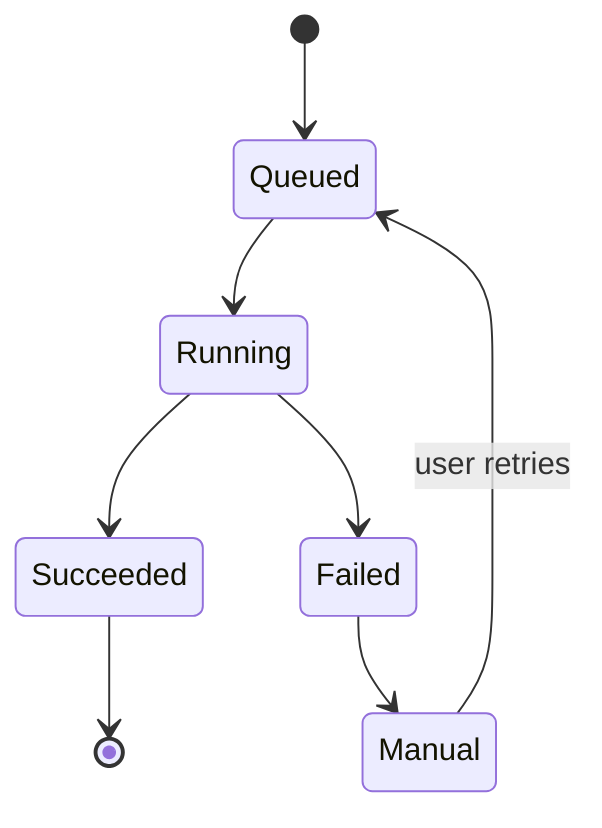
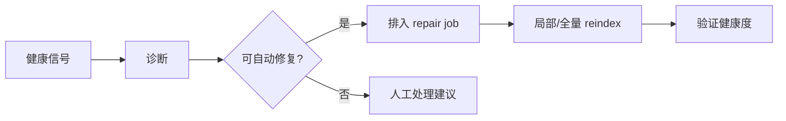

# R04 · Index Health And Repair

Index Health And Repair 定义派生索引的健康检查、重建和修复。索引坏了不等于作品坏了,但必须可见。

## 健康信号

| 信号 | 说明 |
|---|---|
| healthy | 文件、索引、cursor 和 watermark 一致 |
| stale | 文件新于索引 |
| missing anchor | 段落锚点失效 |
| embedding missing | 语义召回不完整 |
| KG conflict | 图谱事实冲突 |
| watcher degraded | 外部改动监听不可靠 |

## 健康级别与能力降级

| 级别 | 含义 | 允许 | 阻断 |
|---|---|---|---|
| healthy | 索引与文件一致 | 全部能力 | 无 |
| stale | 局部文件新于索引 | 精确读取、纯编辑、局部 reindex | 高风险 cascade 和依赖旧索引的写作 |
| degraded | watcher、embedding 或部分索引不可靠 | 只读查询带 warning,人工编辑 | 自动影响分析、跨章节生成 |
| partial | 修复中或部分来源不可用 | 查看已有事实、等待修复 | 新的可写 Agent turn |
| blocked | KG 冲突、anchor 大范围失效或 repair 失败 | 手动修复入口、导出诊断 | 依赖索引的写入和审批应用 |

## Repair job 生命周期

每个 repair job 必须记录范围、触发原因、输入 watermark、输出 watermark、失败原因和用户可见说明。repair 运行时不得假装索引健康;它只能把健康级别从更坏状态推进到已验证状态。

Repair job 必须按范围和输入 watermark 幂等。相同范围、相同输入 watermark、相同 index version 的重复 job 只能复用或重试同一修复意图,不能重复写入派生事实或制造多份冲突记录。job 重入时先读取当前输出 watermark:已成功则直接返回 succeeded,部分完成则从最后确认的输出 watermark 继续,输入文件指纹已变化则关闭旧 job 并排入新 job。

R04 只修派生索引。项目事实库真源损坏时,它可以报告 `facts-degraded` 并建议 R02 恢复或 S01 最小事实库重建,但不能用 reindex 伪造审批历史、版本指纹或 obligation 解决状态。

## 修复流

## 失败收场

| 失败 | 用户看到 | 系统不能做 |
|---|---|---|
| reindex 失败 | 索引仍过期 | 隐藏 warning |
| anchor 修复失败 | 标记需人工处理 | 跳错来源 |
| embedding 失败 | 语义召回降级 | 影响精确查询 |
| KG 冲突 | 展示冲突来源 | 自动裁决 |
| repair job 失败 | 失败范围和重试/人工入口 | 继续开放高风险写入 |
| facts-degraded | 项目事实账本损坏和可选恢复路线 | 把派生重建冒充事实恢复 |

## FAQ

**Q: 索引坏了是否会影响正文事实?**

A: 不影响正文事实。它影响搜索、查询、影响分析和上下文装配,因此这些能力必须降级或提示。

**Q: 自动修复失败后能不能继续写作?**

A: 可以继续纯编辑,但依赖索引的高风险 Agent 能力必须被标记 degraded 或阻断。
